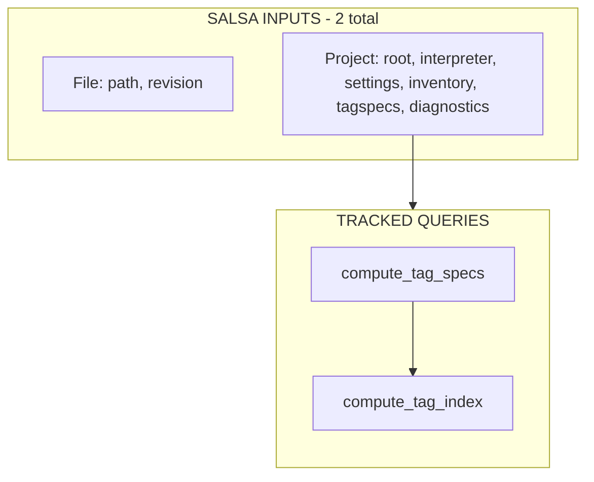
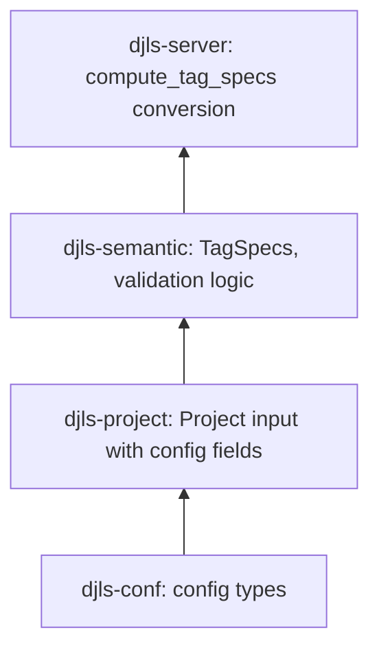

# M2: Salsa Invalidation Plumbing Implementation Plan

## Overview

Eliminate stale template diagnostics by making external data sources explicit Salsa-visible fields within the existing input types. This follows the Ruff/RA-idiomatic pattern of **minimal Salsa inputs** with explicit refresh/update paths.

**Key architectural constraint**: Maintain exactly 2 Salsa inputs (`File` + `Project`). External data (inspector inventory, semantic config) becomes fields on `Project`, not new inputs.

## Current State Analysis

### The Untracked Dependency Problem

The validation pipeline has invisible dependencies that Salsa cannot track:

```
validate_nodelist (tracked)
  └── build_block_tree (tracked)
        └── db.tag_index() (UNTRACKED - trait method)
              └── db.tag_specs() (UNTRACKED - trait method)
                    └── self.settings() (reads from Arc<Mutex<Settings>>)
```

**File references:**

- `crates/djls-semantic/src/db.rs:10-14` - trait definition with plain methods
- `crates/djls-server/src/db.rs:186-193` - implementation reading from mutex
- `crates/djls-semantic/src/blocks.rs:17-22` - `build_block_tree` calling `db.tag_index()`

### Current Salsa Inputs (2 total - keep it this way)

| Input     | Location                      | Purpose                                  |
| --------- | ----------------------------- | ---------------------------------------- |
| `File`    | `djls-source/src/file.rs`     | File path + revision counter             |
| `Project` | `djls-project/src/project.rs` | Project root + Python environment config |

### Key Problems

1. **Settings stored outside Salsa**: `Arc<Mutex<Settings>>` in `DjangoDatabase` - reads bypass Salsa tracking
2. **Inspector results tracked but call is opaque**: `templatetags(db, project)` is `#[salsa::tracked]`, but Salsa can't see when Python state changes
3. **No invalidation path**: Changing `tagspecs` in config doesn't invalidate cached `build_block_tree` results

## Desired End State

After M2:

- `Project` is the **single source of truth** for all semantic-relevant external data
- `Project` fields include:
    - `inspector_inventory: Option<TemplateTags>` - M1 payload shape
    - `tagspecs: TagSpecDef` - config document from djls-conf
    - `diagnostics: DiagnosticsConfig` - from djls-conf
- `compute_tag_specs()` is a **tracked query** that:
    - Reads **only** from Salsa-tracked Project fields
    - Converts `TagSpecDef` → `TagSpecs` and merges with `django_builtin_specs()`
    - Never touches `Arc<Mutex<Settings>>`
- Update methods **manually compare old vs new** before calling setters (Ruff/RA style)
- Tests capture raw `salsa::Event` values and identify executed queries via `db.ingredient_debug_name(database_key.ingredient_index())` (Ruff/RA pattern).

### Dependency Graph (Post-M2)



**Salsa input fields:**

- `File`: `path`, `revision`
- `Project`: `root`, `interpreter`, `django_settings_module`, `pythonpath` + new fields:
    - `inspector_inventory: Option<TemplateTags>` (M1 shape)
    - `tagspecs: TagSpecDef` (config doc, not `TagSpecs`)
    - `diagnostics: DiagnosticsConfig`

**`compute_tag_specs(db, project) → TagSpecs`:**

1. Read `project.inspector_inventory(db)` (Salsa dependency)
2. Read `project.tagspecs(db)` (Salsa dependency)
3. Start with `django_builtin_specs()` (compile-time constant)
4. Convert `TagSpecDef → TagSpecs` and merge
5. **NO `Arc<Mutex<Settings>>` access**

**`compute_tag_index(db, project) → TagIndex`:**

- Depends on `compute_tag_specs` - automatic invalidation cascade

## What We're NOT Doing

- **Adding new Salsa inputs**: No separate `InspectorInventory` or `SemanticConfigRev` inputs
- **Storing derived artifacts in Project**: No `TagSpecs` - only config docs (`TagSpecDef`)
- **Assuming Salsa auto-skips on equal sets**: Manually compare before calling setters
- **Creating djls-project → djls-semantic dependency**: Keep to djls-conf types only
- **Automatic inspector refresh**: Manual `refresh_inspector()` call required

---

## Phase 1: Extend Project Input with djls-conf Types

### Overview

Add new fields to the existing `Project` Salsa input using only types from `djls-conf`. No semantic crate dependency.

### Layering Principle



**Key**: Project stores `TagSpecDef` (the config document), not `TagSpecs` (the derived semantic artifact).

### Changes Required:

#### 1. Ensure config types are comparable

**File**: `crates/djls-conf/src/tagspecs.rs` **Changes**: Ensure `PartialEq` is derived (it already is today). **Do not require `Eq`** here.

**Why not `Eq`?** `TagSpecDef` (and friends) include `serde_json::Value` inside `extra`, and `serde_json::Value` does not implement `Eq`. Manual comparison only needs `PartialEq`.

```rust
#[derive(Debug, Clone, Deserialize, PartialEq, Default)]
pub struct TagSpecDef { /* ... */ }

#[derive(Debug, Clone, Deserialize, PartialEq)]
pub struct TagLibraryDef { /* ... */ }

// ... similarly for TagDef, EndTagDef, IntermediateTagDef, TagArgDef, etc.
```

**File**: `crates/djls-conf/src/diagnostics.rs` **Changes**: `DiagnosticsConfig` can derive `Eq`, but `PartialEq` is sufficient for manual comparison.

```rust
#[derive(Debug, Clone, Default, PartialEq, Eq, Deserialize)]
pub struct DiagnosticsConfig { /* ... */ }
```

#### 2. Add new fields to Project

**File**: `crates/djls-project/src/project.rs` **Changes**: Add config fields using djls-conf types only

```rust
use djls_conf::DiagnosticsConfig;
use djls_conf::TagSpecDef;
use crate::TemplateTags;

/// Complete project configuration as a Salsa input.
///
/// This represents the core identity of a project: where it is (root path),
/// which Python environment to use (interpreter), Django-specific configuration,
/// and semantic validation config.
///
/// Key invariants:
/// - Project id is stable once created (updates via setters, not new instances)
/// - Stores config documents (TagSpecDef), not derived artifacts (TagSpecs)
/// - All fields use djls-conf types to avoid layering violations
#[salsa::input]
#[derive(Debug)]
pub struct Project {
    /// The project root path
    #[returns(ref)]
    pub root: Utf8PathBuf,
    /// Interpreter specification for Python environment discovery
    #[returns(ref)]
    pub interpreter: Interpreter,
    /// Django settings module (e.g., "myproject.settings")
    #[returns(ref)]
    pub django_settings_module: Option<String>,
    /// Additional Python import paths (PYTHONPATH entries)
    #[returns(ref)]
    pub pythonpath: Vec<String>,

    // === NEW FIELDS FOR M2 ===

    /// Runtime inventory from Python inspector (M1 payload shape).
    /// Contains: libraries mapping, ordered builtins, tag inventory with provenance.
    /// None if inspector hasn't been queried yet or failed.
    /// Updated via `DjangoDatabase::refresh_inspector()`.
    #[returns(ref)]
    pub inspector_inventory: Option<TemplateTags>,

    /// Tag specifications config document.
    /// This is the raw config (TagSpecDef), NOT the derived TagSpecs.
    /// compute_tag_specs() converts this to TagSpecs and merges with builtins.
    #[returns(ref)]
    pub tagspecs: TagSpecDef,

    /// Diagnostic severity overrides.
    #[returns(ref)]
    pub diagnostics: DiagnosticsConfig,
}
```

#### 3. Update Project::bootstrap

**File**: `crates/djls-project/src/project.rs` **Changes**: Initialize new fields from settings

```rust
impl Project {
    pub fn bootstrap(
        db: &dyn ProjectDb,
        root: &Utf8Path,
        venv_path: Option<&str>,
        django_settings_module: Option<&str>,
        pythonpath: &[String],
        settings: &djls_conf::Settings,  // NEW parameter
    ) -> Project {
        let interpreter = Interpreter::discover(venv_path);

        let resolved_django_settings_module = django_settings_module
            .map(String::from)
            .or_else(|| {
                // ... existing auto-detection logic unchanged ...
            });

        Project::new(
            db,
            root.to_path_buf(),
            interpreter,
            resolved_django_settings_module,
            pythonpath.to_vec(),
            // NEW fields
            None,                           // inspector_inventory - populated by refresh_inspector()
            settings.tagspecs().clone(),    // tagspecs config doc
            settings.diagnostics().clone(), // diagnostics config
        )
    }
}
```

#### 4. Add djls-conf dependency to djls-project

**File**: `crates/djls-project/Cargo.toml` **Changes**: Add dependency (if not already present)

```toml
[dependencies]
djls-conf = { path = "../djls-conf" }
```

### Success Criteria:

#### Automated Verification:

- [ ] Cargo build passes: `cargo build -p djls-project`
- [ ] No dependency cycles: `cargo build` (full build)
- [ ] Clippy passes: `cargo clippy -p djls-project --all-targets -- -D warnings`

---

## Phase 2: Add Project Update APIs with Manual Comparison

### Overview

Add methods to `DjangoDatabase` that update Project fields **only when values actually change** (Ruff/RA style). This avoids unnecessary invalidation.

### Design Decision: Manual Comparison Before Setting

Salsa setters always mark inputs as changed. To avoid unnecessary invalidation, we manually compare old vs new values before calling setters:

```rust
// ❌ WRONG: Always invalidates
project.set_tagspecs(db).to(new_tagspecs);

// ✅ RIGHT: Only invalidates when changed
if project.tagspecs(db) != &new_tagspecs {
    project.set_tagspecs(db).to(new_tagspecs);
}
```

### Changes Required:

#### 1. Update set_project with manual comparison

**File**: `crates/djls-server/src/db.rs` **Changes**: Only create Project if none exists; update via setters with comparison

```rust
impl DjangoDatabase {
    /// Initialize or update the project.
    ///
    /// If no project exists, creates one. If project exists, updates
    /// fields via setters ONLY when values actually changed (Ruff/RA style).
    fn set_project(&mut self, root: &Utf8Path, settings: &Settings) {
        if let Some(project) = self.project() {
            // Project exists - update via setters with manual comparison
            self.update_project_from_settings(project, settings);
        } else {
            // No project yet - create one
            let project = Project::bootstrap(
                self,
                root,
                settings.venv_path(),
                settings.django_settings_module(),
                settings.pythonpath(),
                settings,
            );
            *self.project.lock().unwrap() = Some(project);

            // Refresh inspector after project creation
            self.refresh_inspector();
        }
    }

    /// Update Project fields from settings, comparing before setting.
    ///
    /// Only calls Salsa setters when values actually changed.
    /// This is the Ruff/RA pattern to avoid unnecessary invalidation.
    fn update_project_from_settings(&mut self, project: Project, settings: &Settings) {
        let mut env_changed = false;

        // Check and update interpreter
        let new_interpreter = Interpreter::discover(settings.venv_path());
        if project.interpreter(self) != &new_interpreter {
            project.set_interpreter(self).to(new_interpreter);
            env_changed = true;
        }

        // Check and update django_settings_module
        let new_dsm = settings.django_settings_module().map(String::from);
        if project.django_settings_module(self) != &new_dsm {
            project.set_django_settings_module(self).to(new_dsm);
            env_changed = true;
        }

        // Check and update pythonpath
        let new_pp = settings.pythonpath().to_vec();
        if project.pythonpath(self) != &new_pp {
            project.set_pythonpath(self).to(new_pp);
            env_changed = true;
        }

        // Check and update tagspecs (config doc, not TagSpecs!)
        let new_tagspecs = settings.tagspecs().clone();
        if project.tagspecs(self) != &new_tagspecs {
            tracing::debug!("Tagspecs config changed, updating Project");
            project.set_tagspecs(self).to(new_tagspecs);
        }

        // Check and update diagnostics
        let new_diagnostics = settings.diagnostics().clone();
        if project.diagnostics(self) != &new_diagnostics {
            tracing::debug!("Diagnostics config changed, updating Project");
            project.set_diagnostics(self).to(new_diagnostics);
        }

        // Refresh inspector if environment changed
        if env_changed {
            tracing::debug!("Python environment changed, refreshing inspector");
            self.refresh_inspector();
        }
    }
}
```

#### 2. Add refresh_inspector with comparison

**File**: `crates/djls-server/src/db.rs` **Changes**: Compare before setting inventory

```rust
use djls_project::inspector;
use djls_project::TemplatetagsRequest;
use djls_project::TemplateTags;

impl DjangoDatabase {
    /// Refresh the inspector inventory by querying Python.
    ///
    /// This method:
    /// 1. Queries the Python inspector DIRECTLY (not through tracked functions)
    /// 2. Compares new inventory with current
    /// 3. Updates Project.inspector_inventory ONLY if changed
    ///
    /// Call this when:
    /// - Project is first initialized
    /// - Python environment changes (venv, PYTHONPATH)
    /// - User explicitly requests refresh (e.g., after pip install)
    pub fn refresh_inspector(&mut self) {
        let Some(project) = self.project() else {
            tracing::warn!("Cannot refresh inspector: no project set");
            return;
        };

        // Call inspector::query directly (side-effect, not tracked)
        let new_inventory = inspector::query(self, &TemplatetagsRequest)
            .map(|response| TemplateTags::from_response(
                response.libraries,
                response.builtins,
                response.templatetags,
            ));

        // Compare before setting (Ruff/RA style)
        let current = project.inspector_inventory(self);
        if current != &new_inventory {
            tracing::debug!(
                "Inspector inventory changed: {} -> {} tags",
                current.as_ref().map_or(0, |t| t.len()),
                new_inventory.as_ref().map_or(0, |t| t.len())
            );
            project.set_inspector_inventory(self).to(new_inventory);
        } else {
            tracing::trace!("Inspector inventory unchanged, skipping update");
        }
    }
}
```

#### 3. Update set_settings

**File**: `crates/djls-server/src/db.rs` **Changes**: Delegate to update_project_from_settings

```rust
pub fn set_settings(&mut self, settings: Settings) {
    // Store new settings in mutex (still needed for non-Project uses)
    *self.settings.lock().unwrap() = settings.clone();

    if let Some(project) = self.project() {
        // Update Project fields with comparison
        self.update_project_from_settings(project, &settings);
    }
}
```

#### 4. Make inspector types public

**File**: `crates/djls-project/src/django.rs` **Changes**: Export types for direct inspector queries

```rust
#[derive(Serialize)]
pub struct TemplatetagsRequest;

#[derive(Deserialize)]
pub struct TemplatetagsResponse {
    pub libraries: std::collections::HashMap<String, String>,
    pub builtins: Vec<String>,
    pub templatetags: Vec<TemplateTag>,
}

impl TemplateTags {
    /// Construct from inspector response data (M1 payload shape).
    pub fn from_response(
        libraries: std::collections::HashMap<String, String>,
        builtins: Vec<String>,
        tags: Vec<TemplateTag>,
    ) -> Self {
        Self { libraries, builtins, tags }
    }
}
```

#### 5. Add PartialEq to TemplateTags

**File**: `crates/djls-project/src/django.rs` **Changes**: Derive PartialEq for comparison

```rust
#[derive(Debug, Default, Clone, PartialEq)]
pub struct TemplateTags {
    libraries: std::collections::HashMap<String, String>,
    builtins: Vec<String>,
    tags: Vec<TemplateTag>,
}

#[derive(Debug, Clone, PartialEq, Eq, Deserialize)]
pub struct TemplateTag { /* ... */ }

#[derive(Debug, Clone, PartialEq, Eq, Deserialize)]
pub enum TagProvenance { /* ... */ }
```

#### 6. Export from djls-project

**File**: `crates/djls-project/src/lib.rs` **Changes**: Export the new public types

```rust
pub use django::TemplatetagsRequest;
pub use django::TemplatetagsResponse;
```

### Success Criteria:

#### Automated Verification:

- [ ] Cargo build passes: `cargo build -p djls-server`
- [ ] Clippy passes: `cargo clippy -p djls-server --all-targets -- -D warnings`

---

## Phase 3: Make tag_specs a Tracked Query

### Overview

Add `compute_tag_specs()` as a tracked query that:

1. Reads **only** from Salsa-tracked Project fields
2. Converts `TagSpecDef` → `TagSpecs`
3. Merges with `django_builtin_specs()`

### Changes Required:

#### 1. Add TagSpecs::from_config_def conversion

**File**: `crates/djls-semantic/src/templatetags/specs.rs` **Changes**: Add conversion from config doc to semantic type

```rust
use djls_conf::TagSpecDef;

impl TagSpecs {
    /// Convert config document (TagSpecDef) to semantic TagSpecs.
    ///
    /// This is used by compute_tag_specs() to convert the Project's
    /// config document into the derived semantic artifact.
    pub fn from_config_def(def: &TagSpecDef) -> Self {
        // Implementation converts TagSpecDef → TagSpecs
        // Similar to existing TagSpecs::from(&Settings) but takes TagSpecDef directly
        let mut specs = TagSpecs::default();

        for library in &def.libraries {
            for tag in &library.tags {
                // Keep module provenance (needed downstream for extraction + attribution).
                // Prefer reusing the existing conversion:
                let spec: TagSpec = (tag.clone(), library.module.clone()).into();
                specs.insert(tag.name.clone(), spec);
            }
        }

        specs
    }
}

// Prefer reusing the existing `impl From<(djls_conf::TagDef, String)> for TagSpec`
// rather than introducing a parallel conversion path.
```

**Note**: If `TagSpecs::from(&Settings)` already has this logic, refactor to share code.

#### 2. Add tracked compute_tag_specs query

**File**: `crates/djls-server/src/db.rs` **Changes**: Add tracked function that reads only from Project

```rust
use djls_project::Project;
use djls_semantic::TagSpecs;
use djls_semantic::django_builtin_specs;

/// Compute tag specifications from all sources.
///
/// This tracked query:
/// 1. Reads Project.inspector_inventory and Project.tagspecs (Salsa dependencies)
/// 2. Starts with django_builtin_specs() (compile-time constant)
/// 3. Converts Project.tagspecs (TagSpecDef) → TagSpecs and merges
///
/// **IMPORTANT**: This function does NOT read from Arc<Mutex<Settings>>.
/// All config must come through Project fields.
#[salsa::tracked]
pub fn compute_tag_specs(db: &DjangoDatabase, project: Project) -> TagSpecs {
    // Read Salsa-tracked fields to establish dependencies
    let _inventory = project.inspector_inventory(db);
    let tagspecs_def = project.tagspecs(db);

    // Start with Django builtins (compile-time constant)
    let mut specs = django_builtin_specs();

    // TODO (M3+): Merge inspector inventory for load scoping
    // if let Some(tags) = _inventory {
    //     specs.merge_from_inventory(&tags);
    // }

    // Convert config doc to TagSpecs and merge
    // This does NOT include builtins - that's why we start with django_builtin_specs()
    let user_specs = TagSpecs::from_config_def(tagspecs_def);
    specs.merge(user_specs);

    tracing::trace!("Computed tag specs: {} tags", specs.len());

    specs
}
```

#### 3. Add tracked compute_tag_index query

**File**: `crates/djls-server/src/db.rs`

```rust
use djls_semantic::TagIndex;

/// Build the tag index from computed tag specs.
#[salsa::tracked]
pub fn compute_tag_index<'db>(db: &'db DjangoDatabase, project: Project) -> TagIndex<'db> {
    let _specs = compute_tag_specs(db, project);
    TagIndex::from_specs(db)
}
```

#### 4. Update SemanticDb implementation

**File**: `crates/djls-server/src/db.rs`

```rust
#[salsa::db]
impl SemanticDb for DjangoDatabase {
    fn tag_specs(&self) -> TagSpecs {
        if let Some(project) = self.project() {
            compute_tag_specs(self, project)
        } else {
            django_builtin_specs()
        }
    }

    fn tag_index(&self) -> TagIndex<'_> {
        if let Some(project) = self.project() {
            compute_tag_index(self, project)
        } else {
            TagIndex::from_specs(self)
        }
    }

    fn template_dirs(&self) -> Option<Vec<Utf8PathBuf>> {
        if let Some(project) = self.project() {
            template_dirs(self, project)
        } else {
            None
        }
    }

    fn diagnostics_config(&self) -> djls_conf::DiagnosticsConfig {
        if let Some(project) = self.project() {
            project.diagnostics(self).clone()
        } else {
            djls_conf::DiagnosticsConfig::default()
        }
    }
}
```

### Success Criteria:

#### Automated Verification:

- [ ] Cargo build passes: `cargo build`
- [ ] Clippy passes: `cargo clippy --all-targets -- -D warnings`
- [ ] All tests pass: `cargo test`

---

## Phase 4: Invalidation Tests with Event Capture

### Overview

Write tests that capture Salsa events and verify invalidation in a stable way.

Prefer the Ruff/Rust-Analyzer approach:

- capture raw `salsa::Event` values
- assert execution by inspecting `WillExecute` events and comparing `db.ingredient_debug_name(database_key.ingredient_index())` to the query name (avoid substring-matching `Debug` output).

### Salsa Test Pattern (Stable)

```rust
let events = logger.take();
let ran = events.iter().any(|event| match event.kind {
    salsa::EventKind::WillExecute { database_key } => {
        db.ingredient_debug_name(database_key.ingredient_index()) == "compute_tag_specs"
    }
    _ => false,
});
assert!(ran);
```

### Changes Required:

#### 1. Add event logging infrastructure

**File**: `crates/djls-server/src/db.rs`

```rust
#[cfg(test)]
mod test_infrastructure {
    use super::*;
    use std::sync::{Arc, Mutex};

    /// Test logger that stores raw Salsa events for stable identification.
    #[derive(Clone, Default)]
    pub struct EventLogger {
        events: Arc<Mutex<Vec<salsa::Event>>>,
    }

    impl EventLogger {
        pub fn push(&self, event: salsa::Event) {
            self.events.lock().unwrap().push(event);
        }

        pub fn take(&self) -> Vec<salsa::Event> {
            std::mem::take(&mut *self.events.lock().unwrap())
        }

        pub fn clear(&self) {
            self.events.lock().unwrap().clear();
        }

        /// Check if a query was executed by looking for a matching ingredient debug name
        /// in `WillExecute` events.
        pub fn was_executed(&self, db: &dyn salsa::Database, query_name: &str) -> bool {
            self.events.lock().unwrap().iter().any(|event| match event.kind {
                salsa::EventKind::WillExecute { database_key } => {
                    db.ingredient_debug_name(database_key.ingredient_index()) == query_name
                }
                _ => false,
            })
        }
    }

    /// Test database with event logging (Salsa pattern)
    pub struct TestDatabase {
        pub db: DjangoDatabase,
        pub logger: EventLogger,
    }

    impl TestDatabase {
        pub fn new() -> Self {
            let logger = EventLogger::default();
            let db = Self::create_db_with_logger(logger.clone());
            Self { db, logger }
        }

        pub fn with_project() -> Self {
            let mut test_db = Self::new();
            let settings = Settings::default();

            // Create project directly (bypass bootstrap which needs real files)
            let project = Project::new(
                &test_db.db,
                Utf8PathBuf::from("/test/project"),
                Interpreter::default(),
                Some("test.settings".to_string()),
                vec![],
                None,                           // inspector_inventory
                settings.tagspecs().clone(),    // tagspecs
                settings.diagnostics().clone(), // diagnostics
            );
            *test_db.db.project.lock().unwrap() = Some(project);

            test_db
        }

        fn create_db_with_logger(logger: EventLogger) -> DjangoDatabase {
            use djls_workspace::InMemoryFileSystem;

            DjangoDatabase {
                fs: Arc::new(InMemoryFileSystem::new()),
                files: Arc::new(FxDashMap::default()),
                project: Arc::new(Mutex::new(None)),
                settings: Arc::new(Mutex::new(Settings::default())),
                inspector: Arc::new(Inspector::new()),
                storage: salsa::Storage::new(Some(Box::new({
                    let logger = logger.clone();
                    move |event| {
                        logger.push(event);
                    }
                }))),
                #[cfg(test)]
                logs: Arc::new(Mutex::new(None)),
            }
        }
    }
}
```

#### 2. Add invalidation tests

**File**: `crates/djls-server/src/db.rs`

```rust
#[cfg(test)]
mod invalidation_tests {
    use super::*;
    use super::test_infrastructure::*;
    use djls_project::TemplateTags;
    use std::collections::HashMap;

    #[test]
    fn test_tag_specs_cached_on_repeated_access() {
        let test = TestDatabase::with_project();

        // First access - should execute query
        let _specs1 = test.db.tag_specs();
        assert!(
            test.logger.was_executed(&test.db, "compute_tag_specs"),
            "compute_tag_specs should execute on first access.\nLogs: {:?}",
            test.logger.take()
        );

        test.logger.clear();

        // Second access - should use cache (no WillExecute event)
        let _specs2 = test.db.tag_specs();
        assert!(
            !test.logger.was_executed(&test.db, "compute_tag_specs"),
            "compute_tag_specs should be cached on second access"
        );
    }

    #[test]
    fn test_tagspecs_change_invalidates() {
        let mut test = TestDatabase::with_project();

        // First access
        let _specs1 = test.db.tag_specs();
        test.logger.clear();

        // Update tagspecs via Project setter
        let project = test.db.project().expect("test project exists");
        let mut new_tagspecs = project.tagspecs(&test.db).clone();
        // Modify tagspecs (add a library)
        new_tagspecs.libraries.push(djls_conf::TagLibraryDef {
            module: "test.templatetags".to_string(),
            requires_engine: None,
            tags: vec![],
            extra: None,
        });

        // Manual comparison shows change - set it
        assert!(project.tagspecs(&test.db) != &new_tagspecs);
        project.set_tagspecs(&mut test.db).to(new_tagspecs);

        // Access again - should recompute
        let _specs2 = test.db.tag_specs();
        assert!(
            test.logger.was_executed(&test.db, "compute_tag_specs"),
            "compute_tag_specs should recompute after tagspecs change"
        );
    }

    #[test]
    fn test_inspector_inventory_change_invalidates() {
        let mut test = TestDatabase::with_project();

        // First access
        let _specs1 = test.db.tag_specs();
        test.logger.clear();

        // Update inspector inventory
        let project = test.db.project().expect("test project exists");
        let new_inventory = TemplateTags::from_response(
            HashMap::new(),
            vec!["django.template.defaulttags".to_string()],
            vec![],
        );
        project.set_inspector_inventory(&mut test.db).to(Some(new_inventory));

        // Access again - should recompute
        let _specs2 = test.db.tag_specs();
        assert!(
            test.logger.was_executed(&test.db, "compute_tag_specs"),
            "compute_tag_specs should recompute after inventory change"
        );
    }

    #[test]
    fn test_same_value_no_invalidation() {
        let mut test = TestDatabase::with_project();

        // First access
        let _specs1 = test.db.tag_specs();
        test.logger.clear();

        // "Update" with same value - should NOT call setter
        let project = test.db.project().expect("test project exists");
        let same_tagspecs = project.tagspecs(&test.db).clone();

        // Manual comparison shows NO change - don't set
        assert!(project.tagspecs(&test.db) == &same_tagspecs);
        // Note: We don't call set_tagspecs because values are equal

        // Access again - should NOT recompute
        let _specs2 = test.db.tag_specs();
        assert!(
            !test.logger.was_executed(&test.db, "compute_tag_specs"),
            "compute_tag_specs should NOT recompute when value unchanged"
        );
    }

    #[test]
    fn test_tag_index_depends_on_tag_specs() {
        let mut test = TestDatabase::with_project();

        // Access tag_index (triggers tag_specs)
        let _index1 = test.db.tag_index();
        assert!(
            test.logger.was_executed(&test.db, "compute_tag_specs"),
            "tag_index should trigger tag_specs"
        );

        test.logger.clear();

        // Change tagspecs
        let project = test.db.project().expect("test project exists");
        let mut new_tagspecs = project.tagspecs(&test.db).clone();
        new_tagspecs.libraries.push(djls_conf::TagLibraryDef {
            module: "another.templatetags".to_string(),
            requires_engine: None,
            tags: vec![],
            extra: None,
        });
        project.set_tagspecs(&mut test.db).to(new_tagspecs);

        // Access tag_index - should recompute
        let _index2 = test.db.tag_index();
        assert!(
            test.logger.was_executed(&test.db, "compute_tag_specs"),
            "tag_index should recompute when tagspecs change"
        );
    }

    #[test]
    fn test_update_project_from_settings_compares() {
        let mut test = TestDatabase::with_project();

        // First access
        let _specs1 = test.db.tag_specs();
        test.logger.clear();

        // Call update_project_from_settings with same settings
        let project = test.db.project().expect("test project exists");
        let settings = test.db.settings();
        test.db.update_project_from_settings(project, &settings);

        // Should NOT invalidate (manual comparison prevents setter calls)
        let _specs2 = test.db.tag_specs();
        assert!(
            !test.logger.was_executed(&test.db, "compute_tag_specs"),
            "update_project_from_settings should not invalidate when unchanged"
        );
    }
}
```

### Success Criteria:

#### Automated Verification:

- [ ] All invalidation tests pass: `cargo test invalidation_tests`
- [ ] Full test suite passes: `cargo test`
- [ ] Clippy passes: `cargo clippy --all-targets -- -D warnings`

---

## Testing Strategy Summary

### Test Pattern (from Salsa)

```rust
// 1. Create test database with event logger
let test = TestDatabase::with_project();

// 2. First access - establishes cache
let _specs1 = test.db.tag_specs();
assert!(test.logger.was_executed(&test.db, "compute_tag_specs"));

// 3. Clear logs
test.logger.clear();

// 4. Second access - should use cache
let _specs2 = test.db.tag_specs();
assert!(!test.logger.was_executed(&test.db, "compute_tag_specs"));

// 5. Change input (with manual comparison)
let project = test.db.project().unwrap();
let new_value = /* modified value */;
if project.field(&test.db) != &new_value {
    project.set_field(&mut test.db).to(new_value);
}

// 6. Access again - should recompute only if value changed
let _specs3 = test.db.tag_specs();
assert!(test.logger.was_executed(&test.db, "compute_tag_specs"));
```

### Event Format

The `was_executed()` helper checks `WillExecute` events and compares `db.ingredient_debug_name(database_key.ingredient_index())` to the query name.

---

## Performance Considerations

- **Manual comparison**: Small overhead but avoids unnecessary cache invalidation
- **Refresh cost**: `refresh_inspector()` spawns Python subprocess; comparison prevents spurious invalidation
- **Stable Project id**: No churn from recreating Project on config changes
- **Config doc vs derived**: Storing `TagSpecDef` (small) not `TagSpecs` (larger) in Project

---

## Migration Notes

This is an **internal refactoring** with no external API changes:

- LSP protocol unchanged
- Config file format unchanged
- User-visible behavior: diagnostics now update correctly when config changes

### Breaking Internal Changes:

- `Project::new()` / `Project::bootstrap()` signature changes (3 new fields)
- `SemanticDb::tag_specs()` now delegates to tracked query
- New `TagSpecs::from_config_def()` method
- `DjangoDatabase` must not read `Arc<Mutex<Settings>>` in tracked queries

---

## References

- Charter: [`.agents/charter/2026-02-05-template-validation-port-charter.md`](../charter/2026-02-05-template-validation-port-charter.md) (M2 section)
- M1 Plan: [`.agents/plans/2026-02-05-m1-payload-library-name-fix.md`](2026-02-05-m1-payload-library-name-fix.md) (payload shape)
- RFC: [`.agents/rfcs/2026-02-05-rfc-extraction-placement.md`](../rfcs/2026-02-05-rfc-extraction-placement.md) (Salsa integration)
- Salsa tests: `~/.cargo/registry/src/*/salsa-0.25.2/tests/common/mod.rs` (event logging pattern)
