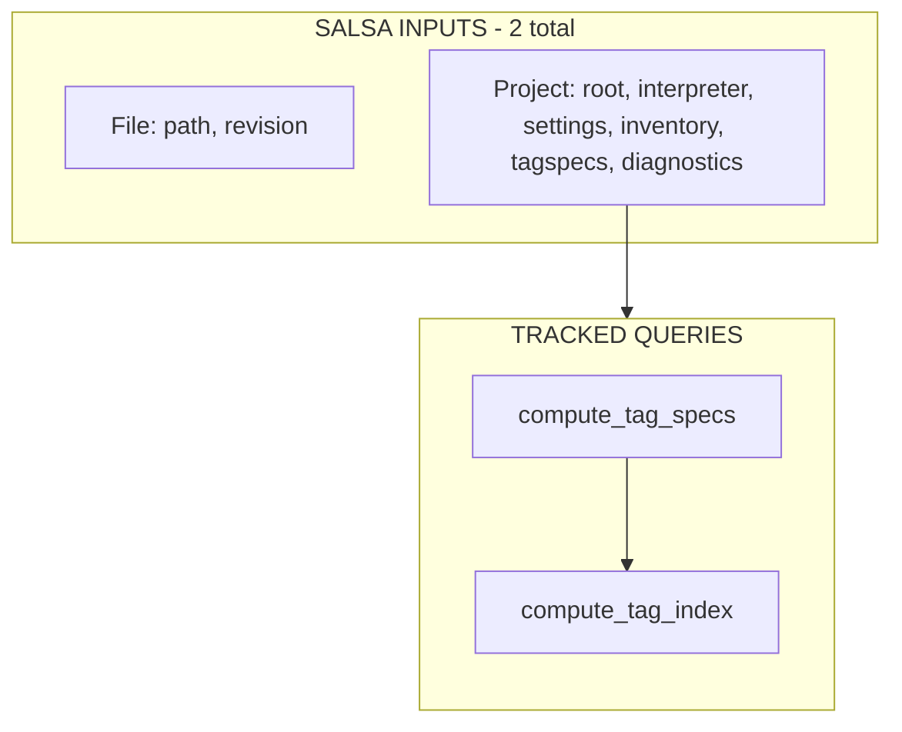
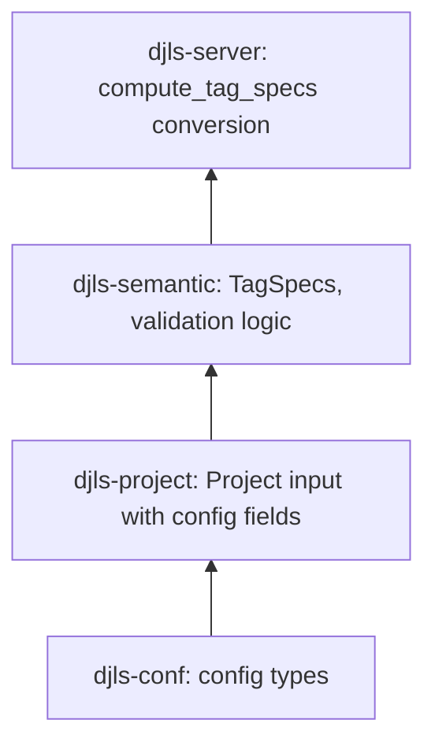

# M2: Salsa Invalidation Plumbing Implementation Plan

## Overview

Eliminate stale template diagnostics by making external data sources explicit Salsa-visible fields within the existing input types. This follows the Ruff/RA-idiomatic pattern of **minimal Salsa inputs** with explicit refresh/update paths.

**Key architectural constraint**: Maintain exactly 2 Salsa inputs (`File` + `Project`). External data (inspector inventory, semantic config) becomes fields on `Project`, not new inputs.

## Current State Analysis

### The Untracked Dependency Problem

The validation pipeline has invisible dependencies that Salsa cannot track:

```
validate_nodelist (tracked)
  └── build_block_tree (tracked)
        └── db.tag_index() (UNTRACKED - trait method)
              └── db.tag_specs() (UNTRACKED - trait method)
                    └── self.settings() (reads from Arc<Mutex<Settings>>)
```

**File references:**

- `crates/djls-semantic/src/db.rs:10-14` — trait definition with plain methods
- `crates/djls-server/src/db.rs:186-193` — implementation reading from mutex
- `crates/djls-semantic/src/blocks.rs:17-22` — `build_block_tree` calling `db.tag_index()`

### Current Salsa Inputs (2 total — keep it this way)

| Input     | Location                      | Purpose                                  |
| --------- | ----------------------------- | ---------------------------------------- |
| `File`    | `djls-source/src/file.rs`     | File path + revision counter             |
| `Project` | `djls-project/src/project.rs` | Project root + Python environment config |

### Key Problems

1. **Settings stored outside Salsa**: `Arc<Mutex<Settings>>` in `DjangoDatabase` — reads bypass Salsa tracking
2. **Inspector results tracked but call is opaque**: `templatetags(db, project)` is `#[salsa::tracked]`, but Salsa can't see when Python state changes
3. **No invalidation path**: Changing `tagspecs` in config doesn't invalidate cached `build_block_tree` results

## Desired End State

After M2:

- `Project` is the **single source of truth** for all semantic-relevant external data
- `Project` fields include:
    - `inspector_inventory: Option<TemplateTags>` — M1 payload shape
    - `tagspecs: TagSpecDef` — config document from djls-conf
    - `diagnostics: DiagnosticsConfig` — from djls-conf
- `compute_tag_specs()` is a **tracked query** that reads **only** from Salsa-tracked Project fields, converts `TagSpecDef` → `TagSpecs`, merges with `django_builtin_specs()`, and never touches `Arc<Mutex<Settings>>`
- Update methods **manually compare old vs new** before calling setters (Ruff/RA style)
- Tests capture raw `salsa::Event` values and verify invalidation via `db.ingredient_debug_name(database_key.ingredient_index())` (Ruff/RA pattern)

### Dependency Graph (Post-M2)



**Salsa input fields:**

- `File`: `path`, `revision`
- `Project`: `root`, `interpreter`, `django_settings_module`, `pythonpath` + new fields:
    - `inspector_inventory: Option<TemplateTags>` (M1 shape)
    - `tagspecs: TagSpecDef` (config doc, not `TagSpecs`)
    - `diagnostics: DiagnosticsConfig`

**`compute_tag_specs(db, project) → TagSpecs`:**

1. Read `project.inspector_inventory(db)` (Salsa dependency)
2. Read `project.tagspecs(db)` (Salsa dependency)
3. Start with `django_builtin_specs()` (compile-time constant)
4. Convert `TagSpecDef → TagSpecs` and merge
5. **NO `Arc<Mutex<Settings>>` access**

**`compute_tag_index(db, project) → TagIndex`:**

- Depends on `compute_tag_specs` — automatic invalidation cascade

## What We're NOT Doing

- **Adding new Salsa inputs**: No separate `InspectorInventory` or `SemanticConfigRev` inputs
- **Storing derived artifacts in Project**: No `TagSpecs` — only config docs (`TagSpecDef`)
- **Assuming Salsa auto-skips on equal sets**: Manually compare before calling setters
- **Creating djls-project → djls-semantic dependency**: Keep to djls-conf types only
- **Automatic inspector refresh**: Manual `refresh_inspector()` call required

---

## Phase 1: Extend Project Input with djls-conf Types

### Goal

Add new fields to the existing `Project` Salsa input using only types from `djls-conf`. No semantic crate dependency.

### Layering Principle



**Key**: Project stores `TagSpecDef` (the config document), not `TagSpecs` (the derived semantic artifact).

### Changes Required

1. **Ensure config types are comparable**: `TagSpecDef` and related types in `djls-conf` need `PartialEq`. Do NOT require `Eq` — `TagSpecDef` contains `serde_json::Value` inside `extra`, which doesn't implement `Eq`. Manual comparison only needs `PartialEq`. `DiagnosticsConfig` can derive both `PartialEq` and `Eq`.

2. **Add new fields to Project**: Extend the `#[salsa::input]` struct with `inspector_inventory: Option<TemplateTags>`, `tagspecs: TagSpecDef`, and `diagnostics: DiagnosticsConfig`. Use `#[returns(ref)]` on these fields. Add documentation explaining that Project stores config docs, not derived artifacts.

3. **Update `Project::bootstrap`**: Accept `&Settings` and use it to initialize `tagspecs` and `diagnostics` fields. Initialize `inspector_inventory` as `None` (populated later by `refresh_inspector()`).

4. **Add djls-conf dependency to djls-project** if not already present.

### Success Criteria

- `cargo build -p djls-project` passes
- No dependency cycles in full build

---

## Phase 2: Add Project Update APIs with Manual Comparison

### Goal

Add methods to `DjangoDatabase` that update Project fields **only when values actually change** (Ruff/RA style). This avoids unnecessary Salsa invalidation.

### Critical Design Decision: Manual Comparison Before Setting

Salsa setters always mark inputs as changed. To avoid unnecessary invalidation, we MUST manually compare old vs new values before calling setters:

```rust
// ❌ WRONG: Always invalidates downstream queries
project.set_tagspecs(db).to(new_tagspecs);

// ✅ RIGHT: Only invalidates when the value actually changed
if project.tagspecs(db) != &new_tagspecs {
    project.set_tagspecs(db).to(new_tagspecs);
}
```

This pattern must be applied consistently to ALL setter calls.

### Changes Required

1. **Implement `update_project_from_settings`**: A method on `DjangoDatabase` that compares each field (interpreter, django_settings_module, pythonpath, tagspecs, diagnostics) before calling the setter. Track whether environment-related fields changed and trigger `refresh_inspector()` if so.

2. **Implement `refresh_inspector`**: A method that queries the Python inspector DIRECTLY (not through tracked functions), compares the new inventory with the current one, and only calls `set_inspector_inventory` if the value changed. This is a side-effect operation, not a tracked query.

3. **Update `set_settings`**: Delegate to `update_project_from_settings` when a project exists, creating a new project if none exists yet.

4. **Make inspector types public**: Export `TemplatetagsRequest`, `TemplatetagsResponse`, and add a `TemplateTags::from_response()` constructor so that `refresh_inspector` can construct the inventory without going through tracked queries.

5. **Add `PartialEq` to `TemplateTags`, `TemplateTag`, and `TagProvenance`** for the comparison checks.

### Success Criteria

- `cargo build -p djls-server` passes
- `cargo clippy -p djls-server --all-targets -- -D warnings` passes

---

## Phase 3: Make tag_specs a Tracked Query

### Goal

Add `compute_tag_specs()` as a `#[salsa::tracked]` function that reads ONLY from Salsa-tracked Project fields, converting `TagSpecDef` → `TagSpecs` and merging with `django_builtin_specs()`.

### Changes Required

1. **Add `TagSpecs::from_config_def` conversion**: A method on `TagSpecs` that converts the config document (`TagSpecDef`) to the semantic type. Reuse existing conversion logic (e.g., `impl From<(TagDef, String)> for TagSpec`) rather than introducing a parallel path.

2. **Add `compute_tag_specs` tracked query**: A `#[salsa::tracked]` function in `djls-server/src/db.rs` that:
    - Reads `project.inspector_inventory(db)` and `project.tagspecs(db)` to establish Salsa dependencies
    - Starts with `django_builtin_specs()` (compile-time constant)
    - Converts `TagSpecDef → TagSpecs` and merges
    - Does NOT read from `Arc<Mutex<Settings>>` — this is the critical invariant

3. **Add `compute_tag_index` tracked query**: Depends on `compute_tag_specs`, providing automatic invalidation cascade.

4. **Update `SemanticDb` implementation**: `tag_specs()` and `tag_index()` delegate to the tracked queries when a project exists, falling back to `django_builtin_specs()` when no project is set. Add `diagnostics_config()` that reads from `project.diagnostics(db)`.

### Success Criteria

- Full build passes: `cargo build`
- All tests pass: `cargo test`
- No `Arc<Mutex<Settings>>` reads in any tracked query path

---

## Phase 4: Invalidation Tests with Event Capture

### Goal

Write tests that capture Salsa events and verify invalidation in a stable way, following the Ruff/Rust-Analyzer test pattern.

### Test Pattern

Use the Ruff/RA approach of capturing raw `salsa::Event` values and identifying executed queries via `db.ingredient_debug_name(database_key.ingredient_index())`:

```rust
let events = logger.take();
let ran = events.iter().any(|event| match event.kind {
    salsa::EventKind::WillExecute { database_key } => {
        db.ingredient_debug_name(database_key.ingredient_index()) == "compute_tag_specs"
    }
    _ => false,
});
assert!(ran);
```

### Test Infrastructure Needed

Build an `EventLogger` and `TestDatabase` that:

- Stores raw `salsa::Event` values via Salsa's event callback
- Provides `was_executed(db, query_name)` helper that checks `WillExecute` events against `ingredient_debug_name`
- Creates a `DjangoDatabase` with a project pre-configured for testing (without needing real files/Python)

### Required Tests

1. **Caching**: `tag_specs()` cached on repeated access (second call has no `WillExecute` event)
2. **Tagspecs change invalidates**: Update `project.tagspecs` via setter → `compute_tag_specs` re-executes
3. **Inspector inventory change invalidates**: Update `project.inspector_inventory` via setter → `compute_tag_specs` re-executes
4. **Same value = no invalidation**: When manual comparison prevents setter call, cache is preserved
5. **Tag index depends on tag specs**: Changing tagspecs causes both `compute_tag_specs` AND `compute_tag_index` to re-execute
6. **update_project_from_settings with unchanged settings**: No invalidation occurs

### Success Criteria

- All invalidation tests pass: `cargo test invalidation_tests`
- Full test suite passes: `cargo test`

---

## Performance Considerations

- **Manual comparison**: Small overhead but avoids unnecessary cache invalidation
- **Refresh cost**: `refresh_inspector()` spawns Python subprocess; comparison prevents spurious invalidation
- **Stable Project id**: No churn from recreating Project on config changes
- **Config doc vs derived**: Storing `TagSpecDef` (small) not `TagSpecs` (larger) in Project

## Migration Notes

This is an **internal refactoring** with no external API changes. LSP protocol unchanged, config file format unchanged. User-visible behavior: diagnostics now update correctly when config changes.

**Breaking internal changes:**

- `Project::new()` / `Project::bootstrap()` signature changes (3 new fields)
- `SemanticDb::tag_specs()` now delegates to tracked query
- New `TagSpecs::from_config_def()` method
- `DjangoDatabase` must not read `Arc<Mutex<Settings>>` in tracked queries

## References

- Charter: [`.agents/charter/2026-02-05-template-validation-port-charter.md`](../charter/2026-02-05-template-validation-port-charter.md) (M2 section)
- M1 Plan: [`.agents/plans/2026-02-05-m1-payload-library-name-fix.md`](2026-02-05-m1-payload-library-name-fix.md) (payload shape)
- RFC: [`.agents/rfcs/2026-02-05-rfc-extraction-placement.md`](../rfcs/2026-02-05-rfc-extraction-placement.md) (Salsa integration)
- Salsa tests: `~/.cargo/registry/src/*/salsa-0.25.2/tests/common/mod.rs` (event logging pattern)
