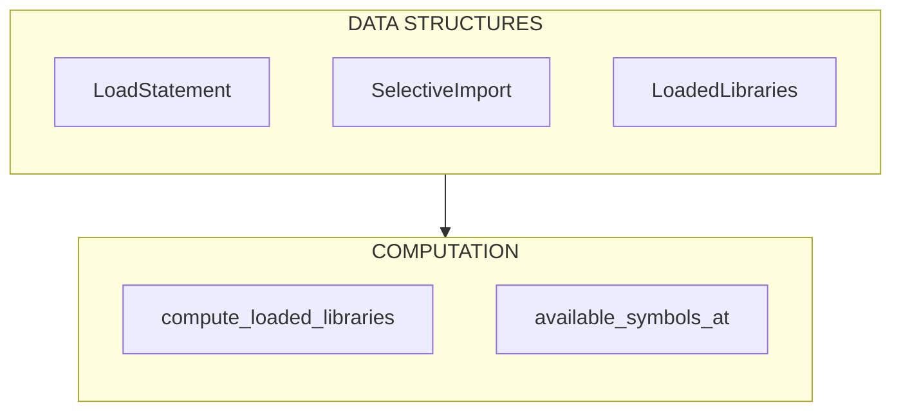

# M3: Load Scoping Infrastructure Implementation Plan

## Overview

Implement position-aware `` scoping for tags and filters, enabling:

- **Diagnostics**: "Tag `` requires ``" when a tag is used before its library is loaded
- **Completions**: Only show tags available at cursor position (builtins + libraries loaded before cursor)
- **Selective imports**: `` correctly scopes only the named symbols

This builds on M1 (payload shape with `TagProvenance`) and M2 (Salsa invalidation plumbing).

## Current State Analysis

### Parser Representation of ``

**Location**: `crates/djls-templates/src/nodelist.rs`

`` is parsed as a generic `Node::Tag`:

```rust
Node::Tag {
    name: "load",           // The tag name
    bits: ["i18n", "static"], // or ["trans", "from", "i18n"]
    span: Span,             // Position in source
}
```

The `bits` field captures library names or selective imports but lacks semantic structure.

### Unknown Tags Pass Silently

**Location**: `crates/djls-semantic/src/arguments.rs:59`

```rust
// Unknown tag - no validation (could be custom tag from unloaded library)
```

Currently, any tag without a `TagSpec` passes validation silently.

### Block Builder Ignores Unknown Tags for Scoping

**Location**: `crates/djls-semantic/src/blocks/builder.rs`

Unknown tags are classified as `TagClass::Unknown` and added as leaf nodes without any scoping consideration.

### Completions Show All Tags

**Location**: `crates/djls-ide/src/completions.rs:310-340`

All tags from `TemplateTags` are shown regardless of `` state:

```rust
for tag in tags.iter() {
    if tag.name().starts_with(partial) {
        // Generate completion - no load-scoping filter
    }
}
```

### M1 Payload Shape (Assumed Complete)

After M1, `TemplateTags` contains:

- `libraries: HashMap<String, String>` - load_name → module_path
- `builtins: Vec<String>` - ordered builtin module paths
- Tags with `TagProvenance::Library { load_name, module }` or `TagProvenance::Builtin { module }`

## Desired End State

### Per Charter Section 1.2

1. **Diagnostics respect load scope**: A tag/filter from library `foo` produces an error if `` hasn't preceded it
2. **Completions respect load scope**: Tag/filter completions only show symbols available at cursor position
3. **`` handled**: Selective imports correctly scope only the named symbols
4. **Builtins always available**: Tags from `engine.template_builtins` available without ``

### Unknown Tag/Filter Behavior (Post-M3)

| Scenario                  | Behavior                                                               |
| ------------------------- | ---------------------------------------------------------------------- |
| **Inspector healthy**     | Unknown tags/filters produce diagnostics by default (S108, S109, S110) |
| **Inspector unavailable** | Suppress S108/S109/S110 entirely; show all tags in completions         |
| **Truly unknown**         | Error: "Unknown tag ``" / "Unknown filter `\|xyz`"            |

### "Inspector Unavailable" Behavior (Explicit)

The inspector may be unavailable when:

- Django initialization failed
- Python environment not configured
- Inspector subprocess crashed

**Where the check lives:**

| Component                                                | Check                                | Behavior when unavailable               |
| -------------------------------------------------------- | ------------------------------------ | --------------------------------------- |
| **Validation** (`validate_tag_scoping`)                  | `db.inspector_inventory().is_none()` | Return early, emit no S108/S109/S110    |
| **Completions** (`generate_tag_name_completions`)        | `loaded_libraries.is_none()`         | Skip availability filter, show all tags |
| **Library completions** (`generate_library_completions`) | `template_tags.is_none()`            | Return empty (no libraries known)       |

This ensures we never emit false positives when we don't have authoritative runtime truth.

## Correctness Fixes (from Review)

The following issues were identified during review and are addressed in this plan:

### Fix 1: Selective Import vs Full Load Logic

**Problem**: The original `available_tags_at()` prevented "full library availability" if ANY selective import existed for that library before the position. This meant `` followed by `` would NOT make `blocktrans` available.

**Solution**: Use a **state-machine approach** that processes load statements in document order:

- `fully_loaded: HashSet<load_name>` - libraries fully loaded
- `selective: HashMap<load_name, HashSet<symbol>>` - selective imports
- On `Libraries([...])`: add to `fully_loaded` AND **clear** `selective[lib]`
- On `Selective{symbols, library}`: if library NOT fully loaded, add symbols to `selective[library]`
- Tag available iff `library ∈ fully_loaded` OR `tag_name ∈ selective[library]`

### Fix 2: Nested Node Traversal

**Problem**: Load extraction might only scan top-level nodes, missing `` inside blocks.

**Solution**: Ensure `compute_loaded_libraries` processes ALL nodes (the current djls-templates parser produces a flat nodelist, but we add a note about future changes). Sort by span start position to guarantee document order.

### Fix 3: Tag-Name Collision Handling

**Problem**: Using `HashMap<tag_name, provenance>` loses information when multiple libraries define the same tag. This leads to arbitrary/incorrect "requires ``" messages.

**Solution**: Use `HashMap<tag_name, TagInventoryEntry>` where `TagInventoryEntry::Libraries(Vec<String>)` collects ALL candidate libraries. When emitting errors:

- Single library → S109 with specific library name
- Multiple libraries → S110 (AmbiguousUnloadedTag) listing all candidates

---

## What We're NOT Doing

- **``/`` scoping**: Load scope inheritance is future work (charter Q2)
- **Filter validation**: Filter scoping/completions is M4 scope
- **Collision handling with warning**: Per charter, when inspector healthy, Django resolves collisions; we trust `engine.libraries`
- **Cross-template state**: Cycle names, partialdef tracking deferred

## Implementation Approach

**Key design decision**: Compute `LoadedLibraries` in semantic crate during a single nodelist pass, store as spans-to-libraries mapping. Completions and validation query this structure.

### Architecture



**Data Structures:**

- **`LoadStatement`**: `span: Span` (position of load tag), `libraries: Vec<String>` (library names), `selective: Option<SelectiveImport>`
- **`SelectiveImport`**: For `` — `symbols: Vec<String>` (`["trans", "blocktrans"]`), `library: String` (`"i18n"`)
- **`LoadedLibraries`**: `loads: Vec<LoadStatement>` (ordered by position), provides `at_position(span) → Set<TagName>`

**Computation:**

- **`compute_loaded_libraries(db, nodelist) → LoadedLibraries`** (tracked)
    - Single pass over nodelist
    - Extract load tags and parse bits
    - Build ordered list of `LoadStatement`
- **`available_symbols_at(db, nodelist, position, inventory) → AvailableSymbols`**
    - Builtins: always available
    - Library tags: only if library loaded before position

---

## Phase Documents

This plan is split into phase-specific documents for easier navigation:

- [Phase 1: Load Statement Parsing and Data Structures](2026-02-05-m3.1-load-scoping.md)
- [Phase 2: Compute LoadedLibraries from NodeList](2026-02-05-m3.2-load-scoping.md)
- [Phase 3: Available Symbols Query](2026-02-05-m3.3-load-scoping.md)
- [Phase 4: Validation Integration - Unknown Tag Diagnostics](2026-02-05-m3.4-load-scoping.md)
- [Phase 5: Completions Integration](2026-02-05-m3.5-load-scoping.md)
- [Phase 6: Library Completions Enhancement](2026-02-05-m3.6-load-scoping.md)

## Testing Strategy

### Unit Tests

#### In `crates/djls-semantic/src/load_resolution.rs`:

1. **parse_load_bits** - Various load syntaxes
2. **LoadedLibraries** - Position-based queries
3. **available_tags_at** - Scoping logic

#### In `crates/djls-ide/src/completions.rs`:

1. **Tag completions** - Verify filtering by load state
2. **Library completions** - Verify library names shown

### Integration Tests

Create test templates that exercise scoping boundaries:

```html
{# test_scoping_boundaries.html #} {# 1. Builtin should work everywhere #} OK {# 2. Library tag BEFORE load - should error #}  {# S109 expected #} {# 3.
Load the library #}  {# 4. Library tag AFTER load - should be valid #}  {# No error expected #} {# 5. Selective import #}  {#
Already have i18n, but this is valid #} {# 6. Unknown tag - should error #}  {#
S108 expected #}
```

```html
{# test_selective_then_full.html #} {# 1. Selective import first #}  {# 2.
trans available, blocktrans not #}  {# No error #} Hi {# S109 expected - blocktrans not imported #} {# 3. Full load overrides selective
#}  {# 4. Now all i18n tags available #} World {#
No error - full load makes all available #}
```

```html
{# test_collision_handling.html #} {# Assumes inventory has mytag defined in both myapp and otherapp
libraries #} {# 1. Tag from multiple libraries, none loaded - should get S110 #}  {#
S110: requires one of ,  #} {# 2. Load one of them #}  {# 3. Now valid - Django will use myapp's version #}  {# No error #}
```

### Completion Position Tests

1. **Before any load**: Only builtins in completions
2. **After ``**: Builtins + i18n tags
3. **With ``**: Builtins + trans only
4. **Multiple loads**: Cumulative availability
5. **Inspector unavailable**: All tags shown (fallback behavior)

### TagSpecs/Structural Edge Cases

1. **Closers without inventory**: `` should NOT get S108 (has spec via opener)
2. **Intermediates**: `` should NOT get S108 (has intermediate spec)
3. **Unknown closer**: `` where "foo" unknown → S108 only if no spec exists
4. **Library closer after load**: `` after `` → valid (opener in inventory)

### Position Unit Tests

1. **Byte offset calculation**: Verify `calculate_byte_offset()` handles UTF-16 → bytes
2. **Multi-byte chars**: Template with emoji, verify span positions correct
3. **Load at position boundary**: Tag at exact `span.end()` position → not yet available

---

## Performance Considerations

- **Single-pass extraction**: `compute_loaded_libraries` is O(n) over nodelist
- **Cached via Salsa**: LoadedLibraries computed once per file revision
- **Position lookup**: `libraries_before` is O(k) where k = number of load statements (typically small)
- **Completion filtering**: O(t) where t = total tags (already existing cost)

---

## Migration Notes

This is a **user-visible behavior change**:

### Before M3:

- Unknown tags pass silently
- All tags shown in completions regardless of ``

### After M3:

- Unknown tags produce S108 diagnostic (when inspector healthy)
- Unloaded library tags produce S109 diagnostic
- Completions filtered by load state

### Configuration (Future)

Consider adding config options:

- `djls.validation.unknown_tag_severity`: error | warning | off
- `djls.validation.unloaded_library_severity`: error | warning | off

---

## References

- Charter: [`.agents/charter/2026-02-05-template-validation-port-charter.md`](../charter/2026-02-05-template-validation-port-charter.md) (Section 1.2)
- M1 Plan: [`.agents/plans/2026-02-05-m1-payload-library-name-fix.md`](2026-02-05-m1-payload-library-name-fix.md) (TagProvenance)
- M2 Plan: [`.agents/plans/2026-02-05-m2-salsa-invalidation-plumbing.md`](2026-02-05-m2-salsa-invalidation-plumbing.md) (inspector_inventory)
- Research: [`.agents/research/2026-02-04_load-tag-library-scoping.md`](../research/2026-02-04_load-tag-library-scoping.md)
- Research: [`.agents/research/2026-02-04_semantic-validation-orchestration.md`](../research/2026-02-04_semantic-validation-orchestration.md)
