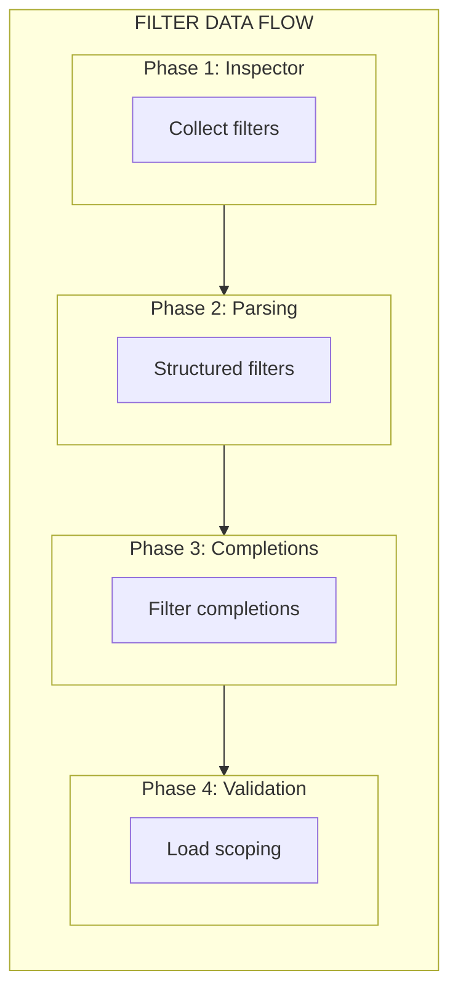

# M4: Filters Pipeline Implementation Plan

## Overview

Implement complete filter support for Django templates:

1. **Inspector filter inventory** - Collect filters from Django with provenance (builtin vs library)
2. **Structured filter representation** - Transform `Vec<String>` → `Vec<Filter>` with name/arg/span
3. **Filter completions** - Completions in `{{ x| }}` context
4. **Unknown filter diagnostics** - Validate filters against inventory with load scoping
5. **Load scoping for filters** - Reuse M3 infrastructure for filter availability

This builds on M1 (payload shape with provenance), M2 (Salsa invalidation), and M3 (load scoping infrastructure).

## Current State Analysis

### Parser Representation (`crates/djls-templates/src/parser.rs:182-202`)

```rust
fn parse_variable(&mut self) -> Result<Node, ParseError> {
    // ...
    let mut parts = content_ref.split('|');
    let var = parts.next().ok_or(ParseError::EmptyTag)?.trim().to_string();
    let filters: Vec<String> = parts.map(|s| s.trim().to_string()).collect();
    Ok(Node::Variable { var, filters, span })
}
```

**Current limitations:**

- `filters: Vec<String>` stores raw strings like `["default:'nothing'", "title"]`
- No parsing of filter name vs argument
- No individual spans per filter
- No validation against known filters

### Node::Variable (`crates/djls-templates/src/nodelist.rs:27-31`)

```rust
Variable {
    var: String,           // e.g., "user.name"
    filters: Vec<String>,  // e.g., ["default:'nothing'", "title"]
    span: Span,            // Entire content span
}
```

### Inspector (`crates/djls-project/inspector/queries.py`)

- **Filters not collected** - Only `library.tags` is iterated, `library.filters` is ignored
- No filter inventory in the payload

### Completions (`crates/djls-ide/src/completions.rs:67-70, 327-329`)

- `TemplateCompletionContext::Filter { partial }` - Placeholder, returns empty vec
- No detection of `{{ var|` context in `analyze_template_context()`

### Validation (`crates/djls-semantic/`)

- **No filter validation** - `filters` field is passed through but never validated

## Desired End State

Per charter section M4:

1. **Filter completions** appear in `{{ var|` context
2. **Unknown filter** produces diagnostic: `"Unknown filter 'xyz'"`
3. **Unloaded filter** produces diagnostic: `"Filter 'escape' requires "`
4. **Filter scoping** respects `` (reuses M3 infrastructure)
5. **Inspector reports filter inventory** with provenance consistent with M1

### Filter Provenance (Mirrors Tag Provenance from M1)

```python
# Python payload
{
    "name": "date",
    "provenance": {"builtin": {"module": "django.template.defaultfilters"}},
    "defining_module": "django.template.defaultfilters",
    "doc": "Formats a date...",
    "expects_arg": true  # optional enrichment
}
```

```rust
// Rust types
pub enum FilterProvenance {
    Library { load_name: String, module: String },
    Builtin { module: String },
}
```

## What We're NOT Doing

- **Filter arity/signature validation** - That's M5/M6 scope (extraction)
- **Filter argument type checking** - Runtime concern
- **Cross-template state** - Future work
- **Safe/autoescape flags** - Not needed for basic validation

---

## Implementation Approach

**Critical breakpoint**: The parser filter representation change (`Vec<String>` → `Vec<Filter>`) touches many layers. This is explicitly handled in **Phase 2** with a clear strategy: update all consumers in one pass.

### Architecture Overview



**Phase Details:**

1. **Inspector Filter Inventory** (`queries.py`)
    - Iterate `library.filters.items()` (not just `library.tags`)
    - Return `TemplateFilter { name, module, doc, provenance }`

2. **Structured Filter Parsing** (`djls-templates`)
    - Transform `"default:'nothing'"` → `Filter { name: "default", arg: Some("'nothing'"), span }`
    - `filters: Vec<Filter>` instead of `Vec<String>`
    - **BREAKPOINT**: Parser changes happen here

3. **Completions** (`djls-ide`)
    - Detect `{{ x|` context in `analyze_template_context()`
    - `generate_filter_completions(inventory, loaded_libs, position)`

4. **Validation with Load Scoping** (`djls-semantic`)
    - Reuse M3 `LoadedLibraries` infrastructure
    - S111: Unknown filter "xyz"
    - S112: Filter "X" requires ``
    - S113: Ambiguous filter (multiple libraries)

---

## Phase Documents

This plan is split into phase-specific documents for easier navigation:

- [Phase 1: Inspector Filter Inventory (via Project Field)](2026-02-05-m4.1-filters-pipeline.md)
- [Phase 2: Structured Filter Representation (BREAKPOINT)](2026-02-05-m4.2-filters-pipeline.md)
- [Phase 3: Filter Completions](2026-02-05-m4.3-filters-pipeline.md)
- [Phase 4: Filter Validation with Load Scoping](2026-02-05-m4.4-filters-pipeline.md)

## Testing Strategy

### Unit Tests

#### Parser Tests (`crates/djls-templates/src/parser.rs`)

```rust
#[test]
fn test_parse_filter_with_arg() {
    let source = "{{ value|default:'fallback' }}";
    let nodelist = parse_test_template(source);
    insta::assert_yaml_snapshot!(convert_nodelist_for_testing(&nodelist));
}

#[test]
fn test_parse_filter_chain_with_args() {
    let source = "{{ value|default:'x'|date:'Y-m-d' }}";
    let nodelist = parse_test_template(source);
    insta::assert_yaml_snapshot!(convert_nodelist_for_testing(&nodelist));
}

#[test]
fn test_parse_filter_no_arg() {
    let source = "{{ value|title|upper }}";
    let nodelist = parse_test_template(source);
    insta::assert_yaml_snapshot!(convert_nodelist_for_testing(&nodelist));
}

#[test]
fn test_parse_filter_quoted_colon() {
    // Colon inside quoted arg should not split
    let source = "{{ value|default:'time:12:30' }}";
    let nodelist = parse_test_template(source);
    insta::assert_yaml_snapshot!(convert_nodelist_for_testing(&nodelist));
}

#[test]
fn test_parse_filter_empty_chain() {
    // Trailing pipe with nothing after
    let source = "{{ value| }}";
    let nodelist = parse_test_template(source);
    insta::assert_yaml_snapshot!(convert_nodelist_for_testing(&nodelist));
}

#[test]
fn test_filter_spans() {
    // Verify span positions are accurate
    let source = "{{ v|a|b:x }}";
    let nodelist = parse_test_template(source);
    // Filter 'a' should span positions 5-6
    // Filter 'b:x' should span positions 7-10
    insta::assert_yaml_snapshot!(convert_nodelist_for_testing(&nodelist));
}
```

#### Completion Tests (`crates/djls-ide/src/completions.rs`)

```rust
#[test]
fn test_filter_context_detection() {
    // After pipe
    let ctx = analyze_template_context("{{ value|", 9);
    assert!(matches!(ctx, Some(TemplateCompletionContext::Filter { partial, .. }) if partial.is_empty()));

    // Partial filter name
    let ctx = analyze_template_context("{{ value|def", 12);
    assert!(matches!(ctx, Some(TemplateCompletionContext::Filter { partial, .. }) if partial == "def"));

    // After space (still in filter context)
    let ctx = analyze_template_context("{{ value| ", 10);
    assert!(matches!(ctx, Some(TemplateCompletionContext::Filter { partial, .. }) if partial.is_empty()));
}

#[test]
fn test_filter_completions_builtin() {
    // Builtin filters should always appear
    let filters = make_test_filter_inventory();
    let completions = generate_filter_completions(
        "",
        &VariableClosingBrace::None,
        Some(&filters),
        None, // No load info
        0,
    );

    let labels: Vec<_> = completions.iter().map(|c| c.label.as_str()).collect();
    assert!(labels.contains(&"title"));
    assert!(labels.contains(&"upper"));
    assert!(labels.contains(&"default"));
}

#[test]
fn test_filter_completions_scoped() {
    // i18n filters should NOT appear without load
    let filters = make_test_filter_inventory_with_i18n();
    let loaded = LoadedLibraries::new(); // Empty

    let completions = generate_filter_completions(
        "",
        &VariableClosingBrace::None,
        Some(&filters),
        Some(&loaded),
        50,
    );

    let labels: Vec<_> = completions.iter().map(|c| c.label.as_str()).collect();
    // Assuming 'localize' is an i18n filter
    assert!(!labels.contains(&"localize"));
}
```

#### Validation Tests (`crates/djls-semantic/src/load_resolution.rs`)

```rust
#[test]
fn test_unknown_filter_diagnostic() {
    // {{ value|nonexistent }} should produce S111
    // ... test setup with db ...
}

#[test]
fn test_unloaded_filter_diagnostic() {
    // {{ value|localize }} without  should produce S112
    // ... test setup with db ...
}

#[test]
fn test_filter_after_load_valid() {
    // {{ value|localize }} should NOT produce diagnostic
    // ... test setup with db ...
}

#[test]
fn test_builtin_filter_always_valid() {
    // {{ value|title }} should NEVER produce diagnostic
    // ... test setup with db ...
}
```

### Integration Tests

Create test templates:

```html
{# test_filter_scoping.html #} {# 1. Builtin filters work everywhere #} {{ value|title }} {{
value|upper|lower }} {# 2. Unknown filter - should error #} {{ value|nonexistent }} {# S111 expected
#} {# 3. Library filter BEFORE load - should error #} {{ value|localize }} {# S112 expected #} {# 4.
Load the library #}  {# 5. Library filter AFTER load - valid #} {{ value|localize }}
{# No error #}
```

```html
{# test_filter_with_args.html #} {# Filter arguments should parse correctly #} {{
value|default:'fallback' }} {{ value|date:'Y-m-d H:i:s' }} {{ value|default:"with:colon" }} {{
value|floatformat:2 }} {# Chain with mixed args #} {{ value|default:'x'|title|truncatewords:3 }}
```

### Manual Testing Steps

1. **Filter completions appear**:
    - Type `{{ value|` - should see filter list
    - Type `{{ value|def` - should filter to `default`
    - Verify documentation appears in completion detail

2. **Unknown filter diagnostic**:
    - Type `{{ value|fakefiltername }}` - should see S111 squiggle

3. **Unloaded filter diagnostic**:
    - Type `{{ value|localize }}` - should see S112 squiggle
    - Add `` before it - squiggle should disappear

4. **Builtin filters never error**:
    - `{{ value|title|upper|default:'x' }}` - no diagnostics

---

## Performance Considerations

- **Filter inventory cached**: Fetched once via Salsa tracked query
- **Load state computed once**: `compute_loaded_libraries` is cached per file revision
- **Completion filtering**: O(f) where f = total filters (typically ~50-100)
- **Validation**: O(v×f) where v = variables with filters in template, f = filters per variable (typically small)

---

## Migration Notes

### Parser Representation Change (Phase 2)

**This is a breaking change** to `Node::Variable` structure. All consumers must be updated simultaneously:

| Consumer                          | Update Required                               |
| --------------------------------- | --------------------------------------------- |
| `djls-semantic/blocks/tree.rs`    | Change `NodeView::Variable` filters type      |
| `djls-semantic/blocks/builder.rs` | Pattern match (likely unchanged)              |
| `djls-ide/context.rs`             | Change `OffsetContext::Variable` filters type |
| Snapshot tests                    | All filter snapshots need update              |

**Strategy**: Single PR, update all consumers, run `cargo test --all` with snapshot updates.

### New Inspector Query

The `templatefilters` query is new. Older djls versions won't have it, but the Salsa query returns `Option<TemplateFilters>`, so missing data is handled gracefully.

---

## References

- Charter: [`.agents/charter/2026-02-05-template-validation-port-charter.md`](../charter/2026-02-05-template-validation-port-charter.md) (Section M4)
- M1 Plan: [`.agents/plans/2026-02-05-m1-payload-library-name-fix.md`](2026-02-05-m1-payload-library-name-fix.md) (TagProvenance pattern)
- M3 Plan: [`.agents/plans/2026-02-05-m3-load-scoping.md`](2026-02-05-m3-load-scoping.md) (LoadedLibraries infrastructure)
- Research: [`.agents/research/2026-02-04_template-filters-analysis.md`](../research/2026-02-04_template-filters-analysis.md)
- Research: [`.agents/research/2026-02-04_load-tag-library-scoping.md`](../research/2026-02-04_load-tag-library-scoping.md)
