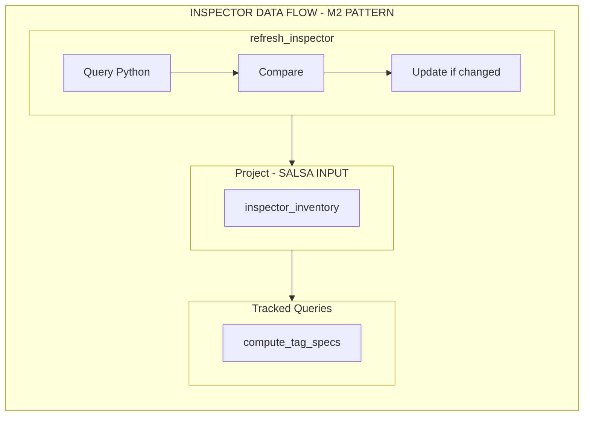

# M4: Filters Pipeline - Phase 1

> **Parent document**: [M4: Filters Pipeline Overview](2026-02-05-m4-filters-pipeline.md)

---

## Phase 1: Inspector Filter Inventory (via Project Field)

### Overview

Add filter collection to the Python inspector and store it on `Project` alongside the tag inventory. **Per M2 architecture**, inspector queries happen in `refresh_inspector()` (side-effect), not tracked queries. Tracked queries only read from Salsa-visible Project fields.

**Key M2 constraint**: No `#[salsa::tracked]` query should call the inspector. Instead:

1. `refresh_inspector()` queries the unified template inventory (tags + filters) in one call
2. Results are stored in Project fields (single snapshot object to avoid split-brain)
3. Downstream tracked queries read from Project fields only

### Architecture (M2-Compliant)

**Key decision**: Single unified inspector query (`template_inventory`) returns tags + filters + registry data in **one response**. This minimizes IPC overhead (one round trip) and eliminates partial-success failure modes.



**`refresh_inspector()` steps** (side-effect, NOT tracked):
1. Query Python: `inspector::query(db, &TemplateInventoryRequest)` — **single round trip** returns tags + filters + libraries + builtins
2. Compare with current `Project.inspector_inventory(db)`
3. If changed: `project.set_inspector_inventory(db).to(new_inventory)` — single atomic setter call

**`Project.inspector_inventory` field:**
- `tags: Vec<TemplateTag>`
- `filters: Vec<TemplateFilter>`
- `libraries: HashMap<String, String>` (load_name → module_path)
- `builtins: Vec<String>` (ordered module paths)

**Tracked queries read Project only:**
- `compute_tag_specs(db, project)` reads `project.inspector_inventory(db)`

**Type evolution (M4 change)**: This plan introduces `InspectorInventory` as the unified inspector snapshot type, replacing the M1/M2 `TemplateTags` type. All downstream consumers (tag scoping from M3, filter scoping, completions) read from this unified type. We're optimizing for correctness + performance, not M1/M2 type stability.

### Changes Required:

#### 1. Add Filter Data Structure

**File**: `crates/djls-project/inspector/queries.py`
**Changes**: Add TemplateFilter dataclass

```python
@dataclass
class TemplateFilter:
    name: str
    provenance: dict  # {"library": {"load_name": str, "module": str}} | {"builtin": {"module": str}}
    defining_module: str
    doc: str | None
```

#### 2. Add Unified Inventory Query (Single Round Trip)

**File**: `crates/djls-project/inspector/queries.py`
**Changes**: Add new unified query returning tags + filters in one response

**Rationale**: Single query minimizes IPC overhead (one round trip) and eliminates partial-success failure modes. The old `templatetags` query can remain for backwards compatibility, but M4+ switches to this unified query.

```python
class Query(str, Enum):
    DJANGO_INIT = "django_init"
    PYTHON_ENV = "python_env"
    TEMPLATE_DIRS = "template_dirs"
    TEMPLATETAGS = "templatetags"             # Legacy (M1 compat)
    TEMPLATE_INVENTORY = "template_inventory"  # NEW: unified query (M4+)


@dataclass
class TemplateInventoryQueryData:
    """Unified template inventory: tags + filters + registry in one snapshot."""
    libraries: dict[str, str]   # load_name → module_path
    builtins: list[str]         # ordered builtin module paths
    templatetags: list[TemplateTag]
    templatefilters: list[TemplateFilter]


def get_template_inventory() -> TemplateInventoryQueryData:
    """Get unified template inventory (tags + filters) in a single query.

    This is the preferred query for M4+. Returns everything needed for
    tag/filter validation and completions in one IPC round trip.
    """
    import django
    from django.apps import apps
    from django.template.engine import Engine
    from django.template.library import import_library

    if not apps.ready:
        django.setup()

    engine = Engine.get_default()
    templatetags: list[TemplateTag] = []
    templatefilters: list[TemplateFilter] = []

    # Preserve registry structures
    libraries = dict(engine.libraries)
    builtins = list(engine.builtins)

    # Sanity check
    if len(engine.builtins) != len(engine.template_builtins):
        raise RuntimeError(
            f"engine.builtins ({len(engine.builtins)}) and "
            f"engine.template_builtins ({len(engine.template_builtins)}) length mismatch"
        )

    # Collect builtins (both tags AND filters)
    for builtin_module, library in zip(engine.builtins, engine.template_builtins):
        if library.tags:
            for tag_name, tag_func in library.tags.items():
                templatetags.append(
                    TemplateTag(
                        name=tag_name,
                        provenance={"builtin": {"module": builtin_module}},
                        defining_module=tag_func.__module__,
                        doc=tag_func.__doc__,
                    )
                )
        if library.filters:
            for filter_name, filter_func in library.filters.items():
                templatefilters.append(
                    TemplateFilter(
                        name=filter_name,
                        provenance={"builtin": {"module": builtin_module}},
                        defining_module=filter_func.__module__,
                        doc=filter_func.__doc__,
                    )
                )

    # Collect library tags AND filters
    for load_name, lib_module in engine.libraries.items():
        library = import_library(lib_module)
        if library:
            if library.tags:
                for tag_name, tag_func in library.tags.items():
                    templatetags.append(
                        TemplateTag(
                            name=tag_name,
                            provenance={"library": {"load_name": load_name, "module": lib_module}},
                            defining_module=tag_func.__module__,
                            doc=tag_func.__doc__,
                        )
                    )
            if library.filters:
                for filter_name, filter_func in library.filters.items():
                    templatefilters.append(
                        TemplateFilter(
                            name=filter_name,
                            provenance={"library": {"load_name": load_name, "module": lib_module}},
                            defining_module=filter_func.__module__,
                            doc=filter_func.__doc__,
                        )
                    )

    return TemplateInventoryQueryData(
        libraries=libraries,
        builtins=builtins,
        templatetags=templatetags,
        templatefilters=templatefilters,
    )
```

#### 2b. Update QueryData Union

**File**: `crates/djls-project/inspector/queries.py`
**Changes**: Add new type to union

```python
QueryData = (
    PythonEnvironmentQueryData
    | TemplateDirsQueryData
    | TemplateTagQueryData
    | TemplateInventoryQueryData  # NEW: unified inventory
)
```

#### 3. Add Rust Filter Types

**File**: `crates/djls-project/src/django.rs`
**Changes**: Add filter types

```rust
/// Provenance of a template filter - either from a loadable library or a builtin
#[derive(Debug, Clone, PartialEq, Eq, Deserialize)]
#[serde(rename_all = "lowercase")]
pub enum FilterProvenance {
    /// Filter requires `` to use
    Library {
        load_name: String,
        module: String,
    },
    /// Filter is always available (builtin)
    Builtin {
        module: String,
    },
}

#[derive(Debug, Clone, PartialEq, Eq, Deserialize)]
pub struct TemplateFilter {
    name: String,
    provenance: FilterProvenance,
    defining_module: String,
    doc: Option<String>,
}

impl TemplateFilter {
    pub fn name(&self) -> &str {
        &self.name
    }

    pub fn provenance(&self) -> &FilterProvenance {
        &self.provenance
    }

    pub fn defining_module(&self) -> &str {
        &self.defining_module
    }

    pub fn doc(&self) -> Option<&str> {
        self.doc.as_deref()
    }

    pub fn library_load_name(&self) -> Option<&str> {
        match &self.provenance {
            FilterProvenance::Library { load_name, .. } => Some(load_name),
            FilterProvenance::Builtin { .. } => None,
        }
    }

    pub fn is_builtin(&self) -> bool {
        matches!(self.provenance, FilterProvenance::Builtin { .. })
    }
}
```

#### 4. Create Unified InspectorInventory Type

**File**: `crates/djls-project/src/django.rs`
**Changes**: Create single snapshot object for Project field

```rust
/// Combined inspector inventory (tags + filters) stored on Project.
///
/// This is a single snapshot to prevent split-brain between tag and filter data.
/// Per M2 architecture, this is stored as a Project field (Salsa input), not
/// computed by a tracked query calling the inspector.
#[derive(Debug, Default, Clone, PartialEq)]
pub struct InspectorInventory {
    /// Load-name → module path mapping
    pub libraries: HashMap<String, String>,
    /// Ordered builtin module paths
    pub builtins: Vec<String>,
    /// Tag inventory
    pub tags: Vec<TemplateTag>,
    /// Filter inventory
    pub filters: Vec<TemplateFilter>,
}

impl InspectorInventory {
    pub fn new(
        libraries: HashMap<String, String>,
        builtins: Vec<String>,
        tags: Vec<TemplateTag>,
        filters: Vec<TemplateFilter>,
    ) -> Self {
        Self { libraries, builtins, tags, filters }
    }

    pub fn tags(&self) -> &[TemplateTag] {
        &self.tags
    }

    pub fn filters(&self) -> &[TemplateFilter] {
        &self.filters
    }

    pub fn libraries(&self) -> &HashMap<String, String> {
        &self.libraries
    }

    pub fn builtins(&self) -> &[String] {
        &self.builtins
    }

    pub fn tag_count(&self) -> usize {
        self.tags.len()
    }

    pub fn filter_count(&self) -> usize {
        self.filters.len()
    }
}
```

#### 5. Update Project Input (Per M2)

**File**: `crates/djls-project/src/project.rs`
**Changes**: Change `inspector_inventory` field type

```rust
// Change from:
pub inspector_inventory: Option<TemplateTags>,

// To:
pub inspector_inventory: Option<InspectorInventory>,
```

#### 6. Add Unified Inventory Request/Response Types

**File**: `crates/djls-project/src/django.rs`
**Changes**: Add unified query types

```rust
#[derive(Debug, Clone, Serialize, Deserialize)]
pub struct TemplateInventoryRequest;

impl InspectorRequest for TemplateInventoryRequest {
    const QUERY: &'static str = "template_inventory";
    type Response = TemplateInventoryResponse;
}

#[derive(Deserialize)]
pub struct TemplateInventoryResponse {
    pub libraries: HashMap<String, String>,
    pub builtins: Vec<String>,
    pub templatetags: Vec<TemplateTag>,
    pub templatefilters: Vec<TemplateFilter>,
}
```

#### 7. Update refresh_inspector() to Use Single Unified Query

**File**: `crates/djls-server/src/db.rs`
**Changes**: Single query, atomic setter

```rust
impl DjangoDatabase {
    /// Refresh the inspector inventory by querying Python.
    ///
    /// This method (per M2 architecture):
    /// 1. Queries Python ONCE: inspector::query(db, &TemplateInventoryRequest)
    ///    (Single round trip - returns tags + filters + libraries + builtins)
    /// 2. Compares with current Project.inspector_inventory
    /// 3. Updates Project field via atomic setter if changed
    pub fn refresh_inspector(&mut self) {
        let Some(project) = self.project() else {
            tracing::warn!("Cannot refresh inspector: no project set");
            return;
        };

        // Single query returning unified inventory
        let new_inventory = inspector::query(self, &TemplateInventoryRequest)
            .map(|response| InspectorInventory::new(
                response.libraries,
                response.builtins,
                response.templatetags,
                response.templatefilters,
            ));

        // Compare before setting (M2 pattern)
        let current = project.inspector_inventory(self);
        if current != &new_inventory {
            tracing::debug!(
                "Inspector inventory changed: {} tags, {} filters -> {} tags, {} filters",
                current.as_ref().map_or(0, |i| i.tag_count()),
                current.as_ref().map_or(0, |i| i.filter_count()),
                new_inventory.as_ref().map_or(0, |i| i.tag_count()),
                new_inventory.as_ref().map_or(0, |i| i.filter_count()),
            );
            project.set_inspector_inventory(self).to(new_inventory);
        }
    }
}
```

#### 8. Add Helper Methods for Downstream Access

**File**: `crates/djls-semantic/src/db.rs`
**Changes**: Add accessor that returns filter slice from Project

```rust
#[salsa::db]
pub trait Db: TemplateDb {
    // ... existing methods ...

    fn inspector_inventory(&self) -> Option<&InspectorInventory>;

    // Convenience methods that delegate to inventory
    fn filter_inventory(&self) -> Option<&[TemplateFilter]> {
        self.inspector_inventory().map(|i| i.filters())
    }
}
```

#### 9. Export Types

**File**: `crates/djls-project/src/lib.rs`
**Changes**: Export new types

```rust
pub use django::FilterProvenance;
pub use django::TemplateFilter;
pub use django::InspectorInventory;
```

### Success Criteria:

#### Automated Verification:

- [ ] Cargo build passes: `cargo build -p djls-project`
- [ ] Clippy passes: `cargo clippy -p djls-project --all-targets -- -D warnings`
- [ ] Unit tests pass: `cargo test -p djls-project`
- [ ] Inspector unified test: `echo '{"query":"template_inventory"}' | python crates/djls-project/inspector/__main__.py`

#### Manual Verification:

- [ ] **CRITICAL (single query)**: Verify `template_inventory` query returns BOTH tags AND filters in one response
- [ ] Verify response contains `templatetags` array with known builtin tag (e.g., `if`)
- [ ] Verify response contains `templatefilters` array with known builtin filter (e.g., `date`, `default`)
- [ ] Confirm builtin filters have `Builtin` provenance
- [ ] Confirm library filters have `Library { load_name, ... }` provenance
- [ ] Verify `refresh_inspector()` makes exactly ONE inspector call (structural review / logging)

#### Single-Query Validation Tests:

Add a test that verifies single IPC round trip:

```rust
#[test]
fn test_refresh_inspector_single_query() {
    // Setup: mock/spy inspector to count queries
    // Action: call refresh_inspector()
    // Assert: exactly 1 inspector query was made (template_inventory)
    // Assert: returned inventory contains both tags and filters
}

#[test]
fn test_unified_query_contains_both() {
    // Query template_inventory directly
    // Assert: response.templatetags is non-empty (has builtins like "if", "for")
    // Assert: response.templatefilters is non-empty (has builtins like "date", "default", "length")
    // Assert: libraries and builtins registries are populated
}
```

**Implementation Note**: After completing this phase, pause for manual confirmation that the unified inventory is correct before proceeding.

---
