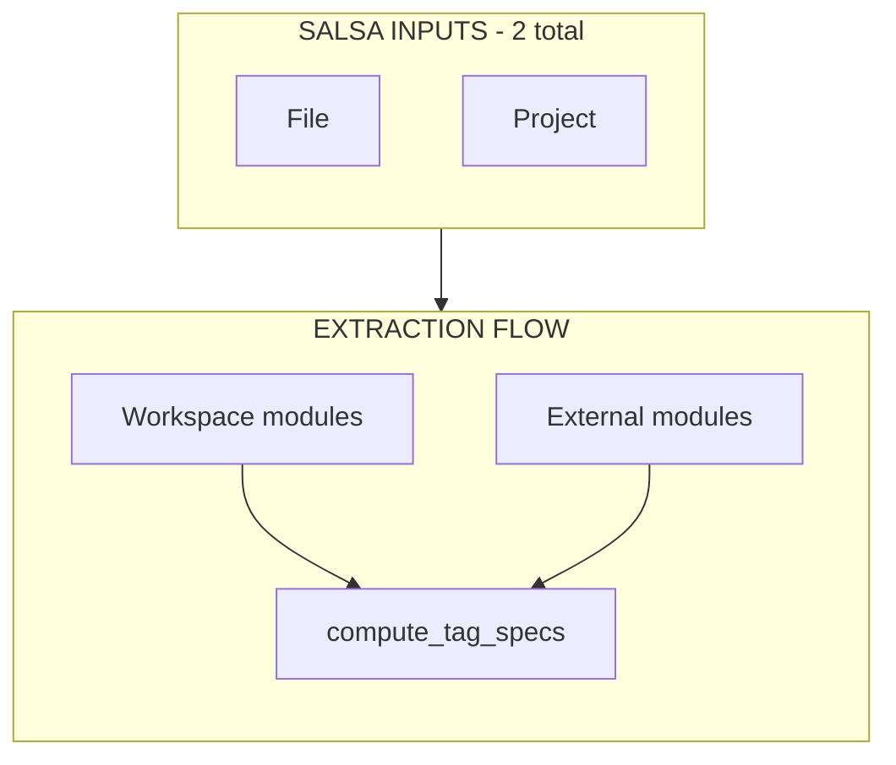

# M5: Extraction Engine (Rules Enrichment) Implementation Plan

## Overview

Implement Rust-side rule mining using Ruff AST to derive validation semantics from Python template tag/filter registration modules. This enriches the inspector inventory with validation rules (argument counts, block structure, option constraints) that power M6 rule evaluation.

**Key architectural principles:**

1. Python inspector provides **authoritative inventory** (what exists + provenance + registry)
2. Rust does **AST extraction** (validation semantics) - no Python AST analysis in inspector
3. Salsa inputs stay minimal: `File` + `Project` only - no new global inputs
4. Extraction results keyed by `SymbolKey` to avoid collisions across libraries

**Critical extraction constraints (non-negotiable):**

1. **No `end*` string heuristics** for end-tag inference - infer closers from control flow patterns only
2. **No hardcoded split variable name** - detect the variable bound to `token.split_contents()` dynamically
3. **Conservative fallback** - emit `None` for block specs when inference is ambiguous

## Current State Analysis

### Inspector Payload (Post-M4)

From M4, `Project.inspector_inventory` contains:

```rust
pub struct InspectorInventory {
    pub libraries: HashMap<String, String>,  // load_name → module_path
    pub builtins: Vec<String>,               // ordered builtin module paths
    pub tags: Vec<TemplateTag>,              // provenance.{library,builtin}.module
    pub filters: Vec<TemplateFilter>,        // provenance.{library,builtin}.module
}
```

**Key**: Each tag/filter carries `provenance.module` - the **registration module** where `@register.tag` is called. This is the extraction target.

### What Extraction Adds

| Existing (M1-M4)            | M5 Adds                                       |
| --------------------------- | --------------------------------------------- |
| Tag names + provenance      | Argument validation rules                     |
| Filter names + provenance   | Filter arity (arg count)                      |
| Library/builtin distinction | Block specs (end_tag, intermediate)           |
| -                           | Option constraints (known values, duplicates) |
| -                           | Opaque block specs (verbatim-like)            |

### Key Files to Reference

| Location                                            | Content                    |
| --------------------------------------------------- | -------------------------- |
| `crates/djls-semantic/src/templatetags/specs.rs`    | `TagSpec`, `TagArg` types  |
| `crates/djls-semantic/src/templatetags/builtins.rs` | Handcoded specs to replace |
| `crates/djls-project/inspector/queries.py`          | Inspector query pattern    |
| `crates/djls-source/src/file.rs`                    | `File` Salsa input pattern |
| `crates/djls-server/src/db.rs`                      | Salsa query patterns       |

## Desired End State

After M5 (9 phases):

1. **`djls-extraction` crate exists** with pure API: `extract_rules(&str) -> ExtractionResult`
2. **Registration discovery** finds `@register.tag`/`@register.filter` decorators
3. **Function context detection** identifies split-contents variable dynamically (not hardcoded `bits`)
4. **Rule extraction** derives validation conditions from TemplateSyntaxError guards
5. **Block spec extraction** infers end-tags from control flow patterns (NO string heuristics)
6. **Filter arity extraction** determines argument requirements
7. **Salsa integration** wires extraction into tracked queries with proper invalidation
8. **Small fixture golden tests** verify individual patterns (fast, always-run)
9. **Corpus/full-source tests** validate at Django + ecosystem scale (env-gated)

### Dependency Graph (Post-M5)



**Salsa inputs (unchanged: 2 total):**

- `File`: `path`, `revision` — workspace Python files become extraction deps
- `Project`: `inspector_inventory` + `extracted_external_rules` + `tagspecs` + ...

**Extraction flow:**

- **Workspace registration modules:**
    - `extract_module_rules(db, file: File) → ExtractionResult` (salsa::tracked)
    - File change → automatic re-extraction
- **External modules (site-packages):**
    - Extracted in `refresh_inspector()`, not as tracked queries
    - Stored on `Project.extracted_external_rules`
- **`compute_tag_specs(db, project)`** merges all sources (salsa::tracked):
    1. `django_builtin_specs()` — compile-time constant
    2. Extracted rules from workspace modules — tracked queries
    3. Extracted rules from external modules — Project field
    4. User config overrides — `Project.tagspecs` field

## What We're NOT Doing

- **Python-side AST analysis**: Inspector reports only inventory, not validation rules
- **New Salsa inputs**: No `ExtractedRules` input - use tracked queries over `File`
- **Type checking Python code**: Extract statically provable patterns only
- **Import tracing**: Don't follow Python imports beyond registration module
- **Immediate builtins.rs removal**: Keep as fallback; extraction enriches/overrides
- **Full parity with template_linter patterns**: Start with core patterns, expand incrementally
- **String-based end-tag heuristics**: No `starts_with("end")` or similar name matching
- **Hardcoded variable names**: No assuming `bits` - detect from `token.split_contents()` binding
- **Guessing when uncertain**: If end-tag inference is ambiguous, return `None` - never guess

---

## Phase Documents

This plan is split into phase-specific documents for easier navigation:

- [Phase 1: Create `djls-extraction` Crate with Ruff Parser](2026-02-05-m5.1-extraction-engine.md)
- [Phase 2: Implement Registration Discovery](2026-02-05-m5.2-extraction-engine.md)
- [Phase 3: Implement Function Context Detection](2026-02-05-m5.3-extraction-engine.md)
- [Phase 4: Implement Rule Extraction](2026-02-05-m5.4-extraction-engine.md)
- [Phase 5: Implement Block Spec Extraction (Control-Flow Based)](2026-02-05-m5.5-extraction-engine.md)
- [Phase 6: Implement Filter Arity Extraction](2026-02-05-m5.6-extraction-engine.md)
- [Phase 7: Salsa Integration](2026-02-05-m5.7-extraction-engine.md)
- [Phase 8: Small Fixture Golden Tests (Tier 1)](2026-02-05-m5.8-extraction-engine.md)
- [Phase 9: Corpus / Full-Source Extraction Tests](2026-02-05-m5.9-extraction-engine.md)

## Testing Strategy Summary

### Two-Tier Testing Approach

| Tier                           | Location                            | Gating                                        | Purpose                               |
| ------------------------------ | ----------------------------------- | --------------------------------------------- | ------------------------------------- |
| **Tier 1: Unit/Fixture**       | `tests/golden.rs`, inline `#[test]` | Always runs                                   | Fast, deterministic, pattern-focused  |
| **Tier 2: Corpus/Full-source** | `tests/corpus.rs`                   | Corpus synced (auto-detects default location) | Scale validation, real-world coverage |

### Tier 1: Unit Tests

| Category     | Coverage                                          |
| ------------ | ------------------------------------------------- |
| Registration | Decorators with various names                     |
| Context      | Split variable detection: `bits`, `args`, `parts` |
| Rules        | All condition types, using detected variable      |
| Structural   | End-tag inference WITHOUT string heuristics       |
| Filters      | Arity detection                                   |

### Tier 2: Corpus Tests

| Category             | Gating                                     | Coverage                                          | Lifetime                        |
| -------------------- | ------------------------------------------ | ------------------------------------------------- | ------------------------------- |
| No panics            | Corpus synced                              | Extraction handles all real-world Python patterns | **Permanent**                   |
| Yield metrics        | Corpus synced                              | Corpus produces meaningful tag/filter counts      | **Permanent**                   |
| Django versions      | Corpus synced                              | Golden snapshots across Django 4.2-6.0            | **Permanent**                   |
| Unsupported tracking | Corpus synced                              | Counts of opaque rules, ambiguous blocks          | **Permanent**                   |
| Parity oracle        | `DJLS_PY_ORACLE=1` + `DJLS_PY_ORACLE_PATH` | Comparison with Python prototype                  | **TEMPORARY** (delete after M6) |

### Key Invariants Verified by Tests

1. **No hardcoded `bits`**: Tests use `args`, `parts`, etc. and verify extraction works
2. **Primary signals first**: `test_singleton_closer_pattern` proves `if`→`endif` via control flow, not naming
3. **No `end*` heuristics**: `test_non_end_prefix_closer` and `test_generic_tag_with_non_conventional_closer` prove we don't rely on naming
4. **Never guess**: `test_ambiguous_returns_none` verifies `end_tag: None` when uncertain
5. **Never invent**: `test_django_convention_not_invented` verifies we don't create end tags from thin air
6. **Convention is tie-breaker for ALL block tags**: `test_django_convention_fallback` selects `end{tag}` only when present in stop-tags
7. **Ambiguity blocks fallback**: `test_django_convention_blocked_by_singleton_ambiguity` verifies competing signals prevent convention
8. **Decorator default vs convention**: `test_simple_block_tag_without_end_name_uses_django_default` is Django-defined semantic (decorator-level), distinct from convention fallback
9. **Corpus diversity**: `test_corpus_no_hardcoded_bits_assumption` confirms corpus has non-`bits` variables

---

## References

- Charter: [`.agents/charter/2026-02-05-template-validation-port-charter.md`](../charter/2026-02-05-template-validation-port-charter.md)
- RFC: [`.agents/rfcs/2026-02-05-rfc-extraction-placement.md`](../rfcs/2026-02-05-rfc-extraction-placement.md)
- Research: [`.agents/research/2026-02-04_python-ast-parsing-rust.md`](../research/2026-02-04_python-ast-parsing-rust.md)
- M2 Plan: [`.agents/plans/2026-02-05-m2-salsa-invalidation-plumbing.md`](2026-02-05-m2-salsa-invalidation-plumbing.md)
- M4 Plan: [`.agents/plans/2026-02-05-m4-filters-pipeline.md`](2026-02-05-m4-filters-pipeline.md)
