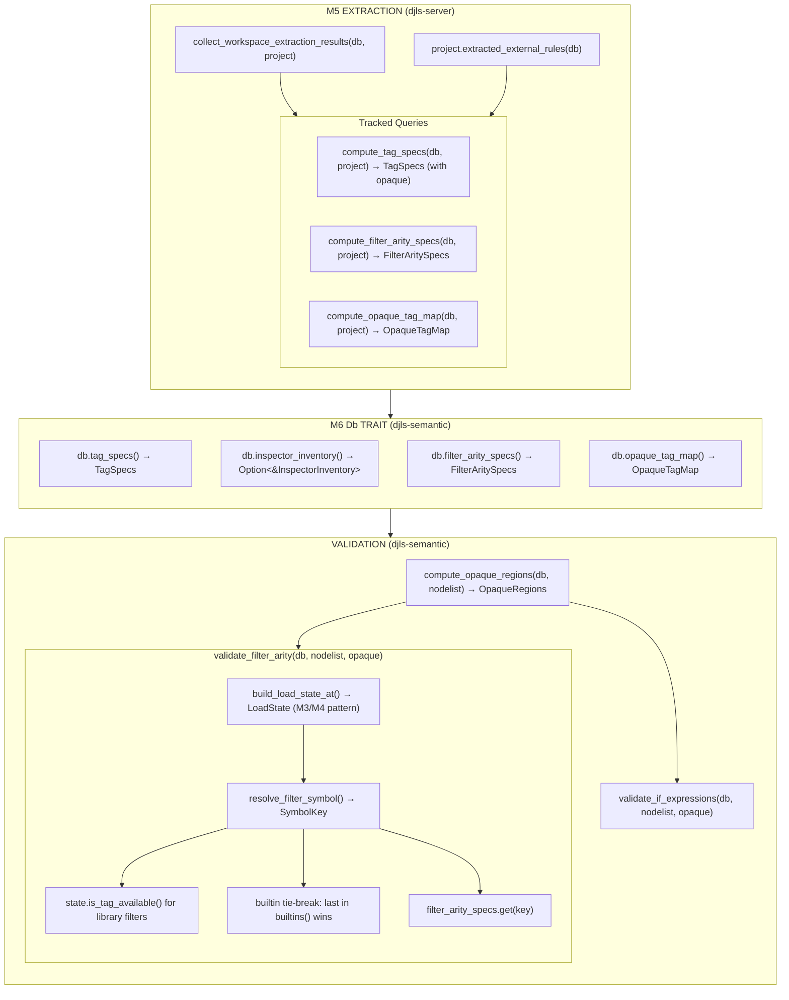

# M6: Rule Evaluation + Expression Validation

## Overview

Apply M5's extracted validation rules to the existing semantic validation pipeline:
- **Expression validation**: Port Django's `smartif.py` Pratt parser for ``/``
- **Filter arity validation**: Use M4's structured `Filter` + M5's extracted `FilterArity` with scope-correct resolution
- **Opaque block handling**: Skip validation inside opaque regions using `TagSpec.opaque` (persisted by M5)

## Dependencies on Prior Milestones

### From M3

- **`LoadState` state machine** (M3): Tracks load statements in document order, handles selective imports (``)
- **`LoadState::is_tag_available(symbol_name, load_name)`** (M3): Check if symbol is available at position — works for both tags and filters

### From M4

- **Structured `Filter` type** (M4.2): `Filter { name, arg, span }` in `Node::Variable.filters`
- **`TemplateFilter::registration_module()`** (M4.1): Returns the registration module for collision-safe keying
- **`Db::inspector_inventory()`** (M4.1/M4.4): Accessor for unified inventory from Project field
- **Filter scoping** (M4.4): S111-S113 for unknown/unloaded/ambiguous filters; uses `LoadState::is_tag_available()` for library filters

### From M5

- **`TagSpec.opaque: bool`** (M5.7): Persisted from `BlockTagSpec.opaque` via `merge_block_spec`
- **`compute_tag_specs(db, project)`** (M5.7): Tracked query returning enriched `TagSpecs`
- **`collect_workspace_extraction_results(db, project)`** (M5.7): Tracked query for workspace extraction
- **`Project.extracted_external_rules`** (M5.7): External extraction results
- **Filter arity in `ExtractionResult.filters`** (M5.6): `FilterArity` enum

### Existing Diagnostic Codes (Reserved)

| Code Range | Milestone | Purpose |
|------------|-----------|---------|
| S100-S107 | Pre-M3 | Block/argument validation |
| S108-S110 | M3 | Tag scoping (Unknown/Unloaded/Ambiguous) |
| S111-S113 | M4 | Filter scoping (Unknown/Unloaded/Ambiguous) |
| **S114-S116** | **M6** | Expression/filter-arity (NEW) |

## Desired End State

After M6:

1. **Expression validation**: `` → S114: "Not expecting 'and' in this position"
2. **Filter arity**: `{{ x|truncatewords }}` → S115: "Filter 'truncatewords' requires an argument"
3. **Filter arity**: `{{ x|title:"arg" }}` → S116: "Filter 'title' does not accept an argument"
4. **Opaque regions**: `` → no validation errors inside

### New Diagnostic Codes (M6)

| Code | Error Type | Example |
|------|------------|---------|
| S114 | ExpressionSyntaxError | `` |
| S115 | FilterMissingArgument | `{{ x|truncatewords }}` |
| S116 | FilterUnexpectedArgument | `{{ x|title:"arg" }}` |

## What We're NOT Doing

- **Cross-template state**: Cycle names, partialdef tracking (deferred per PORTING.md)
- **Variable binding tracking**: ``, ``, `as var` patterns
- **ContextualRule/ExtractedRule evaluation**: Deferred (complex preconditions)
- **Block-spec wiring for validation**: M5's `merge_block_spec` already handles this

---

## Phase Documents

This plan is split into phase-specific documents for easier navigation:

- [Phase 1: Expression Parser](2026-02-05-m6.1-expression-parser.md) — Pratt parser for ``/``
- [Phase 2-5: Filter Arity Validation](2026-02-05-m6.2-filter-arity-validation.md) — Error types, Db trait, pipeline wiring, tests

---

## Data Flow Summary

---

## References

- Charter: [`.agents/charter/2026-02-05-template-validation-port-charter.md`](../charter/2026-02-05-template-validation-port-charter.md)
- M3: [`.agents/plans/2026-02-05-m3-load-scoping.md`](2026-02-05-m3-load-scoping.md) (LoadState, selective imports)
- M4.1: [`.agents/plans/2026-02-05-m4.1-filters-pipeline.md`](2026-02-05-m4.1-filters-pipeline.md) (`TemplateFilter::registration_module()`, `inspector_inventory()`)
- M4.4: [`.agents/plans/2026-02-05-m4.4-filters-pipeline.md`](2026-02-05-m4.4-filters-pipeline.md) (S111-S113, `LoadState::is_tag_available()` for filters)
- M5.7: [`.agents/plans/2026-02-05-m5.7-extraction-engine.md`](2026-02-05-m5.7-extraction-engine.md) (`TagSpec.opaque`, `merge_block_spec`, `merge_extracted_rules`, `from_extraction`)
- PORTING.md: [`template_linter/PORTING.md`](../../template_linter/PORTING.md)
