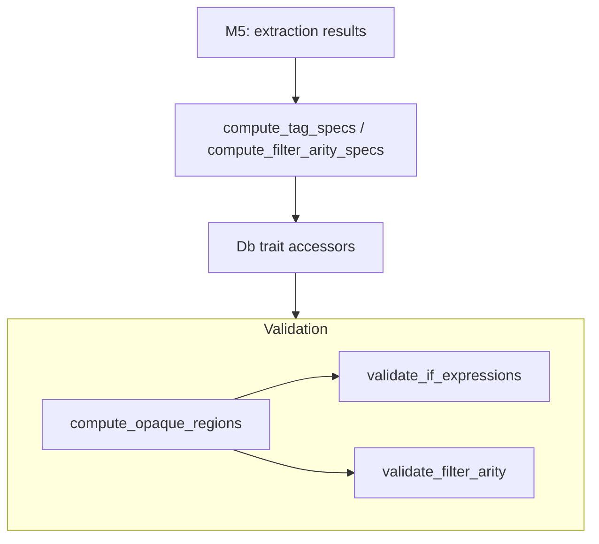

# M6: Rule Evaluation + Expression Validation

## Overview

Apply M5's extracted validation rules to the existing semantic validation pipeline:
- **Expression validation**: Port Django's `smartif.py` Pratt parser for ``/``
- **Filter arity validation**: Use M4's structured `Filter` + M5's extracted `FilterArity` with scope-correct resolution
- **Opaque block handling**: Skip validation inside opaque regions (verbatim, comment-like blocks)

## Dependencies on Prior Milestones

### From M3

- `LoadState` state machine for tracking load statements in document order
- `LoadState::is_tag_available()` for checking symbol availability at position

### From M4

- Structured `Filter` type with `name`, `arg`, `span`
- Filter scoping with S111-S113 diagnostics
- Inspector inventory accessor on Db trait

### From M5

- `TagSpec.opaque: bool` persisted from `BlockTagSpec.opaque` extraction
- Tracked queries for tag specs, extraction results
- `FilterArity` enum in extraction results
- `compute_tag_specs` merges extracted block/opaque semantics into TagSpecs

### Existing Diagnostic Code Ranges

| Code Range | Milestone | Purpose |
|------------|-----------|---------|
| S100-S107 | Pre-M3 | Block/argument validation |
| S108-S110 | M3 | Tag scoping |
| S111-S113 | M4 | Filter scoping |
| **S114-S116** | **M6** | Expression/filter-arity (NEW) |

## Desired End State

After M6:

1. **Expression validation**: `` → S114: "Not expecting 'and' in this position"
2. **Filter arity**: `{{ x|truncatewords }}` → S115: "Filter 'truncatewords' requires an argument"
3. **Filter arity**: `{{ x|title:"arg" }}` → S116: "Filter 'title' does not accept an argument"
4. **Opaque regions**: `` → no validation errors inside

### New Diagnostic Codes

| Code | Error Type | Example |
|------|------------|---------|
| S114 | ExpressionSyntaxError | `` |
| S115 | FilterMissingArgument | `{{ x|truncatewords }}` |
| S116 | FilterUnexpectedArgument | `{{ x|title:"arg" }}` |

## What We're NOT Doing

- **Cross-template state**: Cycle names, partialdef tracking
- **Variable binding tracking**: ``, ``, `as var` patterns
- **ContextualRule/ExtractedRule evaluation**: Complex preconditions deferred
- **Block-spec wiring**: M5's `merge_block_spec` already handles this

---

## Implementation Plan

### Phase 1: Expression Parser

**Goal**: Implement a Pratt parser for Django's `` / `` expression syntax, catching compile-time errors that Django's `IfParser` (smartif.py) would raise.

Port/adapt the expression parsing logic from the Python prototype (`template_linter/src/template_linter/template_syntax/if_expression.py` and `validation/if_expression.py`).

The parser should:
- Tokenize the expression portion of `` / `` tags (everything after the tag name)
- Handle operators: `and`, `or`, `not`, `in`, `not in`, `is`, `is not`, `==`, `!=`, `<`, `>`, `<=`, `>=`
- Treat operands (variables, literals) opaquely — no type checking
- Detect syntax errors: operator in operand position, missing right operand, missing operator between operands, dangling unary operator, incomplete membership test
- Produce S114 diagnostics with clear error messages

Wire into the validation pipeline:
- Run expression validation on `` and `` tags
- Skip validation inside opaque regions
- Identify opaque regions by scanning the block tree for tags where `tag_spec.opaque == true`

**Tests**: Valid expressions (all operator types), invalid expressions with expected error messages, corpus coverage (no false positives on real templates).

### Phase 2: Filter Arity Validation

**Goal**: Validate filter argument usage against extracted arity specs.

Create infrastructure for filter arity validation:
- New error variants for S115 (FilterMissingArgument) and S116 (FilterUnexpectedArgument)
- A `FilterAritySpecs` type mapping `SymbolKey → FilterArity`
- A tracked query `compute_filter_arity_specs(db, project) → FilterAritySpecs` that merges extraction results

Add `filter_arity_specs()` to the `Db` trait in `djls-semantic`.

Implement the validation pipeline:
- For each `Node::Variable` with filters, determine which extraction result applies to each filter
- **Symbol resolution for filters**: Use the M3/M4 load state to determine which library a filter comes from, then key into extraction results via `SymbolKey { registration_module, name, kind: Filter }`
- **Builtin filter resolution**: When multiple builtins define the same filter name, use "last wins" ordering from `builtins()` (matching Django semantics)
- Compare filter usage (has arg vs no arg) against extracted arity
- Skip validation inside opaque regions
- Skip validation when inspector inventory is unavailable

**Tests**: Filter with required arg missing → S115, filter with unexpected arg → S116, builtin filter validation, library filter with load scoping, opaque region skipping, inspector unavailable skipping.

### Phase 3: Opaque Region Computation

**Goal**: Compute which source regions are inside opaque blocks and should skip validation.

Create a `compute_opaque_regions(db, nodelist) → OpaqueRegions` function that:
- Walks the block tree looking for tags where `tag_spec.opaque == true`
- Records the byte spans of content inside those blocks
- Provides an `is_opaque(span) → bool` check

Both expression validation and filter arity validation use this to skip content inside ``, ``, and similar blocks.

---

## Data Flow

## Testing Strategy

### Expression Tests
- Each operator type (binary, unary, comparison, membership)
- Error cases: ``, ``, ``, ``
- Complex valid: ``
- Corpus: no false positives on Django admin templates

### Filter Arity Tests
- Missing required arg → S115
- Unexpected arg on no-arg filter → S116
- Optional arg (both with and without) → no error
- Builtin filter resolution (last wins)
- Library filter with load scoping
- Opaque region skipping

### Integration
- Template with mixed expression errors, filter arity errors, and opaque regions
- Snapshot tests for diagnostic output

## References

- Charter: [`.agents/charter/2026-02-05-template-validation-port-charter.md`](../charter/2026-02-05-template-validation-port-charter.md)
- M3: [`.agents/plans/2026-02-05-m3-load-scoping.md`](2026-02-05-m3-load-scoping.md)
- M4: [`.agents/plans/2026-02-05-m4-filters-pipeline.md`](2026-02-05-m4-filters-pipeline.md)
- M5: [`.agents/plans/2026-02-05-m5-extraction-engine.md`](2026-02-05-m5-extraction-engine.md)
- Python prototype: `template_linter/src/template_linter/template_syntax/if_expression.py`
- Python prototype: `template_linter/src/template_linter/validation/`
