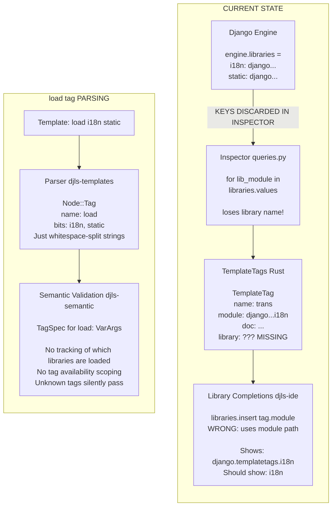

# Research:  and Template Library Naming/Scoping

## Executive Summary

** is minimally handled today.** The parser captures it as a generic tag with whitespace-split arguments, semantic validation ignores library loading entirely, and library completions use the **wrong identifier** (Python module path instead of template library name). The fix requires changes across the full stack: inspector, Rust types, and IDE features.

---

## 1. Parser/AST Representation of 

**Location:** `crates/djls-templates/src/nodelist.rs:14-19`

`` is parsed as a generic `Node::Tag` with no special treatment:

```rust
Tag {
    name: String,      // "load"
    bits: Vec<String>, // ["i18n", "static"] or ["trans", "from", "i18n"]
    span: Span,
}
```

### What's Captured vs Lost

| Captured                              | Lost                                                          |
| ------------------------------------- | ------------------------------------------------------------- |
| Tag name (`"load"`)                   | Semantic structure of arguments                               |
| Whitespace-split arguments as strings | Distinction: library name vs `` syntax |
| Source position (span)                | Which tags become available after load                        |
|                                       | Per-template library loading state                            |

**Example 1:** ``

```yaml
name: load
bits: ["i18n", "static"]
```

**Example 2:** ``

```yaml
name: load
bits: ["trans", "from", "i18n"] # "from" is just another bit, no special parsing
```

---

## 2. Semantic Validation Impact

**Location:** `crates/djls-semantic/src/`

### Current State:  Has NO Effect

1. **TagSpec for load** (`builtins.rs:232-241`):

    ```rust
    ("load", &TagSpec {
        args: B(&[TagArg::VarArgs { name: B("libraries"), required: true }]),
        // Just says "takes varargs", no validation of library existence
    })
    ```

2. **No scope tracking** - `TagSpecs` is a single global collection via `Db::tag_specs()`. No per-template "loaded libraries" state.
3. **Unknown tags pass silently** (`arguments.rs:59`):

    ```rust
    // Unknown tag - no validation (could be custom tag from unloaded library)
    ```

4. **Block classification** (`blocks/grammar.rs:49`): Unknown tags return `TagClass::Unknown` and are treated as leaf nodes.

### What's Missing

| Missing Capability                       | Would Need                                                     |
| ---------------------------------------- | -------------------------------------------------------------- |
| "Tag X requires " diagnostic | Per-template load tracking + tag→library mapping               |
| "Unknown library Z" diagnostic           | Library name validation against `Engine.libraries`             |
| Scoped tag availability                  | Track which tags are available based on preceding `` |

---

## 3. Library Completions: The Module Path Bug

**Location:** `crates/djls-ide/src/completions.rs:651-667`

### Current Implementation

```rust
fn generate_library_completions(..., template_tags: Option<&TemplateTags>) {
    // Get unique library names
    let mut libraries = std::collections::HashSet::new();
    for tag in tags.iter() {
        libraries.insert(tag.module());  // ← THIS IS THE BUG
    }
}
```

### The Problem

`tag.module()` returns the **Python module path** where the tag function is defined:

- `django.template.defaulttags` (builtins)
- `django.templatetags.i18n` (i18n library)
- `django.contrib.humanize.templatetags.humanize` (humanize)

But `` expects the **template library name**:

- (nothing - builtins don't need loading)
- `i18n`
- `humanize`

### Where the Assumption is Encoded

| Location             | Code                                          | Problem                          |
| -------------------- | --------------------------------------------- | -------------------------------- |
| `completions.rs:664` | `libraries.insert(tag.module())`              | Uses module path as library name |
| `queries.py:125`     | `for lib_module in engine.libraries.values()` | Discards library name keys       |
| `django.rs:112-116`  | `TemplateTag { module: String, ... }`         | No field for library name        |

---

## 4. Where Library Name vs Module Path Distinction is Needed

### The Two Identifiers

| Identifier                | Example                                                                     | Used By                                  |
| ------------------------- | --------------------------------------------------------------------------- | ---------------------------------------- |
| **Template library name** | `i18n`, `humanize`, `crispy_forms_tags`                                     | `` tag argument                |
| **Python module path**    | `django.templatetags.i18n`, `django.contrib.humanize.templatetags.humanize` | Import system, tag function `__module__` |

### Touchpoints Requiring the Distinction

1. **Library completions** (`djls-ide/completions.rs:651`)
    - Currently shows: `django.templatetags.i18n`
    - Should show: `i18n`
2. ** argument validation** (doesn't exist)
    - Would validate library names against `Engine.libraries.keys()`
3. **Tag availability scoping** (doesn't exist)
    - "Tag `` requires ``"
    - Need mapping: library name → set of tags it provides
4. **Diagnostic messages** (doesn't exist)
    - "Unknown library 'foo'"
    - "Tag 'mytag' is not available. Did you mean to ?"
5. **Hover/documentation info** (doesn't exist)
    - "From library: i18n (django.templatetags.i18n)"

---

## 5. Existing Data Sources

### Django's `Engine.libraries`

**Location:** Accessed in `crates/djls-project/inspector/queries.py:125`

Django exposes a dict mapping **template library name → module path**:

```python
engine = Engine.get_default()
engine.libraries = {
    'i18n': 'django.templatetags.i18n',
    'static': 'django.templatetags.static',
    'cache': 'django.templatetags.cache',
    'l10n': 'django.templatetags.l10n',
    'tz': 'django.templatetags.tz',
    'humanize': 'django.contrib.humanize.templatetags.humanize',
    # ... plus any project/third-party templatetags
}
```

### Current Usage: Keys Discarded

```python
# queries.py:125 - ONLY iterates values, keys (library names) are LOST
for lib_module in engine.libraries.values():
    library = import_library(lib_module)
```

### Fix Required

```python
# Should iterate items to preserve library name
for lib_name, lib_module in engine.libraries.items():
    library = import_library(lib_module)
    for tag_name, tag_func in library.tags.items():
        templatetags.append(TemplateTag(
            name=tag_name,
            module=tag_func.__module__,
            library=lib_name,  # <-- NEW FIELD
            doc=tag_func.__doc__
        ))
```

### Built-in Tags (No Library Name)

Tags from `engine.template_builtins` don't require ``. They could use a sentinel value like `None` or `""` for library name.

---

## Data Flow Diagram



---

## Summary: All Touchpoints

| Layer                   | File                      | Current State                                       | Needed Change                                         |
| ----------------------- | ------------------------- | --------------------------------------------------- | ----------------------------------------------------- |
| **Python Inspector**    | `queries.py:125`          | Iterates `engine.libraries.values()`, discards keys | Iterate `.items()`, return library name               |
| **Rust Types**          | `django.rs:112-116`       | `TemplateTag { name, module, doc }`                 | Add `library: Option<String>` field                   |
| **Parsing**             | `nodelist.rs:14-19`       | Generic `Node::Tag { bits }`                        | No change needed (bits already capture library names) |
| **Semantic Validation** | `arguments.rs`, `blocks/` | No load tracking                                    | Add per-template loaded libraries state               |
| **TagSpecs**            | `builtins.rs:232`         | `VarArgs` only                                      | Could add library name validation                     |
| **Library Completions** | `completions.rs:664`      | Uses `tag.module()`                                 | Use `tag.library()`                                   |
| **Tag Scoping**         | (doesn't exist)           | N/A                                                 | New feature: track loaded libraries per template      |

---

## Code References

| Purpose              | Location                                             | Key Code                         |
| -------------------- | ---------------------------------------------------- | -------------------------------- |
| Node::Tag definition | `djls-templates/src/nodelist.rs:14-19`               | `Tag { name, bits, span }`       |
| Load TagSpec         | `djls-semantic/src/templatetags/builtins.rs:232-241` | `VarArgs { name: "libraries" }`  |
| Unknown tag handling | `djls-semantic/src/arguments.rs:59`                  | Silent pass comment              |
| Library completions  | `djls-ide/src/completions.rs:651-667`                | `generate_library_completions()` |
| Inspector query      | `djls-project/inspector/queries.py:125`              | `engine.libraries.values()`      |
| TemplateTag type     | `djls-project/src/django.rs:112-116`                 | Rust struct definition           |

---

## Open Questions

1. **Built-in tags**: Should they have `library: None` or `library: Some("")`? They don't need ``.
2. **`` syntax**: Should we parse `` into a structured form, or is `bits: ["trans", "blocktrans", "from", "i18n"]` sufficient for now?
3. **Per-template vs per-file scoping**: If template A `` and B has ``, are i18n tags available in A?
4. **Validation strictness**: Should unknown tags be errors? Warnings? Off by default?
