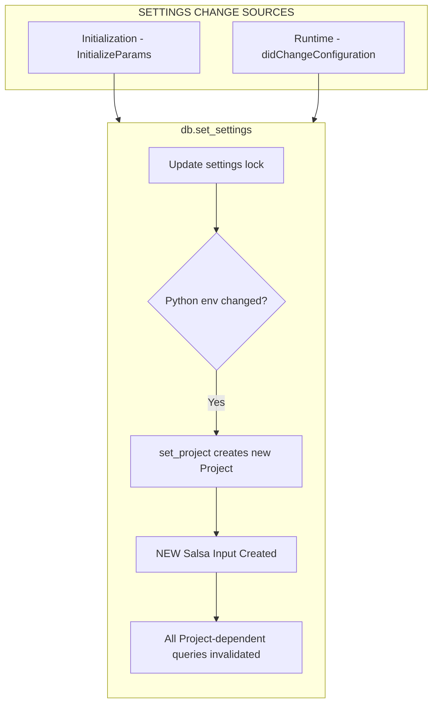
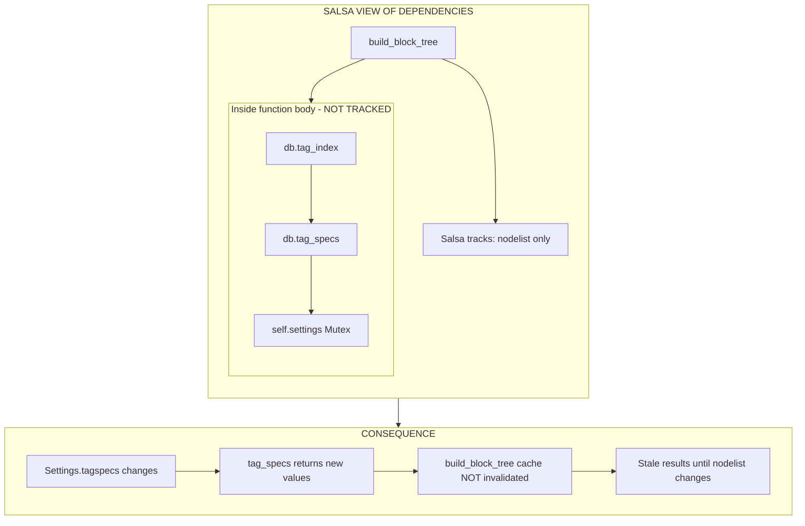

# Settings/Config Propagation Through Salsa

## Executive Summary

**Settings changes do NOT automatically invalidate Salsa caches for template validation.** Settings are stored in `Arc<Mutex<Settings>>` outside Salsa's tracking. The `tag_specs()` and `tag_index()` methods are **plain trait methods** (not Salsa-tracked), called fresh each time but **inside** tracked function bodies where Salsa doesn't track them as dependencies. Only Python-environment settings (`venv_path`, `django_settings_module`, `pythonpath`) trigger invalidation by recreating the `Project` Salsa input.

---

## 1. Salsa Inputs (The Invalidation Roots)

Only **two** Salsa inputs exist in the codebase:

| Input     | Location                         | Fields                                                        | Triggers Invalidation When                  |
| --------- | -------------------------------- | ------------------------------------------------------------- | ------------------------------------------- |
| `File`    | `djls-source/src/file.rs:10`     | `path`, `revision`                                            | `revision` incremented via `set_revision()` |
| `Project` | `djls-project/src/project.rs:14` | `root`, `interpreter`, `django_settings_module`, `pythonpath` | New `Project::new()` called                 |

**Settings is NOT a Salsa input** - it's stored in `Arc<Mutex<Settings>>`.

---

## 2. How Settings Are Stored and Updated

### Storage (`djls-server/src/db.rs:45-47`)

```rust
pub struct DjangoDatabase {
    settings: Arc<Mutex<Settings>>,  // NOT Salsa-tracked
    project: Arc<Mutex<Option<Project>>>,  // Holds Salsa input
    storage: salsa::Storage<Self>,
    // ...
}
```

### Update Flow (`db.rs:107-140`)

```rust
pub fn set_settings(&mut self, settings: Settings) {
    // Check if Python-environment settings changed
    let project_needs_update = {
        let old = self.settings();
        old.venv_path() != settings.venv_path()
            || old.django_settings_module() != settings.django_settings_module()
            || old.pythonpath() != settings.pythonpath()
    };

    // Always update the settings mutex
    *self.settings.lock().unwrap() = settings;

    // Only recreate Project if Python settings changed
    if project_needs_update {
        if let Some(project) = self.project() {
            let root = project.root(self).clone();
            let settings = self.settings();
            self.set_project(&root, &settings);  // Creates NEW Project Salsa input
        }
    }
}
```

---

## 3. What Triggers vs. Doesn't Trigger Invalidation

### ✅ Settings That DO Trigger Invalidation

| Setting                  | Why                 | Effect                                        |
| ------------------------ | ------------------- | --------------------------------------------- |
| `venv_path`              | Recreates `Project` | All Project-dependent queries invalidate      |
| `django_settings_module` | Recreates `Project` | `templatetags()`, `template_dirs()` recompute |
| `pythonpath`             | Recreates `Project` | Python import resolution changes              |

### ❌ Settings That DON'T Trigger Invalidation

| Setting       | Why                                                    | Consequence                                                              |
| ------------- | ------------------------------------------------------ | ------------------------------------------------------------------------ |
| `tagspecs`    | Read fresh via `tag_specs()`, but not tracked by Salsa | Cached `build_block_tree` / `validate_all_tag_arguments` not invalidated |
| `diagnostics` | Read fresh via `diagnostics_config()`                  | Already read at display time (no caching issue)                          |

---

## 4. The Hidden Problem: Untracked Dependencies

### `tag_specs()` and `tag_index()` Are Plain Methods

```rust
// djls-semantic/src/db.rs - Trait definition
#[salsa::db]
pub trait Db: TemplateDb {
    fn tag_specs(&self) -> TagSpecs;      // NOT #[salsa::tracked]
    fn tag_index(&self) -> TagIndex<'_>;  // NOT #[salsa::tracked]
}

// djls-server/src/db.rs - Implementation
impl SemanticDb for DjangoDatabase {
    fn tag_specs(&self) -> TagSpecs {
        TagSpecs::from(&self.settings())  // Fresh read every call, NO caching
    }

    fn tag_index(&self) -> TagIndex<'_> {
        TagIndex::from_specs(self)  // Calls tag_specs() internally
    }
}
```

### These Are Called INSIDE Tracked Functions

```rust
// djls-semantic/src/blocks.rs:17-22
#[salsa::tracked]
pub fn build_block_tree<'db>(db: &'db dyn Db, nodelist: NodeList<'db>) -> BlockTree<'db> {
    let builder = BlockTreeBuilder::new(db, db.tag_index());  // ← Called inside!
    builder.model(db, nodelist)
}

// djls-semantic/src/arguments.rs:37-42
pub fn validate_all_tag_arguments(db: &dyn Db, nodelist: NodeList<'_>) {
    let tag_specs = db.tag_specs();  // ← Called inside!
    // ...
}
```

**Salsa only tracks `nodelist` as a dependency**, not `tag_specs`/`tag_index`. If settings change:

- `tag_specs()` returns new values on next call
- But `build_block_tree` cache entry for that `nodelist` is still valid (from Salsa's perspective)
- **Stale validation results may be returned**

---

## 5. Data Flow Diagrams

### Settings Change Propagation



### The Untracked Dependency Problem



---

## 6. Caching Behavior Summary

| Query/Method                                | Type          | Cached? | Invalidated By              |
| ------------------------------------------- | ------------- | ------- | --------------------------- |
| `parse_template(db, file)`                  | Salsa tracked | ✅ Yes  | `file.revision` change      |
| `validate_nodelist(db, nodelist)`           | Salsa tracked | ✅ Yes  | `nodelist` change only      |
| `build_block_tree(db, nodelist)`            | Salsa tracked | ✅ Yes  | `nodelist` change only      |
| `build_semantic_forest(db, tree, nodelist)` | Salsa tracked | ✅ Yes  | `tree` or `nodelist` change |
| `templatetags(db, project)`                 | Salsa tracked | ✅ Yes  | `project` recreation        |
| `template_dirs(db, project)`                | Salsa tracked | ✅ Yes  | `project` recreation        |
| `tag_specs()`                               | Plain method  | ❌ No   | N/A (always recomputes)     |
| `tag_index()`                               | Plain method  | ❌ No   | N/A (always recomputes)     |
| `diagnostics_config()`                      | Plain method  | ❌ No   | N/A (always recomputes)     |

---

## 7. Implications for New Rule Sources

If you add a new rule source that's config-driven (similar to `tagspecs`):

1. **Same pattern as today**: Read from settings, no automatic invalidation
2. **Stale cache risk**: Validation results may not reflect new rules until file changes
3. **Workaround**: Force file revision bump on settings change to invalidate caches

### Potential Fix: Make TagSpecs a Salsa Input

```rust
// Hypothetical fix - make tag_specs a Salsa-tracked dependency

#[salsa::input]
pub struct TagSpecsInput {
    specs: TagSpecs,
}

#[salsa::tracked]
pub fn build_block_tree<'db>(
    db: &'db dyn Db,
    nodelist: NodeList<'db>,
    tag_specs: TagSpecsInput,  // ← Now Salsa tracks this
) -> BlockTree<'db> {
    // ...
}
```

Then when settings change, create new `TagSpecsInput` to trigger invalidation.

### Alternative: Bump All File Revisions on Config Change

```rust
pub fn set_settings(&mut self, settings: Settings) {
    let tagspecs_changed = self.settings().tagspecs() != settings.tagspecs();

    *self.settings.lock().unwrap() = settings;

    if tagspecs_changed {
        // Force revalidation of all open files
        for file in self.files.iter() {
            self.touch_file(file.path());  // Bumps revision
        }
    }
}
```

---

## 8. Where Settings Are Consumed

| Consumer               | Method Called             | Location             | Notes                           |
| ---------------------- | ------------------------- | -------------------- | ------------------------------- |
| Block tree building    | `db.tag_index()`          | `blocks.rs:21`       | Inside tracked fn               |
| Tag index construction | `db.tag_specs()`          | `grammar.rs:122`     | Inside `TagIndex::from_specs()` |
| Argument validation    | `db.tag_specs()`          | `arguments.rs:42`    | Inside tracked fn               |
| Completions            | `db.tag_specs()`          | `server.rs:278`      | At request time                 |
| Diagnostic filtering   | `db.diagnostics_config()` | `diagnostics.rs:117` | At display time (OK)            |

---

## Code References

| Purpose                                        | File                             | Line(s) |
| ---------------------------------------------- | -------------------------------- | ------- |
| Settings storage                               | `djls-server/src/db.rs`          | 45-47   |
| Settings update                                | `djls-server/src/db.rs`          | 107-140 |
| Project Salsa input                            | `djls-project/src/project.rs`    | 14      |
| File Salsa input                               | `djls-source/src/file.rs`        | 10      |
| `tag_specs()` impl                             | `djls-server/src/db.rs`          | 187-189 |
| `tag_index()` impl                             | `djls-server/src/db.rs`          | 191-193 |
| Untracked call in `build_block_tree`           | `djls-semantic/src/blocks.rs`    | 21      |
| Untracked call in `validate_all_tag_arguments` | `djls-semantic/src/arguments.rs` | 42      |
| Config change handler                          | `djls-server/src/server.rs`      | 380-404 |
| File revision setter                           | `djls-source/src/db.rs`          | 27      |

---

## Related Research

- [2026-02-04_semantic-validation-orchestration.md](2026-02-04_semantic-validation-orchestration.md) - How validation flows through Salsa
- [2026-02-04_tagspecs-flow-analysis.md](2026-02-04_tagspecs-flow-analysis.md) - TagSpecs definition and consumers
