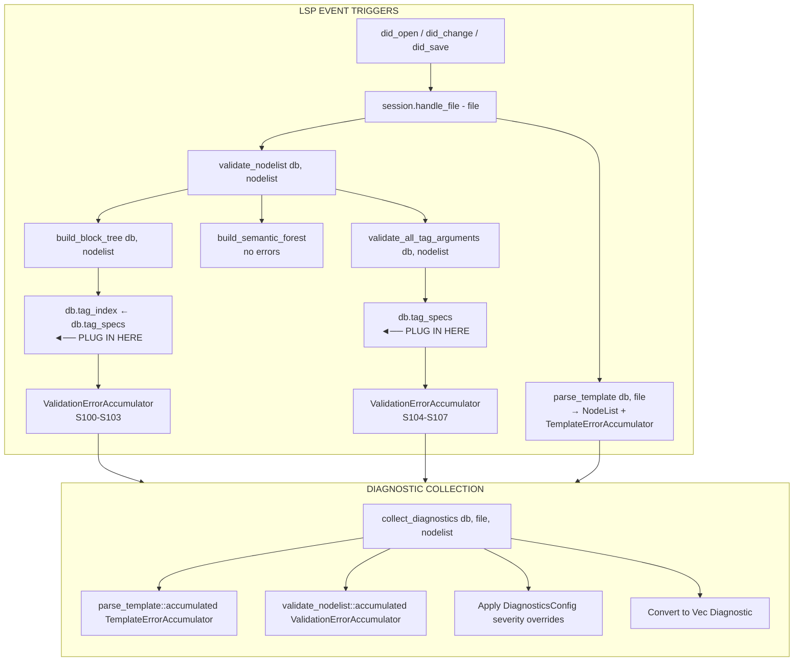

# Template Semantic Validation Orchestration

## Executive Summary

The semantic validation "spine" is a **single Salsa-tracked entry point** `validate_nodelist` that orchestrates three validation passes. Errors are accumulated via Salsa's accumulator pattern and later retrieved and converted to LSP diagnostics. **TagSpecs are assumed static** (hardcoded builtins + TOML config), with unknown tags silently passing validation.

---

## 1. The Salsa-Tracked Entry Point

**Location:** `crates/djls-semantic/src/lib.rs:42-51`

```rust
#[salsa::tracked]
pub fn validate_nodelist(db: &dyn Db, nodelist: djls_templates::NodeList<'_>) {
    if nodelist.nodelist(db).is_empty() {
        return;
    }

    let block_tree = build_block_tree(db, nodelist);
    let _forest = build_semantic_forest(db, block_tree, nodelist);
    validate_all_tag_arguments(db, nodelist);
}
```

### Call Sites (Production)

| Location                          | Trigger                                             |
| --------------------------------- | --------------------------------------------------- |
| `djls-server/src/session.rs:206`  | Cache warming on `did_open`/`did_change`/`did_save` |
| `djls-ide/src/diagnostics.rs:141` | Retrieves accumulated errors via `::accumulated()`  |

---

## 2. Order of Validations & Data Dependencies

```
validate_nodelist(db, nodelist)
│
├─► 1. build_block_tree(db, nodelist)  [blocks.rs:17]
│       │
│       ├── DEPENDS ON: db.tag_index() ← derived from db.tag_specs()
│       │   (TagIndex classifies tags as Opener/Closer/Intermediate/Unknown)
│       │
│       └── ACCUMULATES: Block structure errors
│           • S100: UnclosedTag
│           • S101: UnbalancedStructure
│           • S102: OrphanedTag
│           • S103: UnmatchedBlockName
│
├─► 2. build_semantic_forest(db, block_tree, nodelist)  [semantic.rs:11]
│       │
│       └── NO ERRORS - Pure transformation (BlockTree → SemanticForest)
│
└─► 3. validate_all_tag_arguments(db, nodelist)  [arguments.rs:21]
        │
        ├── DEPENDS ON: db.tag_specs()
        │   (Looks up argument specs per tag name)
        │
        └── ACCUMULATES: Argument validation errors
            • S104: MissingRequiredArguments / MissingArgument
            • S105: TooManyArguments
            • S106: InvalidLiteralArgument
            • S107: InvalidArgumentChoice
```

### Key Dependency: The `Db` Trait (`djls-semantic/src/db.rs`)

```rust
#[salsa::db]
pub trait Db: TemplateDb {
    fn tag_specs(&self) -> TagSpecs;        // Static specs (builtins + TOML)
    fn tag_index(&self) -> TagIndex<'_>;    // Derived from tag_specs
    fn template_dirs(&self) -> Option<Vec<Utf8PathBuf>>;  // For resolution
    fn diagnostics_config(&self) -> DiagnosticsConfig;   // Severity overrides
}
```

### Implementation (`djls-server/src/db.rs:166-175`)

```rust
impl SemanticDb for DjangoDatabase {
    fn tag_specs(&self) -> TagSpecs {
        TagSpecs::from(&self.settings())  // ← Hardcoded builtins + TOML config
    }

    fn tag_index(&self) -> TagIndex<'_> {
        TagIndex::from_specs(self)  // ← Built from tag_specs
    }
    // ...
}
```

---

## 3. Error Accumulation & Conversion to LSP Diagnostics

### Accumulator Definition (`djls-semantic/src/db.rs:23`)

```rust
#[salsa::accumulator]
pub struct ValidationErrorAccumulator(pub ValidationError);
```

### Error Types (`djls-semantic/src/errors.rs`)

```rust
pub enum ValidationError {
    UnclosedTag { tag: String, span: Span },
    OrphanedTag { tag: String, context: String, span: Span },
    UnbalancedStructure { opening_tag, expected_closing, opening_span, closing_span },
    UnmatchedBlockName { name: String, span: Span },
    MissingRequiredArguments { tag, min, span },
    TooManyArguments { tag, max, span },
    MissingArgument { tag, argument, span },
    InvalidLiteralArgument { tag, expected, span },
    InvalidArgumentChoice { tag, argument, choices, value, span },
}
```

### Collection & Conversion (`djls-ide/src/diagnostics.rs:110-158`)

```rust
pub fn collect_diagnostics(db, file, nodelist) -> Vec<ls_types::Diagnostic> {
    // 1. Get parse errors (TemplateErrorAccumulator)
    let template_errors = parse_template::accumulated::<TemplateErrorAccumulator>(db, file);

    // 2. Get validation errors (ValidationErrorAccumulator)
    if let Some(nodelist) = nodelist {
        let validation_errors = validate_nodelist::accumulated::<ValidationErrorAccumulator>(db, nodelist);

        for error_acc in validation_errors {
            let diagnostic = error_acc.0.as_diagnostic(line_index);
            // Apply severity config filtering
            if let Some(severity) = config.get_severity(code).to_lsp_severity() {
                diagnostic.severity = Some(severity);
                diagnostics.push(diagnostic);
            }
        }
    }
}
```

### Diagnostic Code Mapping (`diagnostics.rs:57-80`)

| Code | Error Type                                 |
| ---- | ------------------------------------------ |
| S100 | UnclosedTag                                |
| S101 | UnbalancedStructure                        |
| S102 | OrphanedTag                                |
| S103 | UnmatchedBlockName                         |
| S104 | MissingRequiredArguments / MissingArgument |
| S105 | TooManyArguments                           |
| S106 | InvalidLiteralArgument                     |
| S107 | InvalidArgumentChoice                      |

---

## 4. Assumptions About TagSpecs Being Static

### Where TagSpecs Come From

1. **Hardcoded builtins** (`djls-semantic/src/templatetags/builtins.rs:759`)
    - ~35 Django builtin tags (if, for, with, block, extends, include, trans, etc.)
    - Manually maintained argument specs

2. **TOML config** (`djls-conf/src/tagspecs/`)
    - User can add custom tag specs via `djls.toml` or `pyproject.toml`
    - Merges with builtins (user overrides)

### The Merge Logic (`djls-semantic/src/templatetags/specs.rs:176-195`)

```rust
impl From<&Settings> for TagSpecs {
    fn from(settings: &Settings) -> Self {
        let mut specs = django_builtin_specs();  // Start with hardcoded
        let user_specs = /* convert TOML config */;
        specs.merge(user_specs);  // User overrides builtins
        specs
    }
}
```

### Key Assumption: Unknown Tags Pass Silently

**`arguments.rs:59`** - If a tag has no spec, no validation occurs:

```rust
// Unknown tag - no validation (could be custom tag from unloaded library)
```

**`blocks/grammar.rs:49`** - Unknown tags return `TagClass::Unknown` and are treated as leaf nodes.

---

## 5. Where a New Rule Source Would Plug In

### Option A: Add a New Data Source to `tag_specs()`

**Change `djls-server/src/db.rs`:**

```rust
fn tag_specs(&self) -> TagSpecs {
    let mut specs = TagSpecs::from(&self.settings());  // existing

    // NEW: Merge runtime-derived specs (e.g., from Python introspection)
    if let Some(runtime_specs) = self.runtime_tag_specs() {
        specs.merge(runtime_specs);
    }

    specs
}
```

### Option B: Add a New Validation Pass in `validate_nodelist`

**Change `djls-semantic/src/lib.rs`:**

```rust
pub fn validate_nodelist(db: &dyn Db, nodelist: NodeList<'_>) {
    // ... existing passes ...

    // NEW: Additional rule-based validation
    validate_custom_rules(db, nodelist);  // Would need new accumulator or reuse existing
}
```

### Option C: Extend `TagSpecs` with New Rule Types

**Change `djls-semantic/src/templatetags/specs.rs`:**

```rust
pub struct TagSpec {
    // ... existing fields ...
    pub custom_rules: Vec<CustomRule>,  // NEW: Additional validation rules
}
```

---

## Data Flow Diagram



---

## Summary: Insertion Points for New Rule Sources

| Goal                      | Insertion Point                           | Changes Required                                  |
| ------------------------- | ----------------------------------------- | ------------------------------------------------- |
| Runtime-derived tag specs | `DjangoDatabase::tag_specs()`             | Add Python introspection query, merge with static |
| New validation pass       | `validate_nodelist()`                     | Add new function call, use existing accumulator   |
| New error types           | `ValidationError` enum + `diagnostics.rs` | Add variants, implement `DiagnosticError`         |
| Config-driven rules       | `TagSpec` struct                          | Add `custom_rules` field, extend validation       |
| Library-scoped validation | New infrastructure                        | Track ``, scope tag availability        |

---

## Code References

| Purpose               | File                                              | Key Code                             |
| --------------------- | ------------------------------------------------- | ------------------------------------ |
| Entry point           | `djls-semantic/src/lib.rs:42-51`                  | `validate_nodelist()`                |
| Block validation      | `djls-semantic/src/blocks.rs:17`                  | `build_block_tree()`                 |
| Block builder         | `djls-semantic/src/blocks/builder.rs`             | `BlockTreeBuilder`                   |
| Argument validation   | `djls-semantic/src/arguments.rs:21`               | `validate_all_tag_arguments()`       |
| Db trait              | `djls-semantic/src/db.rs`                         | `Db::tag_specs()`, `Db::tag_index()` |
| Server Db impl        | `djls-server/src/db.rs:166-175`                   | `SemanticDb for DjangoDatabase`      |
| Error accumulator     | `djls-semantic/src/db.rs:23`                      | `ValidationErrorAccumulator`         |
| Error types           | `djls-semantic/src/errors.rs`                     | `ValidationError` enum               |
| Diagnostic collection | `djls-ide/src/diagnostics.rs:110-158`             | `collect_diagnostics()`              |
| Diagnostic codes      | `djls-ide/src/diagnostics.rs:57-80`               | `DiagnosticError` impl               |
| TagSpecs source       | `djls-semantic/src/templatetags/builtins.rs:759`  | `django_builtin_specs()`             |
| TagSpecs merge        | `djls-semantic/src/templatetags/specs.rs:176-195` | `From<&Settings>`                    |
| Cache warming         | `djls-server/src/session.rs:203-210`              | `handle_file()`                      |

---

## Related Research

- `2026-02-04_tagspecs-flow-analysis.md` - How TagSpecs flow through the system
- `2026-02-04_load-tag-library-scoping.md` -  handling and library name issues
- `2026-02-04_template-introspection-pipeline.md` - Full template processing pipeline
- `2026-02-04_template-filters-analysis.md` - Filter handling (minimal today)
