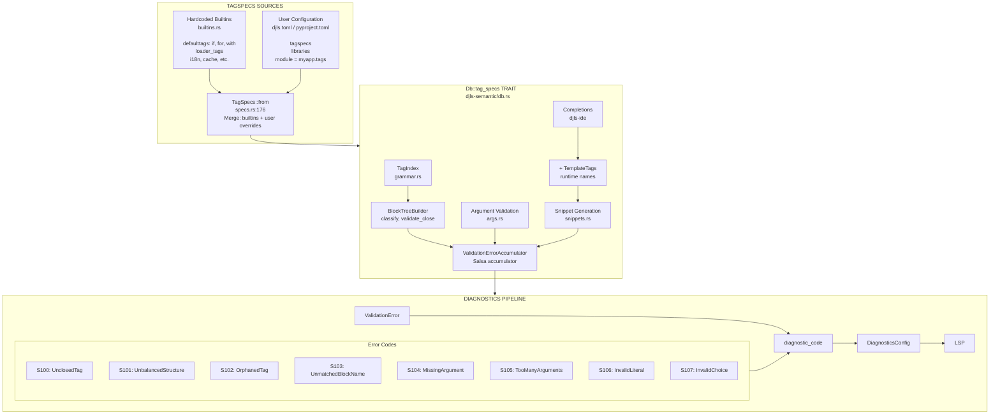

# Research: TagSpecs Flow Analysis

## Executive Summary

**TagSpecs** are static specifications for Django template tags that define argument structure, block relationships (opener/closer/intermediate), and validation rules. They flow through the system via a **Salsa database trait method** (`Db::tag_specs()`) and are consumed by:

1. **Argument validation** (`djls-semantic/arguments.rs`) - validates tag argument counts, order, literals, choices
2. **Block structure validation** (`djls-semantic/blocks/builder.rs`) - via `TagIndex` for opener/closer/intermediate classification
3. **Completions** (`djls-ide/completions.rs`) - merged with runtime `TemplateTags` for tag name suggestions
4. **Snippet generation** (`djls-ide/snippets.rs`) - generates LSP snippets from argument specs

**Key finding:** TagSpecs and runtime TemplateTags are **separate parallel systems** that only merge at completion time. If TagSpecs moved to runtime-derived, the primary changes would be in:

- `djls-semantic/src/templatetags/builtins.rs` (replace hardcoded specs)
- `djls-conf/src/tagspecs/` (config loading becomes secondary/override)
- `TagSpecs::from(&Settings)` (merge logic)

---

## 1. TagSpecs Definition & In-Memory Types

### 1.1 Core Types (`djls-semantic/src/templatetags/specs.rs`)

```rust
/// Collection of tag specifications, keyed by tag name
pub struct TagSpecs(FxHashMap<String, TagSpec>);

/// Specification for a single template tag
pub struct TagSpec {
    pub module: Cow<'static, str>,        // e.g., "django.template.defaulttags"
    pub end_tag: Option<EndTag>,          // None for standalone tags
    pub intermediate_tags: Cow<'static, [IntermediateTag]>,
    pub args: Cow<'static, [TagArg]>,     // Argument specification
}

/// End tag specification (e.g., endif, endfor)
pub struct EndTag {
    pub name: Cow<'static, str>,
    pub required: bool,                   // Must this tag have an explicit closer?
    pub args: Cow<'static, [TagArg]>,     // Args on the end tag (e.g., )
}

/// Intermediate tag specification (e.g., elif, else, empty)
pub struct IntermediateTag {
    pub name: Cow<'static, str>,
    pub args: Cow<'static, [TagArg]>,
}
```

### 1.2 Argument Types

```rust
pub enum TagArg {
    /// Template variable/filter (e.g., `item` in ``)
    Variable { name: S, required: bool, count: TokenCount },

    /// Quoted string (e.g., `"template.html"` in ``)
    String { name: S, required: bool },

    /// Literal keyword with semantic classification
    Literal { lit: S, required: bool, kind: LiteralKind },

    /// Any expression (greedy, consumes multiple tokens)
    Any { name: S, required: bool, count: TokenCount },

    /// Variable assignment (e.g., `var=value`)
    Assignment { name: S, required: bool, count: TokenCount },

    /// Consumes all remaining tokens
    VarArgs { name: S, required: bool },

    /// Choice from specific literals (e.g., `on`|`off` for autoescape)
    Choice { name: S, required: bool, choices: Cow<'static, [Cow<'static, str>]> },
}

pub enum TokenCount {
    Exact(usize),  // Consume exactly N tokens
    Greedy,        // Consume until next literal or end
}

pub enum LiteralKind {
    Literal,   // Plain literal
    Syntax,    // Mandatory keyword like "in", "as"
    Modifier,  // Optional flag like "reversed", "silent"
}
```

### 1.3 Loading & Merging

**Source 1: Hardcoded Builtins** (`djls-semantic/src/templatetags/builtins.rs:759`)

```rust
static BUILTIN_SPECS: LazyLock<TagSpecs> = LazyLock::new(|| { ... });

pub fn django_builtin_specs() -> TagSpecs {
    BUILTIN_SPECS.clone()
}
```

Covers ~35 Django builtin tags from:

- `django.template.defaulttags` (if, for, with, block, etc.)
- `django.template.loader_tags` (extends, include)
- `django.templatetags.cache`
- `django.templatetags.i18n` (trans, blocktranslate)
- `django.templatetags.l10n`, `tz`, `static`

**Source 2: User Configuration** (`djls-conf/src/lib.rs` + `tagspecs/`)

Config files (priority order, later overrides earlier):

1. `~/.config/djls/djls.toml` (user global)
2. `pyproject.toml` under `[tool.djls]`
3. `.djls.toml` (project hidden)
4. `djls.toml` (project explicit)

**Merge Logic** (`djls-semantic/src/templatetags/specs.rs:176-195`):

```rust
impl From<&djls_conf::Settings> for TagSpecs {
    fn from(settings: &djls_conf::Settings) -> Self {
        // Start with built-in specs
        let mut specs = crate::templatetags::django_builtin_specs();

        // Convert user-defined tagspecs from config
        let mut user_specs = FxHashMap::default();
        for library in &settings.tagspecs().libraries {
            for tag_def in &library.tags {
                let tagspec: TagSpec = (tag_def.clone(), library.module.clone()).into();
                user_specs.insert(tag_def.name.clone(), tagspec);
            }
        }

        // User specs override built-ins
        specs.merge(TagSpecs::new(user_specs));
        specs
    }
}
```

---

## 2. TagSpecs Consumers

### 2.1 The `Db` Trait - Central Access Point

**Location:** `crates/djls-semantic/src/db.rs`

```rust
#[salsa::db]
pub trait Db: TemplateDb {
    fn tag_specs(&self) -> TagSpecs;
    fn tag_index(&self) -> TagIndex<'_>;
    fn template_dirs(&self) -> Option<Vec<Utf8PathBuf>>;
    fn diagnostics_config(&self) -> DiagnosticsConfig;
}
```

**Implementations:**

- `DjangoDatabase` (server) - `TagSpecs::from(&self.settings())`
- `TestDatabase` instances - `django_builtin_specs()` or custom specs
- `BenchDatabase` - `django_builtin_specs()`

### 2.2 Block Structure Validation (via `TagIndex`)

**Location:** `crates/djls-semantic/src/blocks/grammar.rs`

`TagIndex` is a **derived structure** built from `TagSpecs` for efficient block grammar lookups:

```rust
#[salsa::tracked]
pub struct TagIndex<'db> {
    openers: FxHashMap<String, EndMeta>,           // tag -> end tag metadata
    closers: FxHashMap<String, String>,            // endtag -> opener name
    intermediate_to_openers: FxHashMap<String, Vec<String>>,  // elif -> [if]
}

impl TagIndex {
    pub fn from_specs(db: &dyn Db) -> Self {
        for (name, spec) in db.tag_specs() {
            if let Some(end_tag) = &spec.end_tag {
                // Build opener, closer, intermediate mappings
            }
        }
    }

    pub fn classify(&self, tag_name: &str) -> TagClass {
        // Returns: Opener | Closer { opener_name } | Intermediate { possible_openers } | Unknown
    }

    pub fn validate_close(&self, opener_name, opener_bits, closer_bits) -> CloseValidation {
        // Validates endblock name matches block name, etc.
    }
}
```

**What TagIndex needs from TagSpecs:**

- `spec.end_tag.name` - closer tag name
- `spec.end_tag.required` - must have explicit closer?
- `spec.end_tag.args` - args that must match opener (e.g., block name)
- `spec.intermediate_tags[].name` - intermediate tag names

**Consumer:** `BlockTreeBuilder` (`blocks/builder.rs`) uses `TagIndex` to:

- Classify each tag as opener/closer/intermediate/unknown
- Build the block tree structure
- Emit `ValidationError::UnclosedTag`, `OrphanedTag`, `UnbalancedStructure`, `UnmatchedBlockName`

### 2.3 Argument Validation

**Location:** `crates/djls-semantic/src/arguments.rs`

```rust
pub fn validate_all_tag_arguments(db: &dyn Db, nodelist: NodeList) {
    for tag in nodelist {
        validate_tag_arguments(db, tag.name, tag.bits, tag.span);
    }
}

fn validate_tag_arguments(db: &dyn Db, tag_name: &str, bits: &[String], span: Span) {
    let tag_specs = db.tag_specs();

    // Try opener, then closer, then intermediate
    if let Some(spec) = tag_specs.get(tag_name) {
        validate_args_against_spec(db, tag_name, bits, span, spec.args.as_ref());
    } else if let Some(end_spec) = tag_specs.get_end_spec_for_closer(tag_name) {
        validate_args_against_spec(db, tag_name, bits, span, end_spec.args.as_ref());
    } else if let Some(intermediate) = tag_specs.get_intermediate_spec(tag_name) {
        validate_args_against_spec(db, tag_name, bits, span, intermediate.args.as_ref());
    }
    // Unknown tag = no validation
}
```

**What argument validation needs from TagSpecs:**

- `spec.args[]` - full argument specification
- `TagArg::is_required()` - minimum argument count
- `TagArg::Literal { lit, kind }` - expected keyword validation
- `TagArg::Choice { choices }` - valid choice values
- `TokenCount::Exact(n)` vs `Greedy` - how many tokens to consume

**Emits ValidationErrors:**

- `MissingRequiredArguments` - too few args
- `TooManyArguments` - excess args
- `MissingArgument` - specific required arg missing
- `InvalidLiteralArgument` - wrong keyword
- `InvalidArgumentChoice` - invalid choice value

### 2.4 Completions

**Location:** `crates/djls-ide/src/completions.rs`

```rust
pub fn handle_completion(
    document: &TextDocument,
    template_tags: Option<&TemplateTags>,  // RUNTIME: from Python inspector
    tag_specs: Option<&TagSpecs>,          // STATIC: from config + builtins
    supports_snippets: bool,
) -> Vec<CompletionItem> {
    // ... context analysis ...

    match context {
        TagName { partial, ... } => generate_tag_name_completions(...),
        TagArgument { tag, position, ... } => generate_argument_completions(...),
        LibraryName { ... } => generate_library_completions(...),
    }
}
```

**Merge point - Tag Name Completions** (`completions.rs:370-450`):

```rust
fn generate_tag_name_completions(
    partial: &str,
    template_tags: Option<&TemplateTags>,  // Runtime tag names + modules
    tag_specs: Option<&TagSpecs>,          // Static argument specs
    supports_snippets: bool,
) {
    // Iterate over RUNTIME TemplateTags for tag names
    for tag in template_tags.iter() {
        if tag.name().starts_with(partial) {
            // Look up STATIC TagSpecs for snippet generation
            if let Some(spec) = tag_specs.get(tag.name()) {
                let snippet = generate_snippet_for_tag_with_end(tag.name(), spec);
                // ... create completion with snippet
            }
        }
    }
}
```

**What completions need from TagSpecs:**

- `spec.args` - for snippet placeholder generation
- `spec.end_tag` - to include closing tag in snippet
- `TagArg::Choice { choices }` - for choice argument completions

### 2.5 Snippet Generation

**Location:** `crates/djls-ide/src/snippets.rs`

```rust
pub fn generate_snippet_for_tag_with_end(tag_name: &str, spec: &TagSpec) -> String {
    let mut snippet = generate_snippet_from_args(&spec.args);

    if let Some(end_tag) = &spec.end_tag {
        if end_tag.required {
            snippet.push_str(" %}\n$0\n");
        }
    }
    snippet
}

pub fn generate_snippet_from_args(args: &[TagArg]) -> String {
    for arg in args {
        match arg {
            TagArg::Variable { name, .. } => format!("${{{}:{}}}", idx, name),
            TagArg::String { name, .. } => format!("\"${{{}:{}}}\"", idx, name),
            TagArg::Choice { choices, .. } => format!("${{{}|{}|}}", idx, choices.join(",")),
            TagArg::Literal { lit, required: true, .. } => lit.to_string(),
            // ... etc
        }
    }
}
```

---

## 3. Diagnostic Codes & Severities

### 3.1 Diagnostic Code Mapping

**Location:** `crates/djls-ide/src/diagnostics.rs`

| Code | Error Type                                 | Source                  | TagSpecs-Dependent?               |
| ---- | ------------------------------------------ | ----------------------- | --------------------------------- |
| T100 | Parser errors                              | `TemplateError::Parser` | No                                |
| T900 | IO errors                                  | `TemplateError::Io`     | No                                |
| T901 | Config errors                              | `TemplateError::Config` | No                                |
| S100 | UnclosedTag                                | Block validation        | **Yes** (end_tag.required)        |
| S101 | UnbalancedStructure                        | Block validation        | **Yes** (opener/closer mapping)   |
| S102 | OrphanedTag                                | Block validation        | **Yes** (intermediate_to_openers) |
| S103 | UnmatchedBlockName                         | Block validation        | **Yes** (end_tag.args matching)   |
| S104 | MissingRequiredArguments / MissingArgument | Arg validation          | **Yes** (args.required)           |
| S105 | TooManyArguments                           | Arg validation          | **Yes** (args count)              |
| S106 | InvalidLiteralArgument                     | Arg validation          | **Yes** (Literal values)          |
| S107 | InvalidArgumentChoice                      | Arg validation          | **Yes** (Choice values)           |

### 3.2 Severity Configuration

**Location:** `crates/djls-conf/src/diagnostics.rs`

```toml
# djls.toml
[diagnostics.severity]
S100 = "off"        # Disable unclosed tag warnings
S104 = "warning"    # Downgrade missing args to warning
"T" = "off"         # Disable all parser errors (prefix match)
```

```rust
impl DiagnosticsConfig {
    pub fn get_severity(&self, code: &str) -> DiagnosticSeverity {
        // Check exact match, then prefix match, then default to Error
    }
}
```

---

## 4. Runtime TemplateTags vs Static TagSpecs

### 4.1 Comparison

| Aspect  | TemplateTags (Runtime)                    | TagSpecs (Static)                |
| ------- | ----------------------------------------- | -------------------------------- |
| Source  | Python inspector querying Django          | Hardcoded builtins + TOML config |
| Content | Tag names, modules, docstrings            | Argument specs, block structure  |
| Query   | `djls_project::templatetags(db, project)` | `db.tag_specs()`                 |
| Crate   | `djls-project`                            | `djls-semantic`                  |
| Updates | Per-project, requires running Python      | Build-time or config reload      |

### 4.2 Where They Diverge

- **TemplateTags knows all registered tags** (including third-party), but not their argument structure
- **TagSpecs knows argument structure** for Django builtins + user-configured tags, but misses third-party tags without config
- **Neither extracts from Django source** - TemplateTags gets names only, TagSpecs is manually maintained

### 4.3 Where They Combine

Only in `completions.rs:generate_tag_name_completions`:

```rust
// Iterate runtime tags for names, look up static specs for snippets
for tag in template_tags {
    if let Some(spec) = tag_specs.get(tag.name()) {
        // Use spec for snippet
    }
}
```

---

## 5. Extension Points & Abstractions

### 5.1 The `Db::tag_specs()` Trait Method

This is the **primary extension point**. To swap TagSpecs source:

```rust
// Current implementation in DjangoDatabase
fn tag_specs(&self) -> TagSpecs {
    TagSpecs::from(&self.settings())  // builtins + config
}

// Hypothetical runtime-derived implementation
fn tag_specs(&self) -> TagSpecs {
    if let Some(runtime_specs) = self.runtime_tag_specs() {
        let mut specs = runtime_specs;
        specs.merge(user_overrides_from_settings(&self.settings()));
        specs
    } else {
        // Fallback to static
        TagSpecs::from(&self.settings())
    }
}
```

### 5.2 The `TagIndex::from_specs()` Pattern

`TagIndex` is **computed from TagSpecs**, not independently maintained. If TagSpecs changes, `TagIndex` recomputes automatically via Salsa tracking.

### 5.3 The `TagSpecs::merge()` Method

Already supports layered composition:

```rust
pub fn merge(&mut self, other: TagSpecs) -> &mut Self {
    self.0.extend(other.0);  // Later values override
    self
}
```

### 5.4 The Config → TagSpecs Conversion

`From<&Settings> for TagSpecs` already handles:

- Starting with builtins
- Converting TOML `TagDef` → internal `TagSpec`
- Merging user overrides

---

## 6. Impact Analysis: Moving to Runtime-Derived TagSpecs

### 6.1 What Would Change

| Component                                | Change Required                        |
| ---------------------------------------- | -------------------------------------- |
| `djls-semantic/templatetags/builtins.rs` | Could become fallback-only or removed  |
| `djls-conf/tagspecs/`                    | Becomes override/extension mechanism   |
| `TagSpecs::from(&Settings)`              | Add runtime specs as base layer        |
| `djls-project/queries.py`                | Add tag argument extraction (complex!) |
| `djls-project/django.rs`                 | New tracked function for runtime specs |

### 6.2 What Would Stay the Same

- `TagSpec`, `TagArg`, `EndTag`, `IntermediateTag` types
- `TagIndex` derived structure
- `Db::tag_specs()` trait method signature
- All consumers (validation, completions, snippets)
- Diagnostic codes and severity system

### 6.3 Key Challenges for Runtime Extraction

1. **Django's dynamic compilation** - Tag functions use `@register.tag` decorator, extracting arg specs requires parsing the function body or Django's `Parser.parse_bits()` internals
2. **No reflection API** - Django doesn't expose tag argument schemas
3. **Third-party tags** - Often have complex, undocumented argument patterns
4. **Performance** - Would need caching, potentially blocking LSP startup

---

## Code References

| Purpose          | File                                                    | Key Functions/Types                    |
| ---------------- | ------------------------------------------------------- | -------------------------------------- |
| TagSpecs types   | `crates/djls-semantic/src/templatetags/specs.rs`        | `TagSpecs`, `TagSpec`, `TagArg`        |
| Builtin specs    | `crates/djls-semantic/src/templatetags/builtins.rs:759` | `django_builtin_specs()`               |
| Config loading   | `crates/djls-conf/src/lib.rs`                           | `Settings::tagspecs()`                 |
| Db trait         | `crates/djls-semantic/src/db.rs`                        | `Db::tag_specs()`                      |
| Server Db impl   | `crates/djls-server/src/db.rs:166-168`                  | `SemanticDb for DjangoDatabase`        |
| TagIndex         | `crates/djls-semantic/src/blocks/grammar.rs`            | `TagIndex::from_specs()`, `classify()` |
| Block validation | `crates/djls-semantic/src/blocks/builder.rs`            | `BlockTreeBuilder`                     |
| Arg validation   | `crates/djls-semantic/src/arguments.rs`                 | `validate_all_tag_arguments()`         |
| Completions      | `crates/djls-ide/src/completions.rs:370-450`            | `generate_tag_name_completions()`      |
| Snippets         | `crates/djls-ide/src/snippets.rs`                       | `generate_snippet_for_tag_with_end()`  |
| Diagnostics      | `crates/djls-ide/src/diagnostics.rs:46-74`              | `ValidationError::diagnostic_code()`   |

---

## Data Flow Diagram



## Open Questions

1. **Extracting specs from Django source**: Is there a reliable way to introspect tag argument patterns from Django's template library registration? The `@register.tag` decorator doesn't capture argument schemas.
2. **Third-party tag coverage**: How important is it to support third-party tags (django-crispy-forms, django-allauth, etc.) without manual config?
3. **Caching strategy**: If TagSpecs becomes runtime-derived, what's the invalidation strategy? Per-file? Per-project? On Django settings change?
4. **Graceful degradation**: Should unknown tags (no spec) show warnings, or silently skip validation?
