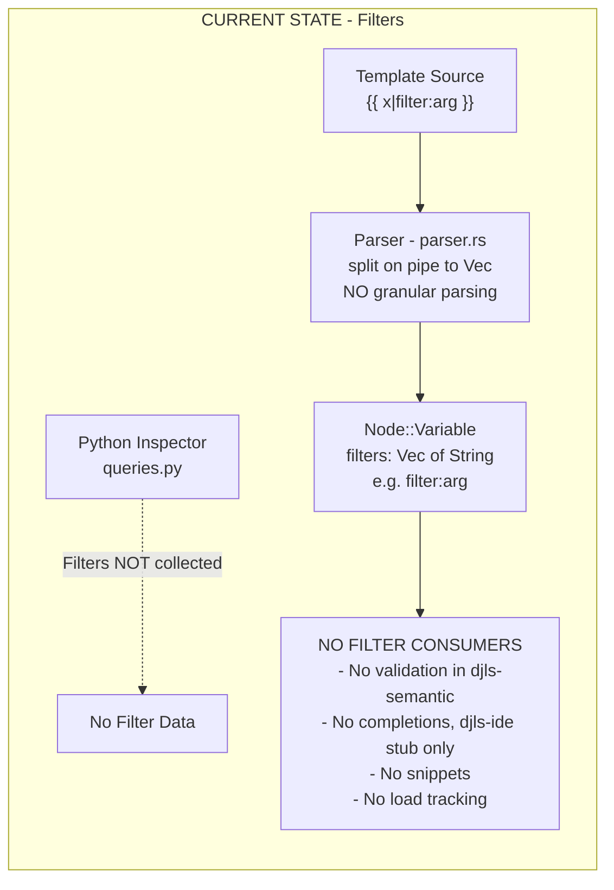

# Research: Django Template Filters End-to-End Analysis

## Executive Summary

**Template filters are minimally supported today.** The parsing layer captures filter data but loses structural detail, semantic validation doesn't exist for filters, IDE features have placeholder code but no implementation, and the Python inspector doesn't collect filter information at all. `` has no impact on filter availability since library loading isn't modeled.

---

## 1. Filter Tokenization/Parsing (djls-templates)

### Current Implementation

**Location:** `crates/djls-templates/src/parser.rs:182-202`

```rust
fn parse_variable(&mut self) -> Result<Node, ParseError> {
    let token = self.peek_previous()?;
    // ...
    let mut parts = content_ref.split('|');
    let var = parts.next().ok_or(ParseError::EmptyTag)?.trim().to_string();
    let filters: Vec<String> = parts.map(|s| s.trim().to_string()).collect();

    Ok(Node::Variable { var, filters, span })
}
```

### Data Structure

**Location:** `crates/djls-templates/src/nodelist.rs:27-31`

```rust
Variable {
    var: String,           // "value" or "user.name"
    filters: Vec<String>,  // ["default:'nothing'", "title", "upper"]
    span: Span,
}
```

### What's Preserved vs Lost

| Preserved                           | Lost                                |
| ----------------------------------- | ----------------------------------- |
| Variable name (before first `\|`)   | Structured filter name vs argument  |
| Raw filter strings (including args) | Individual filter spans             |
| Overall variable span               | Filter argument types               |
| Order of filter chain               | Whether argument is quoted/unquoted |

**Example parsing:**

```django
{{ value|default:'nothing'|title|upper }}
```

Becomes:

```yaml
var: value
filters:
    - "default:'nothing'" # NOT parsed into {name: "default", arg: "'nothing'"}
    - title
    - upper
```

### Error Type (Unused)

There's a `ParseError::InvalidFilterSyntax` variant defined (line 285-286) but it's **never emitted** - the parser doesn't validate filter syntax.

---

## 2. Semantic Validation (djls-semantic)

### Current State: **No Filter Validation**

There is **no filter-specific validation** in `djls-semantic`. The validation system only handles:

- **Tag arguments** (`arguments.rs`) - validates against `TagSpecs`
- **Block structure** (`blocks/builder.rs`) - validates opener/closer/intermediate matching

### What's Missing

| Missing Capability         | Would Need                                 |
| -------------------------- | ------------------------------------------ |
| Unknown filter detection   | `FilterSpecs` or runtime filter data       |
| Filter argument validation | Structured filter parsing + specs          |
| Filter arity checking      | Know how many args each filter takes       |
| Filter type checking       | Know argument types (strings vs variables) |

### The `` Tag Confusion

There's a `TagSpec` for the `` **block tag** (builtins.rs:102-114):

```rust
("filter", &TagSpec {
    end_tag: Some(EndTag { name: B("endfilter"), ... }),
    args: B(&[TagArg::VarArgs { name: B("filters"), ... }]),
    ...
})
```

This is for `...`, **not** for validating filter expressions in variables.

### Implicit Assumption

From `arguments.rs:59`:

```rust
// Unknown tag - no validation (could be custom tag from unloaded library)
```

The same lenient assumption applies to filters - unknown = silently ignored.

---

## 3. IDE Features (djls-ide)

### Completion Context Types

**Location:** `crates/djls-ide/src/completions.rs:67-75`

```rust
/// TODO: Future - completing filters after |
Filter {
    /// Partial filter name typed so far
    partial: String,
},
/// TODO: Future - completing variables after {{
Variable {
    /// Partial variable name typed so far
    partial: String,
    closing: ClosingBrace,
},
```

### Current Implementation: **Stub Only**

The `Filter` and `Variable` contexts exist but:

1. **Never detected** - `analyze_template_context()` only handles `{%` tags, not `{{` variables:

    ```rust
    fn analyze_template_context(line: &str, cursor_offset: usize) -> Option<...> {
        let tag_start = prefix.rfind("{%")?;  // ← Only looks for tags!
        // No handling for {{ at all
    }
    ```

2. **Returns empty** when matched (lines 327-329):
    ```rust
    TemplateCompletionContext::Filter { .. }
    | TemplateCompletionContext::Variable { .. }
    | TemplateCompletionContext::None => {
        Vec::new()  // No completions generated
    }
    ```

### Snippet Generation (Tags Only)

**Location:** `crates/djls-ide/src/snippets.rs`

Snippet generation only exists for tags (`generate_snippet_for_tag_with_end`). No filter snippet generation exists.

---

## 4. Python Inspector (djls-project)

### Current State: **Filters Not Collected**

**Location:** `crates/djls-project/inspector/queries.py:102-135`

The inspector collects `library.tags` but **ignores** `library.filters`:

```python
def get_installed_templatetags() -> TemplateTagQueryData:
    for library in engine.template_builtins:
        for tag_name, tag_func in library.tags.items():  # ← Only .tags
            templatetags.append(...)

    for lib_module in engine.libraries.values():
        library = import_library(lib_module)
        for tag_name, tag_func in library.tags.items():  # ← Only .tags
            templatetags.append(...)
```

### What Django Exposes

Django's `Library` objects have both:

- `library.tags` - dict of tag functions
- `library.filters` - dict of filter functions

### Potential Implementation Shape

```python
@dataclass
class TemplateFilter:
    name: str       # e.g., "title", "default"
    module: str     # e.g., "django.template.defaultfilters"
    doc: str | None # Docstring
    # Potentially: expects_localtime, is_safe, needs_autoescape flags

def get_installed_filters() -> TemplateFilterQueryData:
    for library in engine.template_builtins:
        for filter_name, filter_func in library.filters.items():
            filters.append(TemplateFilter(...))
```

### Rust Side Types That Would Be Needed

Would need parallel types in `crates/djls-project/src/django.rs`:

```rust
pub struct TemplateFilters(Vec<TemplateFilter>);
pub struct TemplateFilter {
    name: String,
    module: String,
    doc: Option<String>,
}
```

---

## 5. `` and Library Availability

### Current State: **No Library Loading Modeled**

The codebase has **no tracking** of what `` statements appear in a template or how they affect tag/filter availability.

### What This Means

| Behavior                              | Implication                                          |
| ------------------------------------- | ---------------------------------------------------- |
| All builtins always shown             | Correct - they don't need loading                    |
| All third-party tags shown            | Wrong - should only show if library loaded           |
| No "unknown filter" diagnostic        | Can't know what's available                          |
| Library completions use `module` path | Bug - shows "django.template.defaulttags" not "i18n" |

### Library Name Bug

**Location:** `crates/djls-ide/src/completions.rs:664-667`

```rust
// Get unique library names
let mut libraries = std::collections::HashSet::new();
for tag in tags.iter() {
    libraries.insert(tag.module());  // ← This is Python module path!
}
```

This shows `django.template.defaulttags` instead of the template library name (which for builtins is implicit, but for third-party like `` matters).

### What Would Be Needed for Library Scoping

1. **Parse `` statements** - extract library names from the current template
2. **Track loaded libraries per-file** - Salsa tracked state
3. **Scope completions** - only show tags/filters from loaded libraries + builtins
4. **Diagnostic for unloaded** - "Filter 'myfilter' requires "
5. **Fix library name mapping** - inspector needs to return template library name, not just module path

---

## Data Flow Diagram: Current State



---

## Key Code References

| Purpose                | Location                                    | Status                   |
| ---------------------- | ------------------------------------------- | ------------------------ |
| Filter parsing         | `djls-templates/src/parser.rs:182-202`      | Minimal (splits on `\|`) |
| Filter AST node        | `djls-templates/src/nodelist.rs:27-31`      | `Vec<String>` only       |
| Parse error variant    | `djls-templates/src/parser.rs:285-286`      | Defined, never used      |
| IDE context enum       | `djls-ide/src/completions.rs:67-75`         | TODO stub                |
| Context detection      | `djls-ide/src/completions.rs:178-270`       | Tags only, no `{{`       |
| Completion handler     | `djls-ide/src/completions.rs:327-329`       | Returns empty            |
| Inspector query        | `djls-project/inspector/queries.py:102-135` | Tags only                |
| Library completion bug | `djls-ide/src/completions.rs:664-667`       | Uses module path         |

---

## Open Questions

1. **Filter argument structure**: Should filters be parsed into structured `{name, args}` tuples, or is the raw string sufficient for most use cases?
2. **FilterSpecs vs runtime-only**: Would a static `FilterSpecs` system (like `TagSpecs`) be valuable for validation, or is runtime data from the inspector sufficient for completions?
3. **Library scoping priority**: How important is accurate library scoping (only showing loaded tags/filters) versus showing everything available?
4. **The `` syntax**: The `` syntax imports specific items - this adds complexity to library tracking.
