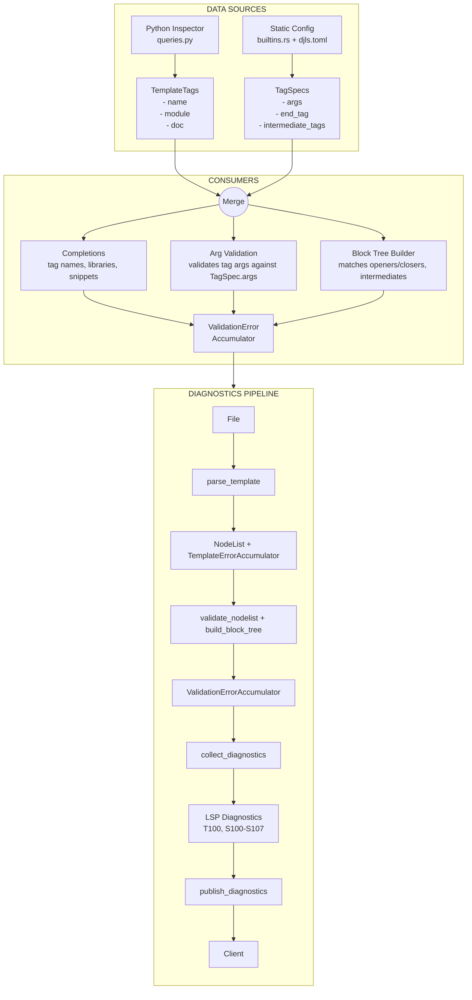

# Research: Template Introspection & Diagnostics Pipeline

## Summary

Template tag information flows through two parallel paths: **runtime TemplateTags** (from Python inspector querying live Django) provides tag names/modules for completions, while **static TagSpecs** (hardcoded builtins + user config) provides argument specifications for validation and snippets. Both converge in `djls-ide` for completions and diagnostics.

## Detailed Findings

### 1. Python Inspector: `templatetags` Query

**Location:** `crates/djls-project/inspector/queries.py:102-135`

The inspector queries Django's template engine for all registered tags:

```python
def get_installed_templatetags() -> TemplateTagQueryData:
    engine = Engine.get_default()

    # 1. Iterate engine.template_builtins (built-in tag libraries)
    for library in engine.template_builtins:
        for tag_name, tag_func in library.tags.items():
            templatetags.append(TemplateTag(
                name=tag_name,
                module=tag_func.__module__,
                doc=tag_func.__doc__
            ))

    # 2. Iterate engine.libraries.values() (registered libraries)
    for lib_module in engine.libraries.values():
        library = import_library(lib_module)
        # ... same pattern
```

**Django imports used:**

- `django.template.engine.Engine` - Get default template engine
- `django.template.library.import_library` - Import tag libraries
- `django.apps.apps` - Check apps.ready

**Data returned:**

```python
@dataclass
class TemplateTag:
    name: str       # e.g., "if", "for", "block"
    module: str     # e.g., "django.template.defaulttags"
    doc: str | None # Docstring from tag function
```

### 2. Rust Salsa Exposure (`djls-project`)

**Location:** `crates/djls-project/src/django.rs:91-99`

```rust
#[salsa::tracked]
pub fn templatetags(db: &dyn ProjectDb, _project: Project) -> Option<TemplateTags> {
    let response = inspector::query(db, &TemplatetagsRequest)?;
    Some(TemplateTags(response.templatetags))
}
```

**Types (`django.rs:101-127`):**

```rust
pub struct TemplateTags(Vec<TemplateTag>);  // Deref to Vec

pub struct TemplateTag {
    name: String,
    module: String,
    doc: Option<String>,
}
```

**Public exports (`lib.rs:10-11`):**

```rust
pub use django::templatetags;
pub use django::TemplateTags;
```

### 3. Consumers of TemplateTags Data

| Location                              | Usage                                                                                       | Assumptions                    |
| ------------------------------------- | ------------------------------------------------------------------------------------------- | ------------------------------ |
| `djls-server/src/server.rs:265-277`   | Fetches tags via `djls_project::templatetags(db, project)` and passes to completion handler | Expects `Option<TemplateTags>` |
| `djls-ide/src/completions.rs:370-450` | `generate_tag_name_completions()` - iterates tags for names, modules, docs                  | Tags have 3 fields             |
| `djls-ide/src/completions.rs:655-690` | `generate_library_completions()` - extracts unique modules for ``                 | `module` = library name        |

**Key assumption:** The `module` field is used directly as a library name for `` completions, but this is technically the Python module path not the template library name.

### 4. Template Parsing & Diagnostics Flow

#### Step 1: Parsing (`djls-templates`)

**Key files:**

- `crates/djls-templates/src/parser.rs` - Main parser with `ParseError` enum
- `crates/djls-templates/src/db.rs:50-51` - `TemplateErrorAccumulator` (Salsa accumulator)
- `crates/djls-templates/src/lib.rs:75` - Entry: `parse_template(db, file) -> Option<NodeList>`

#### Step 2: Semantic Validation (`djls-semantic`)

**Key files:**

- `crates/djls-semantic/src/arguments.rs:30-57` - Tag argument validation against `TagSpec`
- `crates/djls-semantic/src/blocks/builder.rs:44,129-130` - Block tree builder, accumulates `ValidationError`s
- `crates/djls-semantic/src/db.rs:22-23` - `ValidationErrorAccumulator`

#### Step 3: Diagnostic Collection (`djls-ide`)

**Location:** `crates/djls-ide/src/diagnostics.rs:110-158`

```rust
pub fn collect_diagnostics(db, file, nodelist) -> Vec<Diagnostic> {
    // 1. Get parse errors from TemplateErrorAccumulator
    let template_errors = parse_template::accumulated::<TemplateErrorAccumulator>(db, file);

    // 2. Get validation errors from ValidationErrorAccumulator
    let validation_errors = validate_nodelist::accumulated::<ValidationErrorAccumulator>(db, nodelist);

    // 3. Filter by DiagnosticsConfig severity, convert to LSP Diagnostics
}
```

**Diagnostic codes:**

- `T100` - Parser errors
- `T900/T901` - IO/config errors
- `S100-S107` - Semantic validation errors

#### Step 4: Publishing (`djls-server`)

**Location:** `crates/djls-server/src/server.rs:75-107`

Triggered by: `did_open`, `did_change`, `did_save`

### 5. Other Inspector Queries for Templates

| Query           | Python Function                 | Rust Function                   | Returns            | Used By             |
| --------------- | ------------------------------- | ------------------------------- | ------------------ | ------------------- |
| `django_init`   | `initialize_django()`           | `django_available(db, project)` | `bool`             | Project init check  |
| `python_env`    | `get_python_environment_info()` | _(not exposed)_                 | sys.\*, version    | N/A                 |
| `template_dirs` | `get_template_dirs()`           | `template_dirs(db, project)`    | `Vec<Utf8PathBuf>` | Template resolution |

**`template_dirs` usage:** `crates/djls-semantic/src/resolution/templates.rs:21,103` - Used for go-to-definition to find template files.

### 6. Static TagSpecs vs Runtime TemplateTags

The system has **two parallel sources** of template tag information:

#### Static TagSpecs (`djls-semantic/src/templatetags/`)

- **Source:** Hardcoded in `builtins.rs` + user config (`djls.toml`)
- **Purpose:** Argument specifications for validation & snippets
- **Contains:** `TagSpec` with `args`, `end_tag`, `intermediate_tags`
- **Used by:** Argument validation, snippet generation, block tree building

#### Runtime TemplateTags (`djls-project`)

- **Source:** Python inspector querying live Django project
- **Purpose:** List of available tag names & their modules
- **Contains:** `TemplateTag` with `name`, `module`, `doc`
- **Used by:** Completion suggestions (tag names, library names)

#### Merge Point

In `crates/djls-ide/src/completions.rs:370-450`:

```rust
// Get tag names from TemplateTags (runtime)
for tag in tags.iter() {
    // Get snippet/args from TagSpecs (static)
    if let Some(spec) = specs.get(tag.name()) {
        // Generate snippet from spec.args
    }
}
```

## Code References

Key locations for future reference:

- `crates/djls-project/inspector/queries.py:102-135` - Python templatetags query implementation
- `crates/djls-project/src/django.rs:91-99` - Salsa tracked `templatetags()` function
- `crates/djls-project/src/django.rs:101-127` - `TemplateTags` and `TemplateTag` types
- `crates/djls-semantic/src/templatetags/specs.rs:64-208` - `TagSpecs` type and config conversion
- `crates/djls-semantic/src/templatetags/builtins.rs:759` - `django_builtin_specs()`
- `crates/djls-ide/src/completions.rs:370-450` - Tag name completion using both sources
- `crates/djls-ide/src/diagnostics.rs:110-158` - Diagnostic collection combining accumulators
- `crates/djls-server/src/server.rs:265-277` - Server fetching templatetags for completions

## Data Flow Diagram



## Open Questions

1. **Library name mismatch:** The `module` field from `TemplateTags` is the Python module path (e.g., `django.template.defaulttags`), not the template library name used in ``. This may cause incorrect suggestions.

2. **TagSpecs coverage:** Static `TagSpecs` only covers Django builtins + user config. Tags from third-party libraries won't have argument specifications unless manually configured.

3. **python_env query:** The `python_env` inspector query exists but is not exposed to Rust. Could be useful for environment-aware features.
