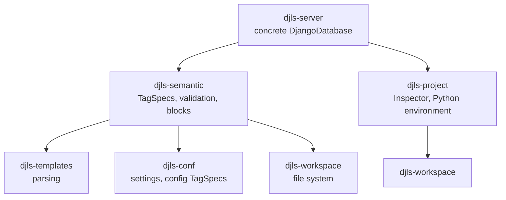
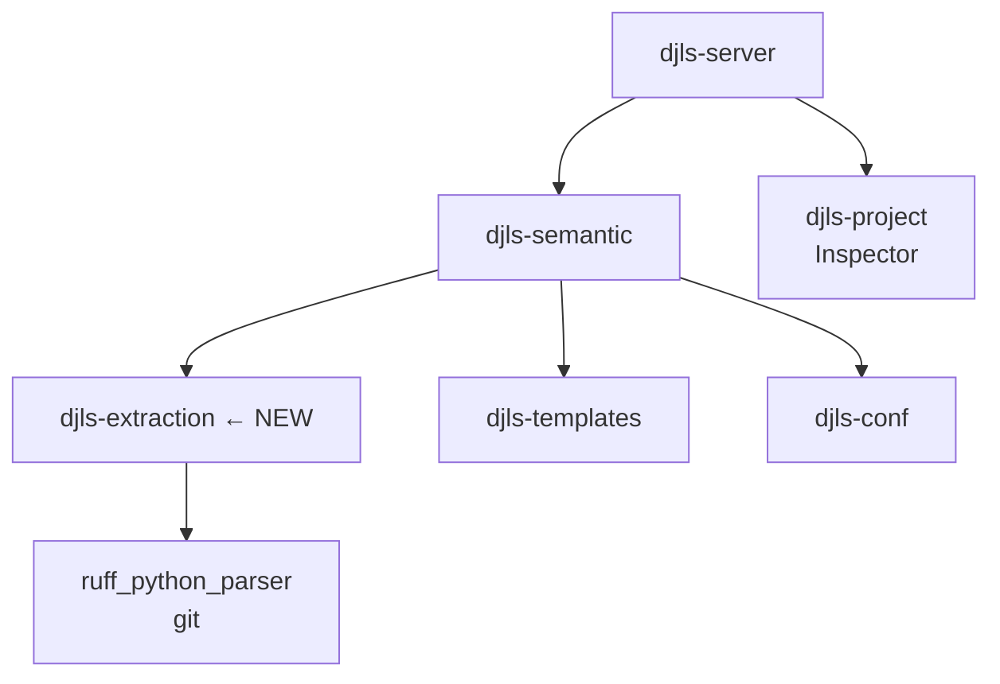
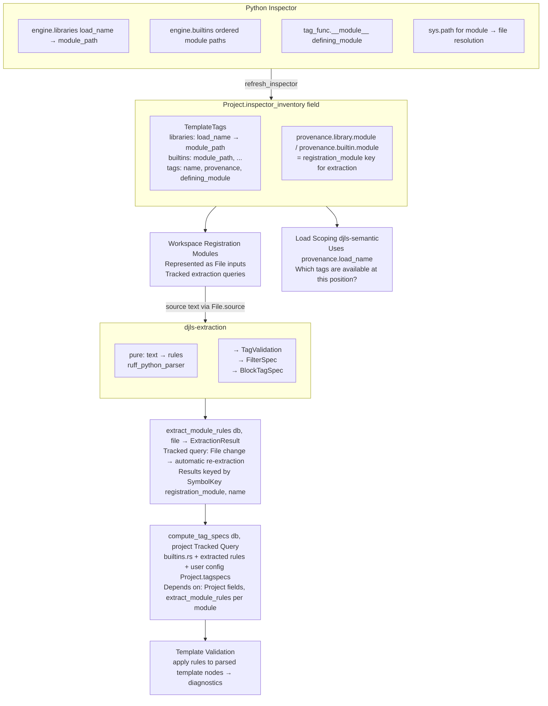

# RFC: Extraction Code Placement

**Date:** 2026-02-05  
**Status:** Draft (revised)  
**Scope:** Where Ruff AST extraction code lives and how it integrates with Salsa and inspector inventory

---

## What Changed Since Initial RFC

> **Revision note (2026-02-05):** The Salsa integration story in sections 5.2–5.6 has been revised to
> align with the M2 implementation plan (`.agents/plans/2026-02-05-m2-salsa-invalidation-plumbing.md`).
>
> **Key change:** The original RFC proposed new global Salsa inputs (`InspectorInventory`,
> `ExtractedRules`). The M2 direction keeps Salsa inputs minimal—**target: 2 primary inputs (`File` +
> `Project`)**—and folds inspector snapshot + semantic config into `Project` fields updated via setters
> with manual comparison before setting (Ruff/RA pattern).
>
> **Extraction caching:** Now recommends **derived tracked queries over Python module `File` sources**
> rather than a new global `ExtractedRules` input, so edits to registration modules invalidate
> naturally through the file dependency graph.

---

## 1. Context

The charter (`.agents/charter/2026-02-05-template-validation-port-charter.md`) establishes that:

1. **Python inspector** provides authoritative inventory (what tags/filters exist, which libraries they belong to)
2. **Rust extraction** enriches inventory with validation semantics by mining Python source via `ruff_python_parser`

This RFC addresses a narrower question: **where does the extraction code live in the Rust crate graph**, how does it integrate with Salsa caching, and how does it consume inspector data?

---

## 2. Current State

### 2.1 Crate Graph



### 2.2 Salsa Integration

`DjangoDatabase` in `djls-server/src/db.rs` implements all `Db` traits:

```rust
#[salsa::db]
impl SemanticDb for DjangoDatabase {
    fn tag_specs(&self) -> TagSpecs {
        TagSpecs::from(&self.settings())  // NOT tracked by Salsa
    }

    fn tag_index(&self) -> TagIndex<'_> {
        TagIndex::from_specs(self)  // Derived from tag_specs
    }
}
```

**Problem:** `tag_specs()` is a plain method, not `#[salsa::tracked]`. Changes to specs don't invalidate dependent queries. The charter's M2 milestone addresses this.

### 2.3 Inspector Inventory

Current `queries.py` returns:

```python
@dataclass
class TemplateTag:
    name: str          # tag name ("trans")
    module: str        # defining_module (tag_func.__module__)
    doc: str | None
```

**Missing:** The `library_module` (load name like `"i18n"`) and provenance distinction (builtin vs library). The charter's M1 milestone addresses this.

Current Rust type in `djls-project/src/django.rs`:

```rust
pub struct TemplateTag {
    name: String,
    module: String,  // defining_module
    doc: Option<String>,
}
```

---

## 3. The Decision

### 3.1 Options

| Option | Description |
|--------|-------------|
| **A: Expand djls-semantic** | Add `extraction/` module to existing crate |
| **B: New djls-extraction crate** | Separate crate depending on `ruff_python_parser` |
| **C: Types-only crate** | `djls-rules` for types; extraction stays in semantic |

### 3.2 Recommendation: **Option B — New `djls-extraction` Crate**

Create a new crate `djls-extraction` that:
- Depends on `ruff_python_parser` (git dependency, SHA-pinned)
- Exports extraction logic and result types
- Is consumed by `djls-semantic` for validation enrichment

**Updated crate graph:**



---

## 4. Rationale

### 4.1 Dependency Isolation

`ruff_python_parser` is:
- A git dependency (no crates.io stability guarantees)
- Internal to Astral's tooling (may have breaking changes)
- Unrelated to template parsing or semantic analysis

Confining it to one crate means:
- Breaking changes affect only `djls-extraction`
- Other crates compile faster (no Python AST in their dependency tree)
- Easier to pin/update deliberately

### 4.2 Testability

Extraction should be testable in isolation:
- Golden tests: "given this Python source, extract these rules"
- No template parsing, no Salsa, no file system

With a separate crate:
```rust
// djls-extraction/tests/django_tags.rs
#[test]
fn test_if_tag_extraction() {
    let source = include_str!("fixtures/defaulttags.py");
    let rules = extract_tag_rules(source);
    insta::assert_yaml_snapshot!(rules);
}
```

### 4.3 Conceptual Clarity

Two distinct concerns:
1. **Extraction:** "Parse Python source → derive validation rules"
2. **Validation:** "Apply rules to template nodes → produce diagnostics"

These should be separate modules at minimum. A crate boundary makes the separation explicit and enforced by the compiler.

### 4.4 Counter-arguments Considered

| Concern | Response |
|---------|----------|
| "More crate boundaries = more complexity" | Minimal: one new Cargo.toml, one new lib.rs. Types naturally cross via pub exports. |
| "Build graph gets deeper" | Extraction is leaf-ish (no djls dependencies except maybe djls-conf for types). Parallel compilation not harmed. |
| "Overkill for now" | The git-dep nature of ruff_python_parser makes isolation valuable immediately, not just at scale. |

---

## 5. Salsa Integration Strategy

### 5.1 Architectural Constraint: Minimal Salsa Inputs

Per the M2 plan, djls maintains a **small number of semantically-meaningful inputs** (Ruff/RA pattern):

| Input | Purpose |
|-------|---------|
| `File` | File path + revision counter |
| `Project` | Project root + Python environment + inspector inventory + semantic config |

**Key principle:** Prefer extending `Project` with fields rather than adding new global inputs. This keeps the dependency graph tractable and avoids "input explosion."

### 5.2 Inspector Inventory: Project Fields, Not Separate Input

**Previous approach (superseded):** The initial RFC proposed `#[salsa::input] InspectorInventory` as a separate Salsa input.

**Current approach:** Inspector inventory is stored as **fields on the `Project` input**, updated via setters with manual comparison (Ruff/RA style):

```rust
#[salsa::input]
pub struct Project {
    // ... existing fields (root, interpreter, etc.) ...
    
    /// Runtime inventory from Python inspector (M1 payload shape).
    /// None if inspector hasn't been queried yet or failed.
    #[returns(ref)]
    pub inspector_inventory: Option<TemplateTags>,
    
    /// Tag specifications config document (from djls.toml).
    #[returns(ref)]
    pub tagspecs: TagSpecDef,
    
    /// Diagnostic severity overrides.
    #[returns(ref)]
    pub diagnostics: DiagnosticsConfig,
}
```

**Refresh mechanism:** `db.refresh_inspector()` is an **explicit side-effecting operation** that:
1. Queries the Python inspector (subprocess call)
2. Compares new inventory with current (`project.inspector_inventory(db)`)
3. Calls setter **only if changed**: `project.set_inspector_inventory(db).to(new_inventory)`

Salsa automatically invalidates downstream queries when the field changes.

### 5.3 Extraction Results: Tracked Queries Over File Sources

**Previous approach (superseded):** The initial RFC proposed `#[salsa::input] ExtractedRules` as a global Salsa input, updated manually on refresh.

**Current approach:** Prefer **Salsa-derived tracked queries over Python module `File` sources**. This means:

1. **Python registration modules are represented as `File` inputs** (already exists in Salsa)
2. **Extraction is a tracked query** that takes a `File` and returns extracted rules
3. **Edits to registration modules invalidate naturally** through the file dependency graph

```rust
/// Key for addressing extracted rules - must include registration module
/// to avoid collisions when same name exists in different libraries.
#[derive(Debug, Clone, Hash, Eq, PartialEq)]
pub struct SymbolKey {
    pub registration_module: String,  // e.g., "django.templatetags.i18n"
    pub name: String,                  // e.g., "trans"
    pub kind: SymbolKind,              // Tag or Filter
}

/// Extract rules from a Python registration module.
/// 
/// This is a tracked query: when the File changes, extraction re-runs.
#[salsa::tracked]
pub fn extract_module_rules(db: &dyn Db, file: File) -> Option<ExtractionResult> {
    let source = file.source(db)?;
    djls_extraction::extract_rules(&source).ok()
}
```

**Why not a global `ExtractedRules` input?**
- File-based tracking provides **automatic invalidation** when source changes
- Avoids a parallel "rule cache" that must be manually synchronized
- Matches how Ruff/RA handle derived data from source files

**When a global input might be unavoidable:**
- If extraction requires data that isn't derivable from files alone (e.g., runtime-only info)
- If extraction cost per-file is prohibitive and batching provides significant wins
- If the workspace doesn't contain the registration modules (e.g., site-packages)

For site-packages modules (not in workspace), extraction results may need to be cached differently—potentially as fields on `Project` alongside the inspector inventory, refreshed via the same `refresh_inspector()` path.

### 5.4 Invalidation Triggers

| Change Signal | Who Detects | What Happens |
|---------------|-------------|--------------|
| **Startup** | `DjangoDatabase::new()` | Fresh state; no invalidation needed |
| **Config file change** | File watcher | `update_project_from_settings()` updates `Project` fields via setters |
| **venv/sys.path change** | Settings change | `refresh_inspector()` re-queries Python, updates `Project.inspector_inventory` |
| **Inspector refresh** (explicit) | User command | `refresh_inspector()` updates `Project.inspector_inventory` |
| **Registration module edit** | Workspace file watcher | `File` revision bumps → tracked extraction query re-runs |

**Key design decision:** Extraction for workspace files is demand-driven via tracked queries. Extraction for site-packages modules (outside workspace) is triggered by `refresh_inspector()`.

### 5.5 Integration with TagSpecs

Current flow:
```
Settings → TagSpecs (builtins.rs + config overrides)
```

Future flow:
```
Project.tagspecs + Project.inspector_inventory + Extracted Rules → TagSpecs
```

The `compute_tag_specs()` tracked query merges all sources:

```rust
#[salsa::tracked]
fn compute_tag_specs(db: &dyn Db, project: Project) -> TagSpecs {
    // Read Salsa-tracked fields to establish dependencies
    let inventory = project.inspector_inventory(db);
    let tagspecs_def = project.tagspecs(db);
    
    // Start with Django builtins (compile-time constant)
    let mut specs = django_builtin_specs();
    
    // Merge extracted rules from workspace registration modules (tracked queries)
    if let Some(inv) = inventory {
        for tag in inv.tags() {
            if let Some(file) = resolve_registration_module_to_file(db, tag.registration_module()) {
                if let Some(extracted) = extract_module_rules(db, file) {
                    specs.merge_extracted(&extracted);
                }
            }
        }
    }
    
    // Merge user config overrides
    specs.merge(TagSpecs::from_config_def(tagspecs_def));
    
    specs
}
```

### 5.6 Invalidation Contract Summary

| Data Source | Salsa Role | Update Trigger | Updated By |
|-------------|------------|----------------|------------|
| `builtins.rs` | Compile-time constant | Rebuild | N/A |
| User config (djls.toml) | `Project.tagspecs` field | File watcher | `update_project_from_settings()` |
| Inspector inventory | `Project.inspector_inventory` field | Explicit refresh | `refresh_inspector()` |
| Workspace registration modules | `File` inputs | File watcher | Automatic (file revision bump) |
| Site-packages registration modules | Cached on `Project` or alongside inventory | `refresh_inspector()` | Explicit in refresh path |

**Invariant:** Every external data source that affects validation must be either:
- A field on `Project` (updated via setters with comparison), OR
- Derivable from `File` inputs via tracked queries

No "invisible" dependencies (e.g., `Arc<Mutex<...>>` reads inside tracked functions).

**Dependency chain:**
```
Project (input)
  ├── inspector_inventory (field)
  ├── tagspecs (field)
  └── diagnostics (field)
File (input, for workspace registration modules)
    └── extract_module_rules(db, file) (tracked)
            └── compute_tag_specs(db, project) (tracked, merges all sources)
                    └── validate_nodelist(db, ...) (tracked)
```

---

## 6. Consuming Inspector Inventory

### 6.1 Inspector Payload Structure (Post-M1)

Per the M1 plan, the inspector provides a structured payload with clear terminology:

```python
@dataclass
class TemplateTag:
    name: str
    provenance: dict  # {"library": {"load_name": str, "module": str}} | {"builtin": {"module": str}}
    defining_module: str  # tag_func.__module__, for docs/jump-to-def
    doc: str | None

@dataclass
class TemplateTagQueryData:
    libraries: dict[str, str]   # load_name → module_path (from engine.libraries)
    builtins: list[str]         # ordered builtin module paths (from engine.builtins)
    templatetags: list[TemplateTag]
```

**Key terminology (avoiding ambiguity):**

| Term | Example | Source | Purpose |
|------|---------|--------|---------|
| `load_name` | `"i18n"` | `engine.libraries.keys()` | Used in `` |
| `registration_module` | `"django.templatetags.i18n"` | `provenance.library.module` or `provenance.builtin.module` | Where `@register.tag` is called; **key for extraction** |
| `defining_module` | `"django.templatetags.i18n"` | `tag_func.__module__` | Where function is defined; for docs/jump-to-def |

**Note:** `registration_module` and `defining_module` are often the same, but can differ when tags are defined in one module and registered in another (wrapper patterns).

### 6.2 Rust Types (Post-M1)

```rust
// djls-project/src/django.rs
#[derive(Debug, Clone, Deserialize, PartialEq)]
#[serde(rename_all = "lowercase")]
pub enum TagProvenance {
    Library {
        load_name: String,  // "i18n" - for 
        module: String,     // "django.templatetags.i18n" - registration_module
    },
    Builtin {
        module: String,     // "django.template.defaulttags" - registration_module
    },
}

#[derive(Debug, Clone, Deserialize, PartialEq)]
pub struct TemplateTag {
    pub name: String,
    pub provenance: TagProvenance,
    pub defining_module: String,
    pub doc: Option<String>,
}

impl TemplateTag {
    /// The module where this tag is registered (@register.tag is called).
    /// This is the primary source for extraction - rule mining happens here.
    pub fn registration_module(&self) -> &str {
        match &self.provenance {
            TagProvenance::Library { module, .. } => module,
            TagProvenance::Builtin { module } => module,
        }
    }
}
```

### 6.3 Extraction Workflow

**Critical:** Extraction keys off `registration_module`, NOT `defining_module`.

Rule mining (TemplateSyntaxError guards, `parse_bits` usage, `parser.parse((...))`  calls, opaque blocks) happens in the module where registration occurs—the library/builtin module with `@register.tag` decorators.

**Workflow (orchestrated by djls-server, NOT djls-extraction):**

1. **Inspector inventory** available on `Project.inspector_inventory` (contains `registration_module` + `sys_path`)
2. **Group tags by `registration_module`** to batch extraction per source file
3. **Resolve module to file** (workspace files become `File` inputs; site-packages handled separately)
4. **For workspace files:** Call tracked query `extract_module_rules(db, file)`
5. **For site-packages:** Extract via `refresh_inspector()` path, cache alongside inventory
6. **Merge results** into `TagSpecs` via `compute_tag_specs()` tracked query

**Why this separation?** `djls-extraction` stays pure and testable—it only knows about Python source text, not file systems, paths, or environments. All I/O and path resolution lives in the caller.

### 6.4 Data Flow Diagram



---

## 7. Crate Structure

### 7.1 `djls-extraction` Layout

```
crates/djls-extraction/
├── Cargo.toml
└── src/
    ├── lib.rs           # Public API
    ├── parser.rs        # ruff_python_parser wrapper
    ├── tags.rs          # Tag rule extraction
    ├── filters.rs       # Filter spec extraction
    ├── structural.rs    # Block structure (end tags, intermediates)
    ├── patterns.rs      # AST pattern matching utilities
    └── types.rs         # TagValidation, FilterSpec, etc.
```

### 7.2 `Cargo.toml`

```toml
[package]
name = "djls-extraction"
version = "0.0.0"
edition = "2021"

[dependencies]
ruff_python_parser = { git = "https://github.com/astral-sh/ruff", rev = "SHA_TO_PIN" }
ruff_python_ast = { git = "https://github.com/astral-sh/ruff", rev = "SHA_TO_PIN" }

camino = { workspace = true }
rustc-hash = { workspace = true }
serde = { workspace = true }
thiserror = { workspace = true }

[dev-dependencies]
insta = { workspace = true }
```

### 7.3 Public API

```rust
// djls-extraction/src/lib.rs

pub use types::{TagValidation, FilterSpec, BlockTagSpec, ExtractedRule, SymbolKey, SymbolKind};

/// Extract all rules from a single Python source file.
/// 
/// This is a pure function: source text in, rules out.
/// Module-to-path resolution is NOT this crate's responsibility.
pub fn extract_rules(source: &str) -> Result<ExtractionResult, ExtractionError>;

pub struct ExtractionResult {
    pub tags: Vec<TagValidation>,
    pub filters: Vec<FilterSpec>,
    pub blocks: Vec<BlockTagSpec>,
}
```

**Design principle:** `djls-extraction` is pure—it takes source text and returns rules. It does NOT:
- Resolve module paths to file paths
- Read files from disk
- Know about `sys.path` or the Python environment

Path resolution lives in the caller (`djls-project` or `djls-server`):

```rust
// In djls-project or djls-server (NOT djls-extraction)
fn resolve_module_to_file(
    db: &dyn Db,
    registration_module: &str,
) -> Option<File> {
    let sys_path = db.python_sys_path();
    let source_path = resolve_module_to_path(registration_module, &sys_path)?;
    db.file_for_path(&source_path)
}

fn resolve_module_to_path(module: &str, sys_path: &[PathBuf]) -> Option<PathBuf> {
    // "django.templatetags.i18n" → find "django/templatetags/i18n.py"
    // ...
}
```

This keeps `djls-extraction` testable in isolation (just source strings) and avoids pulling file system or Python environment dependencies into the crate.

---

## 8. Tradeoffs

### 8.1 What We Gain

| Benefit | Impact |
|---------|--------|
| **Dependency isolation** | `ruff_python_parser` changes don't ripple through codebase |
| **Fast iteration** | Extraction tests run without template/Salsa overhead |
| **Clear ownership** | "Python AST stuff" has a home; easier to navigate |
| **Future flexibility** | Could swap parser, cache extraction artifacts, etc. |

### 8.2 What We Pay

| Cost | Mitigation |
|------|------------|
| **One more crate** | Minimal overhead; follows existing pattern |
| **Type re-exports** | `djls-semantic` re-exports what it needs; callers don't know |
| **Build graph depth** | Extraction is a leaf; doesn't hurt parallelism |

---

## 9. Success Looks Like

### 9.1 Immediate (M5 complete)

- [ ] `djls-extraction` exists with `ruff_python_parser` pinned
- [ ] Golden tests: `extract_tag_rules("django/template/defaulttags.py")` matches expected output
- [ ] `djls-semantic` consumes extraction output via tracked queries
- [ ] Changing registration module source invalidates dependent validation queries (automatic via File tracking)

### 9.2 Ongoing

- [ ] Third-party library rules extracted on-demand (inspector provides module path → source)
- [ ] Extraction errors are graceful: missing/unparseable source → skip enrichment, don't crash
- [ ] `ruff_python_parser` updates are deliberate: bump SHA, run golden tests, review changes

### 9.3 Anti-patterns Avoided

- ❌ Extraction logic scattered across `djls-semantic` modules
- ❌ `ruff_python_parser` imported in multiple crates
- ❌ Extraction results computed inline during validation (should be cached via tracked queries)
- ❌ Inspector inventory and extracted rules conflated (they're separate concerns)
- ❌ Using `defining_module` for extraction (should use `registration_module`)
- ❌ Invisible dependencies on external state (all inputs must be Salsa-visible)
- ❌ Proliferating Salsa inputs beyond `File` + `Project` without justification

---

## 10. Open Questions (For Implementation)

| # | Question | Notes |
|---|----------|-------|
| 1 | Initial SHA for `ruff_python_parser`? | Pick a recent stable Ruff release tag |
| 2 | Bundle extracted Django rules as JSON or compute at startup? | Charter suggests runtime JSON; TBD based on startup cost |
| 3 | How to handle site-packages modules not in workspace? | May need to cache extraction results alongside inventory on `Project` |
| 4 | How to resolve `registration_module` → source path? | Need `sys.path` from inspector + module-to-path logic |
| 5 | What triggers `db.refresh_inspector()`? | User command? Periodic timer? File watcher on site-packages? |
| 6 | How to detect workspace templatetags source changes? | File watcher → `File` revision bump → tracked query invalidates |
| 7 | Should extraction be eager (on refresh) or lazy (on first access)? | Lazy via tracked queries for workspace; eager in refresh for site-packages |

---

## 11. Appendix: Alternative Considered

### A.1 Expand djls-semantic (Option A)

```
djls-semantic/src/
├── extraction/           # NEW submodule
│   ├── mod.rs
│   ├── tags.rs
│   └── ...
└── templatetags/
    ├── builtins.rs
    └── specs.rs
```

**Why not:** 
- `ruff_python_parser` becomes a dependency of `djls-semantic`
- Everything that depends on `djls-semantic` now transitively depends on the Python parser
- Harder to test extraction in isolation
- Conceptual pollution: "semantic analysis of templates" ≠ "parsing Python source"

The crate boundary cost is low; the isolation benefit is high.

---

## 12. Appendix: Salsa Integration Evolution

### A.2 Why Not Separate Salsa Inputs?

The initial RFC proposed:
- `#[salsa::input] InspectorInventory` — separate input for inspector data
- `#[salsa::input] ExtractedRules` — separate input for extraction results

**Why this was changed:**

1. **Input explosion:** Each new Salsa input adds cognitive overhead and makes the dependency graph harder to reason about.

2. **Ruff/RA precedent:** Both codebases use a small number of "big inputs" (`SourceRoot`, `File`, `Package`) rather than many fine-grained inputs. Data that changes together should live together.

3. **Automatic invalidation for files:** By representing workspace registration modules as `File` inputs and extraction as tracked queries over those files, edits invalidate naturally without manual coordination.

4. **Setter-with-comparison pattern:** Folding inspector inventory into `Project` fields and using manual comparison before setters achieves the same invalidation precision as a separate input, with less machinery.

### A.3 When Might a Global Input Be Necessary?

A new `#[salsa::input]` might be justified if:
- Data cannot be derived from existing inputs (truly external, not representable as files)
- Performance requires batched updates that don't fit the per-file model
- The data's lifecycle is fundamentally different from files or project config

For extraction, none of these apply: registration modules are files, extraction is derivable, and the lifecycle matches file edits.
