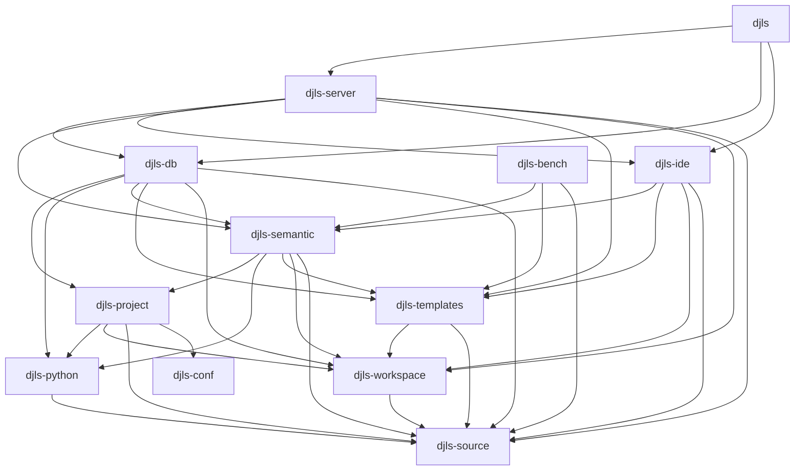

# Architecture

This document describes the high-level architecture of Django Language Server (`djls`). It's meant to help you get oriented in the codebase — where things live, how they connect, and why they're shaped the way they are.

The structure and general vibe of this document is inspired by [rust-analyzer's ARCHITECTURE.md](https://github.com/rust-lang/rust-analyzer/blob/master/docs/dev/architecture.md), which is an excellent example of this kind of guide.

For contribution guidelines, see [CONTRIBUTING.md](CONTRIBUTING.md).

## Overview

Django Language Server is an LSP server written in Rust that provides IDE features for Django templates. The editor sends template source code; the server combines it with knowledge about the Django project — installed apps, template libraries, tag and filter definitions — and returns diagnostics, completions, and navigation results.

[Salsa](https://github.com/salsa-rs/salsa) drives incremental computation: when a file changes, only the affected queries recompute. The architecture borrows from [Ruff/ty](https://github.com/astral-sh/ruff/tree/main/crates/ty): layered database traits, a single concrete database type that owns all state, and a session model for LSP operations.

The server depends on two distinct kinds of knowledge:

1. What tags and filters exist — which template libraries are installed, what symbols they export, what arguments they accept. This comes from the Python side of the Django project.
2. What the template says — its syntax, its structure, and whether it uses those tags and filters correctly. This comes from parsing the template source.

Separate subsystems produce each kind of knowledge. Both feed into the same Salsa database, where they meet during semantic analysis.

## Entry Points

`crates/djls/src/main.rs` parses CLI arguments and either starts the LSP server or runs the `djls check` command. There's not much to see here — the interesting stuff is deeper in.

If you're already familiar with LSP, `crates/djls-server/src/server.rs` is a good starting point. It implements all the LSP request handlers (`did_open`, `completion`, `goto_definition`, etc.) and shows how requests flow through the system.

If you want to understand how templates get parsed, start with the hand-written recursive descent parser in `crates/djls-templates/src/parser.rs`.

If you're curious about how the server validates tags without a Django runtime, look at `crates/djls-python/src/analysis/` — it extracts validation rules from Python templatetag source purely through static analysis. If anyone's tried this before, they and their project didn't make it out with their sanity intact (and who says I have?) — I've never come across one. It's early and rough, but it's one of the more interesting parts of the project.

If you're interested in how parsing, extraction, and project knowledge come together to give templates *meaning*, start with `crates/djls-semantic/src/lib.rs` — that's where "is this tag valid here?" actually gets answered.

## Code Map

All crates live in `crates/`. The dependency arrows below point from consumer to dependency:



Throughout the code map you'll see **Architecture Invariant** callouts. These are constraints we maintain deliberately — things that are true about the code on purpose and that we'd like to keep true.

### `crates/djls-server`

The LSP server. This is the crate that wires everything together at runtime.

`Session` owns the `DjangoDatabase` and all document state. It's behind a `tokio::Mutex`, and request handlers access it through helper methods:

- `with_session` / `with_session_mut` — lock the session and run a synchronous closure. All current LSP request handlers (completions, goto definition, references, diagnostics) use this path.
- `with_session_mut_task` — submit an async task to a `Queue` backed by an mpsc channel. Used for expensive background work like inspector refresh, so it doesn't block the request path.

A `SessionSnapshot` type (idea borrowed from Ruff/ty, natch) exists for cloning the database for concurrent read-only access, but current request handlers don't use it yet — everything goes through the session lock. This could evolve toward a snapshot-per-request model, but it hasn't been necessary so far.

**Architecture Invariant:** `djls-server` is the only crate that speaks the LSP protocol — handling requests, managing the session, pushing notifications.

### `crates/djls-db`

The concrete Salsa database. `DjangoDatabase` implements every `Db` trait defined across the other crates — it's the single type that ties the whole trait hierarchy together. Both the LSP server and the `djls check` CLI use it.

This crate also owns the inspector refresh logic: querying the Python subprocess, updating Salsa inputs with the results, and managing the disk cache at `~/.cache/djls/inspector/`.

### `crates/djls-templates`

The template parser — a hand-written recursive descent parser for Django's template syntax. It's inspired by Django's own parser but designed around IDE needs: error recovery, partial results, and position tracking rather than template rendering.

It lexes and parses template source into a flat `NodeList` — the same representation Django's own template engine uses internally. Each `Node` is a `Tag`, `Variable`, `Comment`, `Text`, or `Error`. The parser always produces a node list; parse errors become `Node::Error` entries in the list and are also emitted through a Salsa accumulator (`TemplateErrorAccumulator`).

**Architecture Invariant:** the parser never fails. It produces `(Vec<Node>, Vec<ParseError>)` rather than `Result<NodeList, Error>`. This is critical for an IDE: users are *always* in the middle of typing something invalid, and the rest of the pipeline needs to keep working around the errors.

**Architecture Invariant:** this crate knows nothing about Django semantics. It can't tell whether `` refers to a real library, whether `` has the right number of arguments, or whether a filter exists. It handles only template *syntax*: delimiters, tag structure, filter chains, token boundaries. This separation matters because it means you can use the parser for things like syntax highlighting or formatting without needing any Django project context at all.

### `crates/djls-semantic`

Semantic analysis. This is where Django knowledge meets the parsed template, and where most of the interesting analysis happens.

It takes the flat node list from `djls-templates` and does two things:

1. Builds a `BlockTree` that reconstructs nested block structure by matching `` with ``, ``, and ``. Structural errors (unclosed tags, orphaned intermediates, mismatched block names) are accumulated as `ValidationError`s during construction.
2. Runs the `TemplateValidator`, a single-pass visitor over the flat node list that checks load scoping, argument counts, filter arity, `` expression syntax, and `` positioning. It skips nodes inside opaque regions (``, ``).

All errors go through a `ValidationErrorAccumulator` — the validator never returns errors directly. Callers retrieve them with `validate_nodelist::accumulated::<ValidationErrorAccumulator>(db, nodelist)`.

This crate also owns:
- **Load scoping** — tracking which tags and filters are available at each position based on preceding `` tags
- **Template name resolution** — resolving template names to files on disk
- **Tag specifications** — the merged view of validation rules (extracted by `djls-python`, combined with manual specs) that the validator checks against

### `crates/djls-ide`

IDE features: completions, diagnostics, snippets, goto definition, find references. This is the boundary between internal domain knowledge and the outside world — it takes everything the semantic model knows and translates it into LSP-shaped output that editors can consume.

**Architecture Invariant:** `djls-ide` is the translation layer. Everything below it — `djls-semantic`, `djls-templates`, `djls-python`, `djls-source` — is LSP-unaware. `djls-server` does reach into domain crates directly in places (calling `parse_template`, `validate_nodelist`, `compute_loaded_libraries`), so the boundary isn't perfectly clean in that direction yet.

### `crates/djls-python`

Static analysis of Python templatetag files using the [Ruff](https://github.com/astral-sh/ruff) parser. This crate parses Python source into an AST, then walks it looking for `@register.tag`, `@register.simple_tag`, `@register.filter`, and similar decorators. From the decorated functions it extracts validation rules — argument count constraints, required keywords, `as var` support, block specs, filter arity — by analyzing function signatures, decorators, and `if condition: raise TemplateSyntaxError(...)` guard patterns.

**Architecture Invariant:** this crate never imports Django or runs Python. It parses Python source as text with the same Ruff parser that powers the Ruff linter. If a templatetag file is syntactically valid Python, we can analyze it. We don't need a working Django installation, a virtual environment, or even a Python interpreter.

### `crates/djls-project`

Project configuration and Python environment discovery. `Project` is a Salsa input holding the project root, interpreter path, Django settings module, template libraries, and extraction results.

This crate owns the Python inspector subprocess (`Inspector`), module resolution, and template library discovery. It also defines the `TemplateLibraries` type that holds the combined knowledge from inspector results and environment scanning.

### `crates/djls-source`

Foundation crate — file representation, text positions, spans, line indexing, diagnostic rendering. Nearly every other crate depends on this one.

### `crates/djls-workspace`

Virtual file system layer, document buffers, and file discovery. `OverlayFileSystem` is the VFS — it checks editor buffers first, then falls back to disk, so unsaved changes are visible to Salsa queries without touching the real filesystem. Also owns `TextDocument` (open document representation with version tracking) and `walk_files` for `djls check` file discovery.

### `crates/djls-conf`

Settings and diagnostics configuration. Merges configuration from multiple sources into a single `Settings` type. See [Configurability](#configurability) for the full picture.

### `crates/djls-bench`

Benchmarks using [divan](https://github.com/nvzqz/divan). Owns a `BenchDatabase` that implements `SemanticDb` with realistic tag specs, plus benchmarks for parsing, validation, extraction, and full-pipeline `djls check` runs. `just dev profile <bench> [filter]` generates flamegraphs.

### `crates/djls-corpus`

Corpus management for integration tests. Syncs real-world Django project source — templates and templatetag modules from 40+ packages and 17 real projects — for testing extraction and validation against code that actually exists in the wild. See the [Testing](#testing) section for how corpus tests work.

## The Database Trait Stack

Salsa requires a single concrete database type, but we don't want every crate to depend on every other crate. Layered traits let each crate declare only the capabilities it needs:

```
salsa::Database
├── SourceDb          (djls-source)    — file tracking, read_file, revision bumping
│   ├── WorkspaceDb   (djls-workspace) — file system access (overlay → disk)
│   └── TemplateDb    (djls-templates) — marker trait for template parsing context
│       └── SemanticDb (djls-semantic) — tag specs, filter specs, template libraries, diagnostics config
└── ProjectDb         (djls-project)   — project input, inspector access
```

Note the two independent roots: `SourceDb` and `ProjectDb` both extend `salsa::Database` directly. `TemplateDb` extends `SourceDb` (not `WorkspaceDb`) — it needs file access but not the overlay filesystem.

`DjangoDatabase` in `djls-db` implements all of them. Test databases and `BenchDatabase` implement only the subset they need, which keeps tests fast and focused.

## How Knowledge Gets In

### The Python Inspector

> [!NOTE]
> The inspector is planned for replacement with static settings extraction ([#401](https://github.com/joshuadavidthomas/django-language-server/issues/401)). The goal: parse `settings.py` with the Ruff AST — the same approach used for templatetag extraction — and eliminate the Python subprocess and calling `django.setup()` entirely.

The server needs to know what Django has installed: `INSTALLED_APPS`, template directories, templatetag libraries, and the symbols they export. A Python subprocess currently provides this.

A small Python program (`python/dist/djls_inspector.pyz`) ships embedded in the binary as a zipapp. At startup the server writes it to a temp file and runs it against the project's Python interpreter with Django configured. The inspector queries Django's template engine registry and returns JSON describing installed libraries and their symbols.

Startup uses two phases to avoid blocking the editor:

1. A cache check during `initialized`. The server loads a cached inspector response from `~/.cache/djls/inspector/`. The cache key is a SHA-256 hash of the project root, interpreter path, settings module, and PYTHONPATH. If the cache exists (and its `djls_version` matches), the server becomes functional immediately with the cached data.
2. A background task spawns the real inspector subprocess, updates the Salsa inputs, and writes a fresh cache. When a cache was loaded in phase 1, this runs concurrently with normal operation. If no cache existed, the server waits for this to complete before advertising full capabilities.

This means that in the common case (you've opened this project before and the environment hasn't changed), startup is nearly instant — the server just reads a JSON file from disk.

### Rust-Side Extraction (Static Validation Rules)

The inspector reports *what* tags and filters exist. But to actually validate usage — "does this tag accept these arguments?" — the server needs to know *how* each tag and filter works. Django's template engine answers this question at runtime, by calling the tag's compilation function and seeing what happens. We don't have a runtime.

Instead, `djls-python` parses templatetag Python source files with the Ruff parser and extracts validation rules directly from the AST. It walks each module looking for `@register.tag`, `@register.simple_tag`, `@register.filter`, and similar decorators, then analyzes the decorated function's signature, decorators, and `if condition: raise TemplateSyntaxError(...)` guard patterns to infer:

- **Tag rules** — argument count constraints (min/max positional args), required keywords, choice-constrained positions, `as var` support, block specs (which intermediate and end tags a block tag expects)
- **Filter arity** — whether a filter requires an argument, accepts one optionally, or takes none

This works well for `simple_tag` and `inclusion_tag` registrations where the function signature maps directly to template arguments. Hand-written compilation functions (like Django's built-in `do_if` or `do_for`) are harder — those have custom argument parsing that doesn't follow a signature — but extraction still tries, using abstract interpretation to track variables like `bits = token.split_contents()` through the function body and infer constraints from the raise guards. Hardcoded specs provide baseline structure (end tags, intermediates) for builtins, and extraction results merge on top to add argument validation. When extraction can't figure something out, it falls back gracefully.

Two paths exist for extraction:

- **External modules** (site-packages) — extracted once during startup, stored in `Project.extracted_external_rules`. These don't change during a session.
- **Workspace modules** (project code) — extracted via Salsa tracked queries, so they automatically recompute when you edit a templatetag file.

## The Template Pipeline

When a template file opens or changes, it flows through a series of stages. Each stage feeds the next, and errors accumulate along the way without blocking later stages:

1. **Lexing** — tokenizes template text into tag, variable, comment, and text tokens.
2. **Parsing** — produces a flat `NodeList`. Parse errors become `Node::Error` entries and are also emitted via `TemplateErrorAccumulator`.
3. **Structural analysis** — builds a `BlockTree` from the flat list, matching openers (``) with intermediates (``, ``) and closers (``). Structural errors (unclosed tags, orphaned intermediates) accumulate as `ValidationError`s.
4. **Validation** — a single-pass visitor checks load scoping, argument counts, filter arity, expression syntax, `` rules. Skips nodes inside opaque regions (``, ``). Errors accumulate as `ValidationError`s.
5. **Diagnostics** — `collect_diagnostics` in `djls-ide` retrieves accumulated errors from both the parsing and validation accumulators, converts them to LSP diagnostics, and applies severity overrides from the diagnostics configuration.

The key insight is that no stage blocks on errors from a previous stage. A template full of syntax errors still gets structural analysis on its valid portions, and a template with structural problems still gets validation on the tags that parsed correctly.

### Load Scoping

Django templates have position-dependent symbol availability. A tag or filter becomes valid only *after* the `` that introduces it, and only tags/filters from loaded libraries are available.

1. `compute_loaded_libraries` scans the node list for `` tags, recording what each imports and where it appears.
2. `AvailableSymbols` answers position-aware queries: "is tag X available at byte offset Y?"
3. The validator uses this to distinguish between genuinely "unknown" tags (not in any installed library) and "unloaded" tags (installed but the user forgot ``), and can suggest the correct import.

## Cross-Cutting Concerns

### Error Handling

The codebase follows a deliberate split: **analysis never fails, infrastructure can.**

Template parsing and semantic validation currently use Salsa accumulators to report errors. These functions return their primary result (a node list, a block tree) regardless of how many errors they found. The errors are side-channel output that callers retrieve separately. This is essential for IDE use — you need to provide completions and navigation even in files full of errors.

> [!NOTE]
> Accumulators work well at our current scale, but they have a known limitation: calling `accumulated()` adds an untracked dependency, which means the collecting query re-runs on every revision. Larger Salsa projects (ty, rust-analyzer, Cairo) avoid accumulators in favor of embedding diagnostics in return values. We'll likely need to make that migration at some point.

Infrastructure code — the CLI, the inspector subprocess, file I/O, cache operations, configuration loading — uses `anyhow::Result`. These are operations that can genuinely fail (disk full, Python not installed, malformed TOML), and the failure should propagate up to the user.

The boundary between these two worlds is `collect_diagnostics` in `djls-ide`: it reaches into the Salsa accumulators, gathers everything, and produces a flat `Vec<Diagnostic>`. That function itself never fails — if there's nothing to report, it returns an empty vec.

### Observability

The server uses `tracing` with a custom `LspLayer` subscriber that routes a single log call to two destinations: rotating daily log files on disk, and the editor's output panel via LSP `window/logMessage` notifications. This means `tracing::info!("something happened")` in any crate automatically shows up in both places without the callsite knowing about LSP.

### Configurability

`djls-conf` merges settings from multiple sources (user config, project TOML files, LSP client options) into a single `Settings` type. When settings change at runtime via `didChangeConfiguration`, the server compares each field before calling Salsa setters — this avoids unnecessary invalidation and keeps incremental recomputation tight.

## Testing

The project has a few different testing layers, each targeting a different boundary.

### Template Parser Tests

The parser uses [insta](https://insta.rs/) snapshot tests extensively — there are 400+ snapshot files across the codebase. A typical parser test parses a template string and snapshots the resulting AST:

```rust
#[test]
fn test_parse_django_variable() {
    let source = "{{ user.name|title }}";
    let nodelist = parse_test_template(source);
    insta::assert_yaml_snapshot!(convert_nodelist_for_testing(&nodelist));
}
```

In general, we prefer snapshot tests over hand-written assertions. Nobody wants to write `assert_eq!` against a deeply nested AST, and nobody wants to read one either. Snapshots show you the full picture, `cargo insta review` makes changes easy to audit, and adding a new test case is just "write the input, run it, eyeball the output, accept."

### Semantic Validation Tests

Validation tests use test databases that implement only the Salsa traits they need. A `TestDatabase` carries an in-memory file system, tag specs, and template libraries — no Python, no Django, no disk I/O.

The typical pattern is: build a database with the specs you care about, parse a template, validate it, and check the accumulated errors:

```rust
#[test]
fn unknown_tag_produces_diagnostic() {
    let db = standard_db();
    let errors = collect_errors(&db, "test.html", "");
    assert!(errors.iter().any(|e| matches!(e, ValidationError::UnknownTag { .. })));
}
```

For more complex cases, there's a diagnostic renderer (the same one `djls check` uses for terminal output) that produces human-readable snapshots:

```
error[S114]: Not expecting 'and' in this position in if tag.
 --> test.html:1:1
  |
1 | oops
  | ^^^^^^^^^^^^^^
  |
  = note: in tag: if
```

**Architecture Invariant:** tests never require a Django installation or a Python interpreter. Test databases supply tag specs, template libraries, and filter arities directly. If a test needs Python knowledge, it builds it from JSON fixtures, not by running Django.

### Corpus Tests

This is the most interesting testing infrastructure. The corpus (`just corpus sync`) downloads real source from 40+ PyPI packages (Django itself, django-allauth, django-crispy-forms, etc.) and 17 real-world projects (Sentry, NetBox, Read the Docs).

Corpus tests serve two purposes:

1. **Extraction snapshot tests** — parse every `templatetags/*.py` file with the Ruff parser and snapshot the extracted rules. This catches regressions in Python AST analysis and documents what we can extract from real-world code.
2. **Validation integration tests** — validate real templates against extracted rules. This is our "zero false positives" check: if we report a diagnostic on a template from a real project, it's probably a bug in our analysis, not in the project.

The corpus is deliberately not checked into the repository (it's ~hundreds of MB of third-party source). `just corpus sync` downloads it from the lockfile (`crates/djls-corpus/manifest.lock`), which pins exact versions and SHA-256 checksums.

### Incremental Computation Tests

`DjangoDatabase` (in test builds) captures Salsa events — `WillExecute`, `DidValidateMemoizedValue`, etc. Tests mutate inputs and then assert that specific queries were or weren't re-executed:

```rust
// Prime the cache
let _specs = db.tag_specs();
event_log.take();

// Mutate an input
let project = db.project.lock().unwrap().unwrap();
project.set_template_libraries(&mut db).to(new_libraries);

// Verify the dependent query re-ran
let events = event_log.take();
assert!(was_executed(&db, &events, "compute_tag_specs"));
```

This verifies that incrementality works — that changing one input doesn't cause unrelated queries to reanalyze. Current coverage focuses on `compute_tag_specs`, `compute_tag_index`, and `extract_module` in `djls-db`, which is a start but doesn't cover the template parsing and validation pipeline yet.

### CLI Integration Tests

Black-box tests in `crates/djls/tests/check.rs` that invoke the `djls check` binary as a subprocess against temp directories. They verify exit codes, diagnostic output format, and CLI flags like `--ignore` and stdin input (`check -`).
