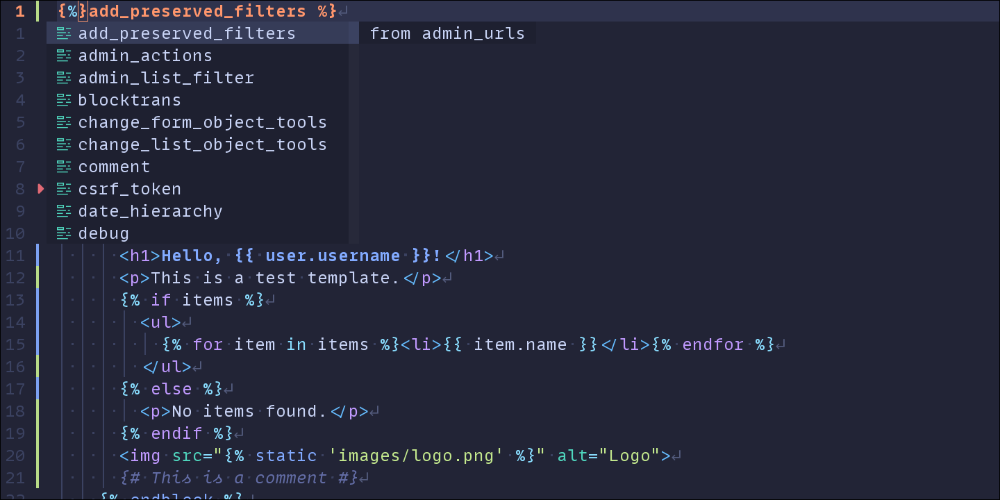
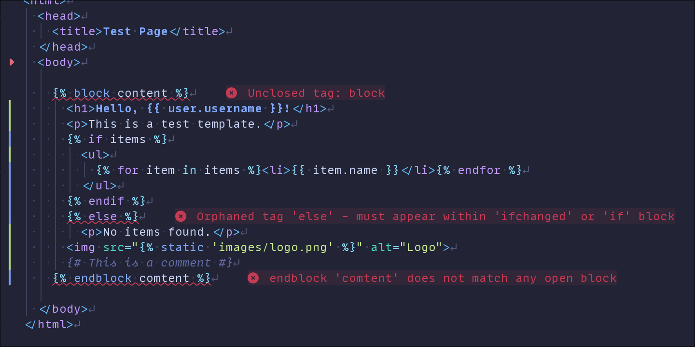

# django-language-server

<!-- [[[cog
import subprocess
import cog

from noxfile import DJ_VERSIONS
from noxfile import PY_VERSIONS
from noxfile import display_version

django_versions = [display_version(version) for version in DJ_VERSIONS]

cog.outl("[](https://pypi.org/project/django-language-server/)")
cog.outl("")
cog.outl(f"}-%2344B78B?labelColor=%23092E20)")
]]] -->
[](https://pypi.org/project/django-language-server/)


<!-- [[[end]]] -->

A language server for the Django web framework.

> [!CAUTION]
> This project is in early stages. ~~All~~ Most features are incomplete and missing.

## Features

- [x] **Completions** - Template tag and filter autocompletion with snippets
  

- [x] **Diagnostics** - Real-time error checking and validation
  

- [x] **Folding ranges** - Fold Django template block and comment regions
- [x] **Template navigation** - Jump to and find references for `` and `` templates

- [ ] **Full go to definition** - Jump to block or variable definitions
- [ ] **Full find references** - See where blocks and variables are used
- [ ] **Hover** - View documentation and type info on hover
- [ ] **Rename** - Refactor names across files
- [ ] **Code actions** - Quick fixes and refactorings
- [ ] **Document symbols** - Outline view of template structure
- [ ] **Workspace symbols** - Search across all project templates
- [ ] **Signature help** - Parameter hints while typing

## Getting Started

Set up your editor's LSP client to run the server:

- [VS Code](docs/clients/vscode.md) - Install the extension from the marketplace
- [Neovim](docs/clients/neovim.md) - Configure with `vim.lsp.config()`
- [Sublime Text](docs/clients/sublime-text.md) - Set up with LSP package
- [Zed](docs/clients/zed.md) - Install the extension

See [all client configurations](docs/clients/index.md).

Most editors can use `uvx --from django-language-server djls serve` to run the server on-demand without installing it. Alternatively, install it globally first:

```bash
uv tool install django-language-server
# or: pipx install django-language-server
```

See the [Installation](docs/installation.md) guide for more options including pip, standalone binaries, and building from source.

Once configured, open any Django template file in your project to get:

- Template tag and filter completions with snippets
- Real-time syntax validation and diagnostics
- Folding for template block and comment regions
- Navigation to template definitions and references

## Documentation

Visit [djls.joshthomas.dev](https://djls.joshthomas.dev) for full documentation including installation guides, configuration options, and editor setup instructions.

## License

django-language-server is licensed under the Apache License, Version 2.0. See the [`LICENSE`](LICENSE) file for more information.

---

django-language-server is not associated with the Django Software Foundation.

Django is a registered trademark of the Django Software Foundation.
