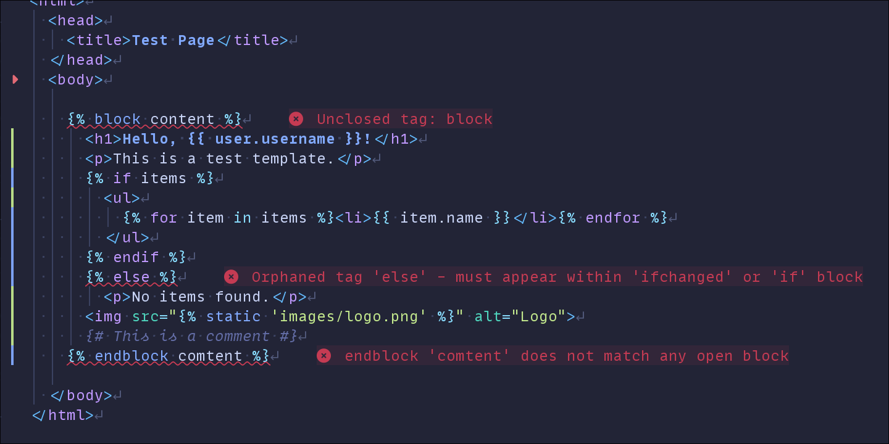

# django-language-server


A language server for the Django web framework.

!!! warning

    This project is in early stages. ~~All~~ Most features are incomplete and missing.

## Features

- [x] **Completions** - Template tag autocompletion with snippets
  

- [x] **Diagnostics** - Real-time error checking and validation
  

- [ ] **Go to definition** - Jump to template, block, or variable definitions
- [ ] **Find references** - See where templates and blocks are used
- [ ] **Hover** - View documentation and type info on hover
- [ ] **Rename** - Refactor names across files
- [ ] **Formatting** - Auto-format templates
- [ ] **Code actions** - Quick fixes and refactorings
- [ ] **Document symbols** - Outline view of template structure
- [ ] **Workspace symbols** - Search across all project templates
- [ ] **Signature help** - Parameter hints while typing

## Getting Started

Set up your editor's LSP client to run the server:

- [VS Code](clients/vscode.md) - Install the extension from the marketplace
- [Neovim](clients/neovim.md) - Configure with `vim.lsp.config()`
- [Sublime Text](clients/sublime-text.md) - Set up with LSP package
- [Zed](clients/zed.md) - Install the extension

See [all client configurations](clients/index.md).

Most editors can use `uvx --from django-language-server djls serve` to run the server on-demand without installing it. Alternatively, install it globally first:

```bash
uv tool install django-language-server
# or: pipx install django-language-server
```

See the [Installation](installation.md) guide for more options including pip, standalone binaries, and building from source.

Once configured, open any Django template file in your project to get:

- Template tag completions with snippets
- Real-time syntax validation and diagnostics
- Navigation to template definitions and references

